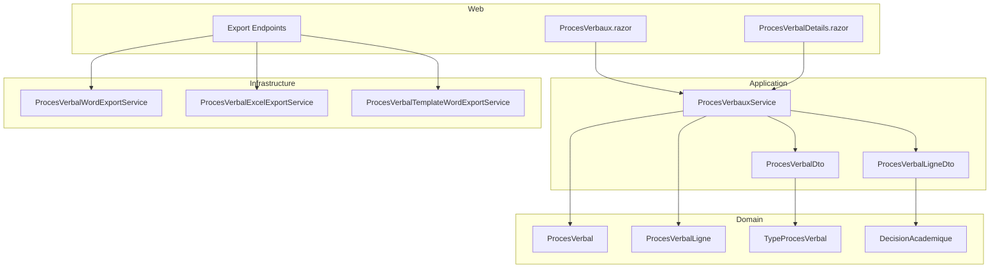
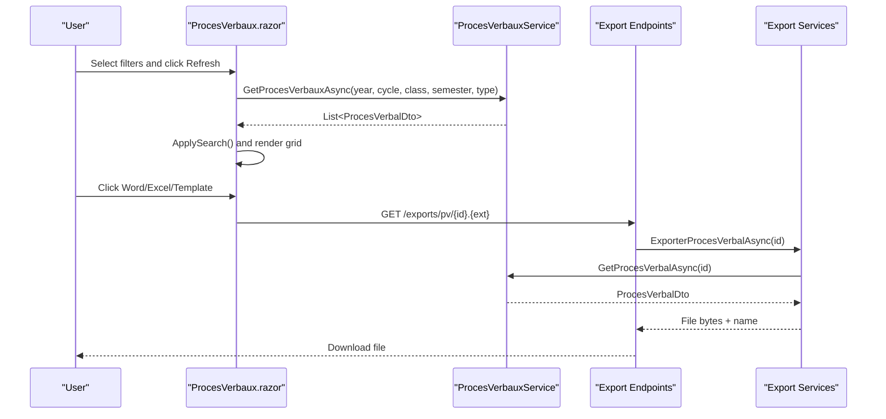
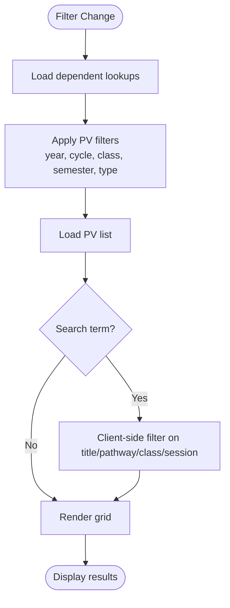
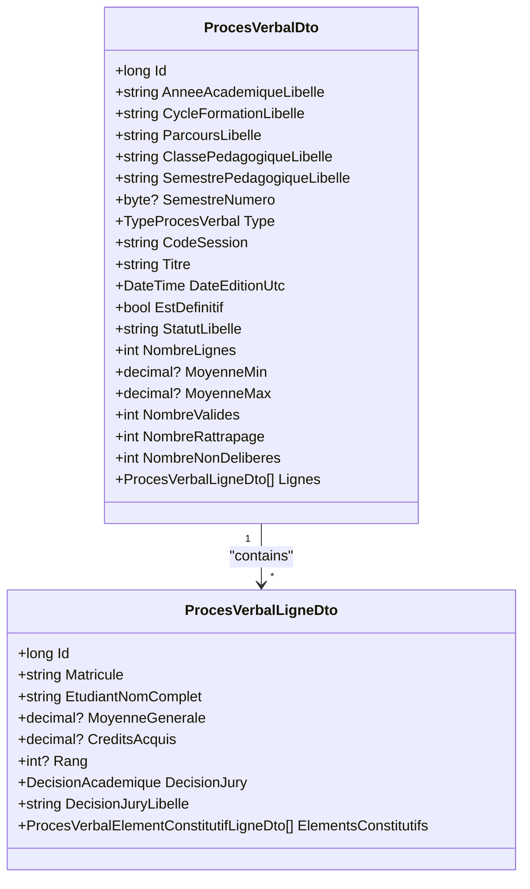
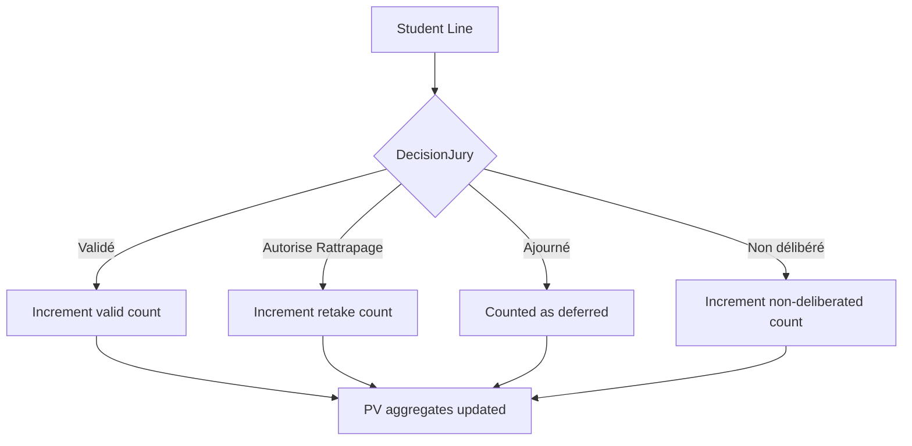
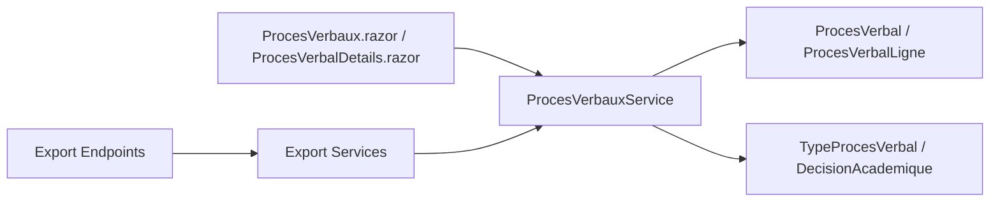

# Meeting Minutes Management

<cite>
**Referenced Files in This Document**
- [ProcesVerbaux.razor](file://RIIS.Academic.Web/Components/Pages/ProcesVerbaux.razor)
- [ProcesVerbalDetails.razor](file://RIIS.Academic.Web/Components/Pages/ProcesVerbalDetails.razor)
- [RiisAcademicExportEndpointExtensions.cs](file://RIIS.Academic.Web/Extensions/RiisAcademicExportEndpointExtensions.cs)
- [IProcesVerbauxService.cs](file://RIIS.Academic.Application/ProcesVerbaux/Services/IProcesVerbauxService.cs)
- [ProcesVerbauxService.cs](file://RIIS.Academic.Application/ProcesVerbaux/Services/ProcesVerbauxService.cs)
- [ProcesVerbalDto.cs](file://RIIS.Academic.Application/ProcesVerbaux/Dtos/ProcesVerbalDto.cs)
- [ProcesVerbalLigneDto.cs](file://RIIS.Academic.Application/ProcesVerbaux/Dtos/ProcesVerbalLigneDto.cs)
- [ProcesVerbal.cs](file://RIIS.Academic.Domain/ProcesVerbaux/ProcesVerbal.cs)
- [ProcesVerbalLigne.cs](file://RIIS.Academic.Domain/ProcesVerbaux/ProcesVerbalLigne.cs)
- [TypeProcesVerbal.cs](file://RIIS.Academic.Domain/Enums/TypeProcesVerbal.cs)
- [DecisionAcademique.cs](file://RIIS.Academic.Domain/Enums/DecisionAcademique.cs)
- [ProcesVerbalWordExportService.cs](file://RIIS.Academic.Infrastructure/Documents/ProcesVerbalWordExportService.cs)
- [ProcesVerbalExcelExportService.cs](file://RIIS.Academic.Infrastructure/Documents/ProcesVerbalExcelExportService.cs)
- [ProcesVerbalTemplateWordExportService.cs](file://RIIS.Academic.Infrastructure/Documents/ProcesVerbalTemplateWordExportService.cs)
</cite>

## Table of Contents
1. [Introduction](#introduction)
2. [Project Structure](#project-structure)
3. [Core Components](#core-components)
4. [Architecture Overview](#architecture-overview)
5. [Detailed Component Analysis](#detailed-component-analysis)
6. [Dependency Analysis](#dependency-analysis)
7. [Performance Considerations](#performance-considerations)
8. [Troubleshooting Guide](#troubleshooting-guide)
9. [Conclusion](#conclusion)

## Introduction
This document explains the Meeting Minutes (Procès-Verbaux, PV) management interface and its supporting services. It covers:
- Comprehensive filtering by academic year, formation cycle, pedagogical class, semester, and PV type
- Data grid features including sorting, paging, and nested student details
- Export capabilities: Word generation, Excel export, and template-based Word generation
- Decision tracking for validation status, retake authorization, and non-deliberated students
- Search functionality and guidance on custom templates for official meeting minutes

## Project Structure
The PV feature spans three layers:
- Web UI (Blazor pages): list view with filters and actions; detail view for a single PV
- Application services: query composition, filtering, DTO mapping, and lookup population
- Infrastructure exports: Word, Excel, and template-based Word generation endpoints



**Diagram sources**
- [ProcesVerbaux.razor:121-219](file://RIIS.Academic.Web/Components/Pages/ProcesVerbaux.razor#L121-L219)
- [ProcesVerbalDetails.razor:105-176](file://RIIS.Academic.Web/Components/Pages/ProcesVerbalDetails.razor#L105-L176)
- [IProcesVerbauxService.cs:9-29](file://RIIS.Academic.Application/ProcesVerbaux/Services/IProcesVerbauxService.cs#L9-L29)
- [ProcesVerbauxService.cs:18-60](file://RIIS.Academic.Application/ProcesVerbaux/Services/ProcesVerbauxService.cs#L18-L60)
- [ProcesVerbalDto.cs:5-40](file://RIIS.Academic.Application/ProcesVerbaux/Dtos/ProcesVerbalDto.cs#L5-L40)
- [ProcesVerbalLigneDto.cs:5-24](file://RIIS.Academic.Application/ProcesVerbaux/Dtos/ProcesVerbalLigneDto.cs#L5-L24)
- [ProcesVerbal.cs:3-23](file://RIIS.Academic.Domain/ProcesVerbaux/ProcesVerbal.cs#L3-L23)
- [ProcesVerbalLigne.cs:3-18](file://RIIS.Academic.Domain/ProcesVerbaux/ProcesVerbalLigne.cs#L3-L18)
- [TypeProcesVerbal.cs:3-9](file://RIIS.Academic.Domain/Enums/TypeProcesVerbal.cs#L3-L9)
- [DecisionAcademique.cs:3-9](file://RIIS.Academic.Domain/Enums/DecisionAcademique.cs#L3-L9)
- [ProcesVerbalWordExportService.cs:12-45](file://RIIS.Academic.Infrastructure/Documents/ProcesVerbalWordExportService.cs#L12-L45)
- [ProcesVerbalExcelExportService.cs:14-49](file://RIIS.Academic.Infrastructure/Documents/ProcesVerbalExcelExportService.cs#L14-L49)
- [ProcesVerbalTemplateWordExportService.cs:16-68](file://RIIS.Academic.Infrastructure/Documents/ProcesVerbalTemplateWordExportService.cs#L16-L68)

**Section sources**
- [ProcesVerbaux.razor:1-222](file://RIIS.Academic.Web/Components/Pages/ProcesVerbaux.razor#L1-L222)
- [ProcesVerbalDetails.razor:1-191](file://RIIS.Academic.Web/Components/Pages/ProcesVerbalDetails.razor#L1-L191)
- [RiisAcademicExportEndpointExtensions.cs:9-57](file://RIIS.Academic.Web/Extensions/RiisAcademicExportEndpointExtensions.cs#L9-L57)

## Core Components
- Filtering and listing: The PV page composes hierarchical lookups (academic year → cycle → class → semester) and applies PV type and search filters to render a sortable, pageable data grid.
- Detail view: Displays metadata, decision summaries, and a detailed table of students with per-element scores when available.
- Exports: Three endpoints generate downloadable files:
  - Word report (formatted table with headers and signatures)
  - Excel workbook (styled sheet with merged headers and frozen panes)
  - Template-based Word (replaces placeholders and injects a table into a provided template)

Key responsibilities:
- IProcesVerbauxService: exposes queries for lists, single PV retrieval, and lookups
- ProcesVerbauxService: loads entities, applies filters, maps to DTOs, computes aggregates (min/max averages, decision counts), and parses nested element details
- Export services: build Office Open XML artifacts from DTOs

**Section sources**
- [IProcesVerbauxService.cs:9-29](file://RIIS.Academic.Application/ProcesVerbaux/Services/IProcesVerbauxService.cs#L9-L29)
- [ProcesVerbauxService.cs:18-60](file://RIIS.Academic.Application/ProcesVerbaux/Services/ProcesVerbauxService.cs#L18-L60)
- [ProcesVerbauxService.cs:245-302](file://RIIS.Academic.Application/ProcesVerbaux/Services/ProcesVerbauxService.cs#L245-L302)
- [ProcesVerbalWordExportService.cs:32-89](file://RIIS.Academic.Infrastructure/Documents/ProcesVerbalWordExportService.cs#L32-L89)
- [ProcesVerbalExcelExportService.cs:34-139](file://RIIS.Academic.Infrastructure/Documents/ProcesVerbalExcelExportService.cs#L34-L139)
- [ProcesVerbalTemplateWordExportService.cs:36-68](file://RIIS.Academic.Infrastructure/Documents/ProcesVerbalTemplateWordExportService.cs#L36-L68)

## Architecture Overview
The flow from user interaction to exported documents is as follows:



**Diagram sources**
- [ProcesVerbaux.razor:275-321](file://RIIS.Academic.Web/Components/Pages/ProcesVerbaux.razor#L275-L321)
- [IProcesVerbauxService.cs:9-17](file://RIIS.Academic.Application/ProcesVerbaux/Services/IProcesVerbauxService.cs#L9-L17)
- [ProcesVerbauxService.cs:18-87](file://RIIS.Academic.Application/ProcesVerbaux/Services/ProcesVerbauxService.cs#L18-L87)
- [RiisAcademicExportEndpointExtensions.cs:11-57](file://RIIS.Academic.Web/Extensions/RiisAcademicExportEndpointExtensions.cs#L11-L57)
- [ProcesVerbalWordExportService.cs:12-29](file://RIIS.Academic.Infrastructure/Documents/ProcesVerbalWordExportService.cs#L12-L29)
- [ProcesVerbalExcelExportService.cs:14-31](file://RIIS.Academic.Infrastructure/Documents/ProcesVerbalExcelExportService.cs#L14-L31)
- [ProcesVerbalTemplateWordExportService.cs:16-33](file://RIIS.Academic.Infrastructure/Documents/ProcesVerbalTemplateWordExportService.cs#L16-L33)

## Detailed Component Analysis

### Filtering System
- Hierarchical lookups: Academic year, Formation cycle, Pedagogical class, Semester are loaded and cascaded. Dependent lookups refresh when higher-level filters change.
- PV type filter: Limits results to a specific session type (e.g., continuous assessment, normal session, retake session, final).
- Search: Client-side text search across title, pathway, class, and session code.



**Diagram sources**
- [ProcesVerbaux.razor:252-309](file://RIIS.Academic.Web/Components/Pages/ProcesVerbaux.razor#L252-L309)
- [ProcesVerbauxService.cs:180-243](file://RIIS.Academic.Application/ProcesVerbaux/Services/ProcesVerbauxService.cs#L180-L243)

**Section sources**
- [ProcesVerbaux.razor:21-110](file://RIIS.Academic.Web/Components/Pages/ProcesVerbaux.razor#L21-L110)
- [ProcesVerbaux.razor:252-309](file://RIIS.Academic.Web/Components/Pages/ProcesVerbaux.razor#L252-L309)
- [ProcesVerbauxService.cs:89-178](file://RIIS.Academic.Application/ProcesVerbaux/Services/ProcesVerbauxService.cs#L89-L178)
- [ProcesVerbauxService.cs:180-243](file://RIIS.Academic.Application/ProcesVerbaux/Services/ProcesVerbauxService.cs#L180-L243)

### Data Grid and Nested Student Details
- Top-level grid: Sortable columns for academic year, cycle, pathway, class, semester, type, session, line count, min/max average, status, decisions summary, edit date. Paging enabled.
- Expanded row template: Shows PV header and a nested grid of student lines with rank, matricule, full name, overall average, credits, and jury decision. Sorting and paging apply to nested rows.



**Diagram sources**
- [ProcesVerbalDto.cs:5-40](file://RIIS.Academic.Application/ProcesVerbaux/Dtos/ProcesVerbalDto.cs#L5-L40)
- [ProcesVerbalLigneDto.cs:5-24](file://RIIS.Academic.Application/ProcesVerbaux/Dtos/ProcesVerbalLigneDto.cs#L5-L24)

**Section sources**
- [ProcesVerbaux.razor:121-219](file://RIIS.Academic.Web/Components/Pages/ProcesVerbaux.razor#L121-L219)
- [ProcesVerbalDetails.razor:105-176](file://RIIS.Academic.Web/Components/Pages/ProcesVerbalDetails.razor#L105-L176)

### Decision Tracking System
- Status: Derived from whether the PV is definitive or provisional.
- Decisions per student: Validated, authorized for retake, deferred, or non-deliberated.
- Aggregates: Counts of validated, retake-authorized, and non-deliberated students are computed and shown in both list and detail views.



**Diagram sources**
- [ProcesVerbauxService.cs:266-302](file://RIIS.Academic.Application/ProcesVerbaux/Services/ProcesVerbauxService.cs#L266-L302)
- [DecisionAcademique.cs:3-9](file://RIIS.Academic.Domain/Enums/DecisionAcademique.cs#L3-L9)

**Section sources**
- [ProcesVerbalDto.cs:19-38](file://RIIS.Academic.Application/ProcesVerbaux/Dtos/ProcesVerbalDto.cs#L19-L38)
- [ProcesVerbalLigneDto.cs:17-23](file://RIIS.Academic.Application/ProcesVerbaux/Dtos/ProcesVerbalLigneDto.cs#L17-L23)
- [ProcesVerbauxService.cs:266-302](file://RIIS.Academic.Application/ProcesVerbaux/Services/ProcesVerbauxService.cs#L266-L302)

### Export Capabilities
- Word export: Builds an Office Open XML document with headers, metadata table, student table (simple or detailed based on presence of element details), and signature blocks.
- Excel export: Generates a styled worksheet with merged headers, frozen panes, print titles, and conditional note colors.
- Template Word export: Loads a template file, replaces text placeholders, and injects a generated table where a placeholder marker exists.

```mermaid
sequenceDiagram
participant UI as "UI Buttons"
participant EP as "Export Endpoints"
participant WS as "Word Export"
participant XS as "Excel Export"
TS as "Template Export"
UI->>EP : GET /exports/pv/{id}.docx/.xlsx/.modele.docx
alt .docx
EP->>WS : ExporterProcesVerbalAsync(id)
WS-->>EP : File(bytes, name)
else .xlsx
EP->>XS : ExporterProcesVerbalAsync(id)
XS-->>EP : File(bytes, name)
else .modele.docx
EP->>TS : ExporterProcesVerbalAsync(id)
TS-->>EP : File(bytes, name)
end
EP-->>UI : Download response
```

**Diagram sources**
- [RiisAcademicExportEndpointExtensions.cs:11-57](file://RIIS.Academic.Web/Extensions/RiisAcademicExportEndpointExtensions.cs#L11-L57)
- [ProcesVerbalWordExportService.cs:12-45](file://RIIS.Academic.Infrastructure/Documents/ProcesVerbalWordExportService.cs#L12-L45)
- [ProcesVerbalExcelExportService.cs:14-49](file://RIIS.Academic.Infrastructure/Documents/ProcesVerbalExcelExportService.cs#L14-L49)
- [ProcesVerbalTemplateWordExportService.cs:16-68](file://RIIS.Academic.Infrastructure/Documents/ProcesVerbalTemplateWordExportService.cs#L16-L68)

**Section sources**
- [ProcesVerbalWordExportService.cs:32-89](file://RIIS.Academic.Infrastructure/Documents/ProcesVerbalWordExportService.cs#L32-L89)
- [ProcesVerbalExcelExportService.cs:34-139](file://RIIS.Academic.Infrastructure/Documents/ProcesVerbalExcelExportService.cs#L34-L139)
- [ProcesVerbalTemplateWordExportService.cs:70-86](file://RIIS.Academic.Infrastructure/Documents/ProcesVerbalTemplateWordExportService.cs#L70-L86)
- [ProcesVerbalTemplateWordExportService.cs:88-137](file://RIIS.Academic.Infrastructure/Documents/ProcesVerbalTemplateWordExportService.cs#L88-L137)

### Search Functionality
- The search field filters the client-side list by title, pathway, class, and session code using case-insensitive substring matching.
- Results update immediately as the user types.

**Section sources**
- [ProcesVerbaux.razor:95-101](file://RIIS.Academic.Web/Components/Pages/ProcesVerbaux.razor#L95-L101)
- [ProcesVerbaux.razor:305-351](file://RIIS.Academic.Web/Components/Pages/ProcesVerbaux.razor#L305-L351)

### Custom Template Usage for Official Meeting Minutes
- Template Word export requires a Word template file placed in one of the expected locations.
- Placeholders such as type, semester label, academic year, cycle, pathway, level, class, semester number, session, status, student counts, and observation are replaced.
- A table placeholder marker is required; it will be replaced with a dynamically generated table containing student details.

**Section sources**
- [ProcesVerbalTemplateWordExportService.cs:70-86](file://RIIS.Academic.Infrastructure/Documents/ProcesVerbalTemplateWordExportService.cs#L70-L86)
- [ProcesVerbalTemplateWordExportService.cs:88-137](file://RIIS.Academic.Infrastructure/Documents/ProcesVerbalTemplateWordExportService.cs#L88-L137)

## Dependency Analysis
- UI depends on application service for data and lookups.
- Application service depends on domain entities and enumerations to compute DTOs and aggregates.
- Export endpoints depend on export services which depend on the application service to fetch a single PV.



**Diagram sources**
- [ProcesVerbaux.razor:275-321](file://RIIS.Academic.Web/Components/Pages/ProcesVerbaux.razor#L275-L321)
- [ProcesVerbalDetails.razor:326-374](file://RIIS.Academic.Web/Components/Pages/ProcesVerbalDetails.razor#L326-L374)
- [IProcesVerbauxService.cs:9-17](file://RIIS.Academic.Application/ProcesVerbaux/Services/IProcesVerbauxService.cs#L9-L17)
- [ProcesVerbauxService.cs:18-87](file://RIIS.Academic.Application/ProcesVerbaux/Services/ProcesVerbauxService.cs#L18-L87)
- [RiisAcademicExportEndpointExtensions.cs:11-57](file://RIIS.Academic.Web/Extensions/RiisAcademicExportEndpointExtensions.cs#L11-L57)

**Section sources**
- [ProcesVerbauxService.cs:18-87](file://RIIS.Academic.Application/ProcesVerbaux/Services/ProcesVerbauxService.cs#L18-L87)
- [RiisAcademicExportEndpointExtensions.cs:11-57](file://RIIS.Academic.Web/Extensions/RiisAcademicExportEndpointExtensions.cs#L11-L57)

## Performance Considerations
- In-memory filtering: The current implementation loads all relevant entities into memory and filters client-side or via LINQ. For large datasets, consider server-side pagination and filtering at the repository layer.
- Lookup caching: Lookups are refreshed on hierarchy changes; consider caching if the underlying reference data is stable.
- Export generation: Building Office Open XML documents is CPU-intensive; ensure background processing or rate limiting for bulk operations.

[No sources needed since this section provides general guidance]

## Troubleshooting Guide
- Missing template file: Template-based Word export throws if the template cannot be found in expected paths. Ensure the template is present before exporting.
- Not found responses: Export endpoints return not found when the requested PV does not exist.
- Error notifications: UI surfaces errors via a notification service when exceptions occur during loading or parameter handling.

**Section sources**
- [ProcesVerbalTemplateWordExportService.cs:70-86](file://RIIS.Academic.Infrastructure/Documents/ProcesVerbalTemplateWordExportService.cs#L70-L86)
- [RiisAcademicExportEndpointExtensions.cs:18-57](file://RIIS.Academic.Web/Extensions/RiisAcademicExportEndpointExtensions.cs#L18-L57)
- [ProcesVerbaux.razor:288-291](file://RIIS.Academic.Web/Components/Pages/ProcesVerbaux.razor#L288-L291)
- [ProcesVerbalDetails.razor:335-338](file://RIIS.Academic.Web/Components/Pages/ProcesVerbalDetails.razor#L335-L338)

## Conclusion
The PV management interface provides a robust, filter-driven experience with rich grids, clear decision tracking, and multiple export formats. The architecture cleanly separates UI, application logic, and infrastructure concerns, enabling maintainability and extensibility. For high-volume scenarios, consider moving filtering and pagination to the server side and optimizing export generation.

[No sources needed since this section summarizes without analyzing specific files]