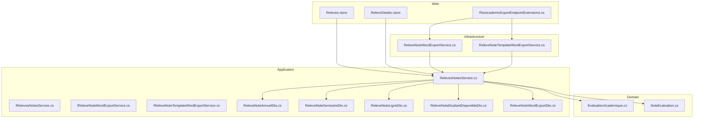
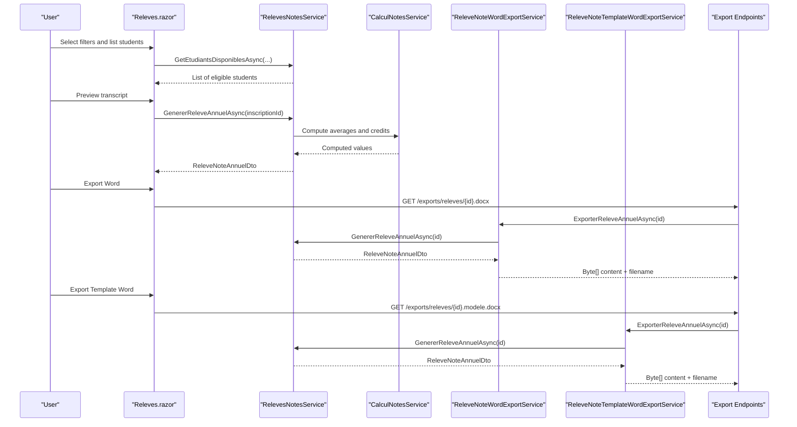
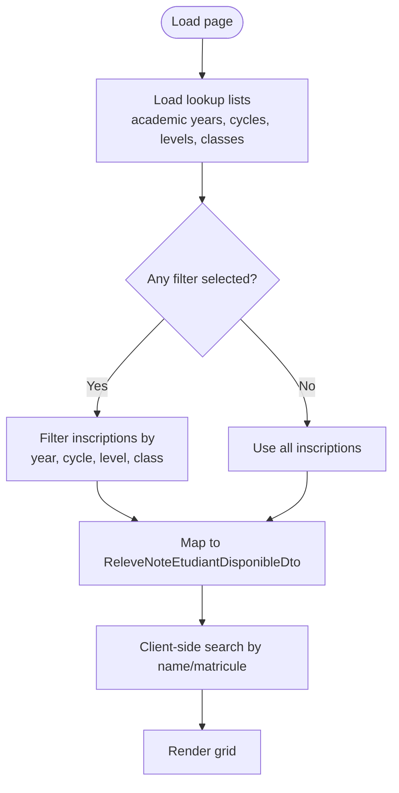
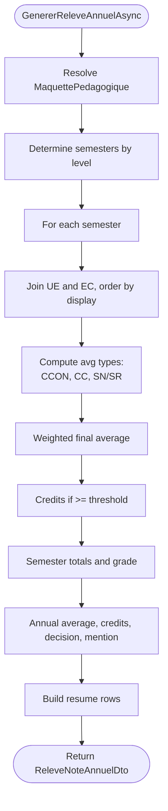
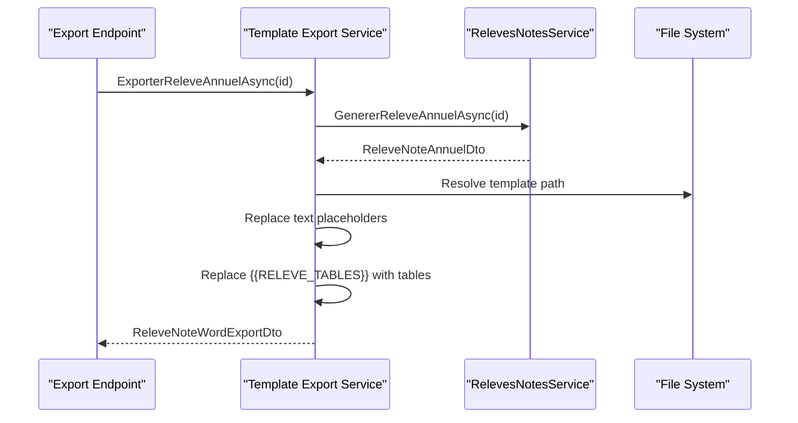
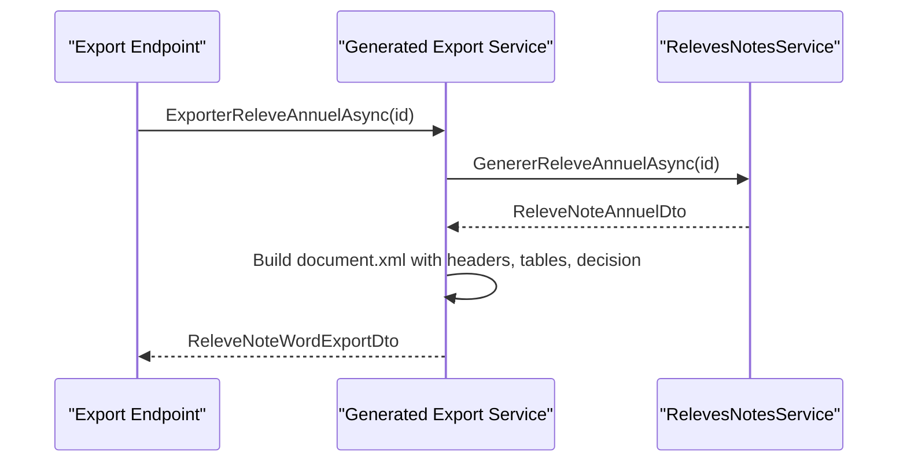
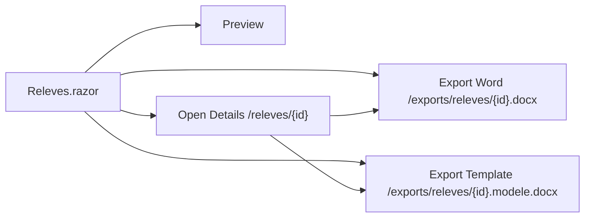
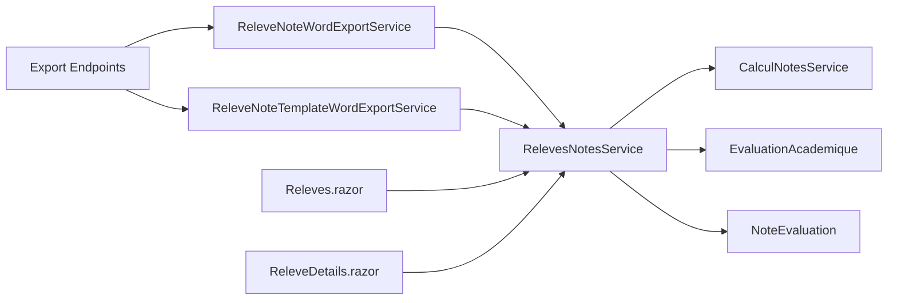

# Transcript Generation

<cite>
**Referenced Files in This Document**
- [RelevesNotesService.cs](file://RIIS.Academic.Application/Releves/Services/RelevesNotesService.cs)
- [IRelevesNotesService.cs](file://RIIS.Academic.Application/Releves/Services/IRelevesNotesService.cs)
- [ReleveNoteAnnuelDto.cs](file://RIIS.Academic.Application/Releves/Dtos/ReleveNoteAnnuelDto.cs)
- [ReleveNoteSemestreDto.cs](file://RIIS.Academic.Application/Releves/Dtos/ReleveNoteSemestreDto.cs)
- [ReleveNoteLigneDto.cs](file://RIIS.Academic.Application/Releves/Dtos/ReleveNoteLigneDto.cs)
- [ReleveNoteEtudiantDisponibleDto.cs](file://RIIS.Academic.Application/Releves/Dtos/ReleveNoteEtudiantDisponibleDto.cs)
- [ReleveNoteWordExportDto.cs](file://RIIS.Academic.Application/Releves/Dtos/ReleveNoteWordExportDto.cs)
- [IReleveNoteWordExportService.cs](file://RIIS.Academic.Application/Releves/Services/IReleveNoteWordExportService.cs)
- [IReleveNoteTemplateWordExportService.cs](file://RIIS.Academic.Application/Releves/Services/IReleveNoteTemplateWordExportService.cs)
- [ReleveNoteWordExportService.cs](file://RIIS.Academic.Infrastructure/Documents/ReleveNoteWordExportService.cs)
- [ReleveNoteTemplateWordExportService.cs](file://RIIS.Academic.Infrastructure/Documents/ReleveNoteTemplateWordExportService.cs)
- [RiisAcademicExportEndpointExtensions.cs](file://RIIS.Academic.Web/Extensions/RiisAcademicExportEndpointExtensions.cs)
- [Releves.razor](file://RIIS.Academic.Web/Components/Pages/Releves.razor)
- [ReleveDetails.razor](file://RIIS.Academic.Web/Components/Pages/ReleveDetails.razor)
- [EvaluationAcademique.cs](file://RIIS.Academic.Domain/Notes/EvaluationAcademique.cs)
- [NoteEvaluation.cs](file://RIIS.Academic.Domain/Notes/NoteEvaluation.cs)
- [ICalculNotesService.cs](file://RIIS.Academic.Application/Abstractions/Services/ICalculNotesService.cs)
- [CalculNotesService.cs](file://RIIS.Academic.Application/Notes/Services/CalculNotesService.cs)
</cite>

## Table of Contents
1. Introduction
2. Project Structure
3. Core Components
4. Architecture Overview
5. Detailed Component Analysis
6. Dependency Analysis
7. Performance Considerations
8. Troubleshooting Guide
9. Conclusion
10. Appendices

## Introduction
This document explains the transcript (Relevé de Notes) generation interface and backend services. It covers:
- Listing students eligible for transcripts with filtering by academic year, program/cycle, level, and class
- Generating a detailed annual transcript view including per-course grades, credits, GPA-like averages, and decisions
- Template-based Word document generation for official transcripts, including grade formatting, university branding, and signature blocks
- Validation workflow, version control of pedagogical blueprints, and distribution via export endpoints
- Examples of custom templates, bulk generation patterns, and integration points with student records

## Project Structure
The transcript feature spans Application, Infrastructure, Web, and Domain layers:
- Application layer defines services and DTOs for transcript data and calculations
- Infrastructure implements Word export from template or generated XML
- Web exposes UI pages and export endpoints
- Domain models represent evaluations and grades used to compute transcripts

**Diagram sources**
- [Releves.razor:1-356](file://RIIS.Academic.Web/Components/Pages/Releves.razor#L1-L356)
- [ReleveDetails.razor:1-200](file://RIIS.Academic.Web/Components/Pages/ReleveDetails.razor#L1-L200)
- [RiisAcademicExportEndpointExtensions.cs:1-93](file://RIIS.Academic.Web/Extensions/RiisAcademicExportEndpointExtensions.cs#L1-L93)
- [RelevesNotesService.cs:1-377](file://RIIS.Academic.Application/Releves/Services/RelevesNotesService.cs#L1-L377)
- [ReleveNoteWordExportService.cs:1-405](file://RIIS.Academic.Infrastructure/Documents/ReleveNoteWordExportService.cs#L1-L405)
- [ReleveNoteTemplateWordExportService.cs:1-465](file://RIIS.Academic.Infrastructure/Documents/ReleveNoteTemplateWordExportService.cs#L1-L465)
- [EvaluationAcademique.cs:1-24](file://RIIS.Academic.Domain/Notes/EvaluationAcademique.cs#L1-L24)
- [NoteEvaluation.cs:1-17](file://RIIS.Academic.Domain/Notes/NoteEvaluation.cs#L1-L17)

**Section sources**
- [Releves.razor:1-356](file://RIIS.Academic.Web/Components/Pages/Releves.razor#L1-L356)
- [ReleveDetails.razor:1-200](file://RIIS.Academic.Web/Components/Pages/ReleveDetails.razor#L1-L200)
- [RiisAcademicExportEndpointExtensions.cs:1-93](file://RIIS.Academic.Web/Extensions/RiisAcademicExportEndpointExtensions.cs#L1-L93)
- [RelevesNotesService.cs:1-377](file://RIIS.Academic.Application/Releves/Services/RelevesNotesService.cs#L1-L377)
- [ReleveNoteWordExportService.cs:1-405](file://RIIS.Academic.Infrastructure/Documents/ReleveNoteWordExportService.cs#L1-L405)
- [ReleveNoteTemplateWordExportService.cs:1-465](file://RIIS.Academic.Infrastructure/Documents/ReleveNoteTemplateWordExportService.cs#L1-L465)
- [EvaluationAcademique.cs:1-24](file://RIIS.Academic.Domain/Notes/EvaluationAcademique.cs#L1-L24)
- [NoteEvaluation.cs:1-17](file://RIIS.Academic.Domain/Notes/NoteEvaluation.cs#L1-L17)

## Core Components
- Student listing and filtering: The service returns available students for transcripts filtered by academic year, cycle formation, study level, and pedagogical class.
- Annual transcript generation: Builds a structured DTO with semesters, course lines, averages, credits, decision, and mention.
- Word export: Two implementations:
  - Template-based: Replaces placeholders in a .docx template and injects tables
  - Generated: Builds a Word document from XML with branding and signature blocks
- Export endpoints: HTTP GET endpoints return downloadable files for both standard and template exports.

Key responsibilities:
- Data aggregation across inscriptions, students, programs, semesters, units, elements, evaluations, and grades
- Grade computation using weighted averages and credit acquisition rules
- Formatting of notes, credits, grades, and mentions for display and export

**Section sources**
- [IRelevesNotesService.cs:1-18](file://RIIS.Academic.Application/Releves/Services/IRelevesNotesService.cs#L1-L18)
- [RelevesNotesService.cs:25-200](file://RIIS.Academic.Application/Releves/Services/RelevesNotesService.cs#L25-L200)
- [ReleveNoteAnnuelDto.cs:1-26](file://RIIS.Academic.Application/Releves/Dtos/ReleveNoteAnnuelDto.cs#L1-L26)
- [ReleveNoteSemestreDto.cs:1-14](file://RIIS.Academic.Application/Releves/Dtos/ReleveNoteSemestreDto.cs#L1-L14)
- [ReleveNoteLigneDto.cs:1-14](file://RIIS.Academic.Application/Releves/Dtos/ReleveNoteLigneDto.cs#L1-L14)
- [ReleveNoteEtudiantDisponibleDto.cs:1-12](file://RIIS.Academic.Application/Releves/Dtos/ReleveNoteEtudiantDisponibleDto.cs#L1-L12)
- [ReleveNoteWordExportDto.cs:1-9](file://RIIS.Academic.Application/Releves/Dtos/ReleveNoteWordExportDto.cs#L1-L9)
- [IReleveNoteWordExportService.cs:1-11](file://RIIS.Academic.Application/Releves/Services/IReleveNoteWordExportService.cs#L1-L11)
- [IReleveNoteTemplateWordExportService.cs:1-11](file://RIIS.Academic.Application/Releves/Services/IReleveNoteTemplateWordExportService.cs#L1-L11)

## Architecture Overview
The transcript flow integrates UI, application logic, domain data, and document generation:

**Diagram sources**
- [Releves.razor:251-325](file://RIIS.Academic.Web/Components/Pages/Releves.razor#L251-L325)
- [RelevesNotesService.cs:93-200](file://RIIS.Academic.Application/Releves/Services/RelevesNotesService.cs#L93-L200)
- [CalculNotesService.cs:7-25](file://RIIS.Academic.Application/Notes/Services/CalculNotesService.cs#L7-L25)
- [ReleveNoteWordExportService.cs:12-43](file://RIIS.Academic.Infrastructure/Documents/ReleveNoteWordExportService.cs#L12-L43)
- [ReleveNoteTemplateWordExportService.cs:16-34](file://RIIS.Academic.Infrastructure/Documents/ReleveNoteTemplateWordExportService.cs#L16-L34)
- [RiisAcademicExportEndpointExtensions.cs:59-89](file://RIIS.Academic.Web/Extensions/RiisAcademicExportEndpointExtensions.cs#L59-L89)

## Detailed Component Analysis

### Student Listing and Filtering
- Filters supported: Academic year, cycle formation, study level, pedagogical class
- Search: Local client-side search by name or matricule
- Output: List of eligible students with key identifiers for preview/export

**Diagram sources**
- [Releves.razor:240-276](file://RIIS.Academic.Web/Components/Pages/Releves.razor#L240-L276)
- [RelevesNotesService.cs:25-91](file://RIIS.Academic.Application/Releves/Services/RelevesNotesService.cs#L25-L91)

**Section sources**
- [Releves.razor:20-147](file://RIIS.Academic.Web/Components/Pages/Releves.razor#L20-L147)
- [RelevesNotesService.cs:25-91](file://RIIS.Academic.Application/Releves/Services/RelevesNotesService.cs#L25-L91)

### Annual Transcript Generation
- Resolves pedagogical blueprint (maquette) by inscription or by program with active status and highest version
- Aggregates semesters based on study level
- For each element constitutif:
  - Computes averages for continuous assessment, knowledge tests, normal session, and make-up session
  - Uses weighted formula to determine final average
  - Determines credits acquired and decision per element
- Computes semester totals, averages, and grades
- Computes annual average, credits, decision, and mention; builds summary rows

**Diagram sources**
- [RelevesNotesService.cs:93-200](file://RIIS.Academic.Application/Releves/Services/RelevesNotesService.cs#L93-L200)
- [RelevesNotesService.cs:202-267](file://RIIS.Academic.Application/Releves/Services/RelevesNotesService.cs#L202-L267)
- [RelevesNotesService.cs:269-333](file://RIIS.Academic.Application/Releves/Services/RelevesNotesService.cs#L269-L333)
- [CalculNotesService.cs:7-25](file://RIIS.Academic.Application/Notes/Services/CalculNotesService.cs#L7-L25)

**Section sources**
- [RelevesNotesService.cs:93-377](file://RIIS.Academic.Application/Releves/Services/RelevesNotesService.cs#L93-L377)
- [ICalculNotesService.cs:1-12](file://RIIS.Academic.Application/Abstractions/Services/ICalculNotesService.cs#L1-L12)
- [CalculNotesService.cs:1-25](file://RIIS.Academic.Application/Notes/Services/CalculNotesService.cs#L1-L25)

### Word Export: Template-Based
- Loads a .docx template from configured locations
- Replaces text placeholders such as student info, averages, credits, decision, mention, and date
- Replaces a placeholder table with dynamically built tables for semester details and annual summary
- Produces a slugified file name combining student identifiers and academic year

**Diagram sources**
- [ReleveNoteTemplateWordExportService.cs:16-154](file://RIIS.Academic.Infrastructure/Documents/ReleveNoteTemplateWordExportService.cs#L16-L154)
- [ReleveNoteTemplateWordExportService.cs:156-286](file://RIIS.Academic.Infrastructure/Documents/ReleveNoteTemplateWordExportService.cs#L156-L286)
- [ReleveNoteTemplateWordExportService.cs:288-465](file://RIIS.Academic.Infrastructure/Documents/ReleveNoteTemplateWordExportService.cs#L288-L465)
- [RiisAcademicExportEndpointExtensions.cs:75-89](file://RIIS.Academic.Web/Extensions/RiisAcademicExportEndpointExtensions.cs#L75-L89)

**Section sources**
- [ReleveNoteTemplateWordExportService.cs:1-465](file://RIIS.Academic.Infrastructure/Documents/ReleveNoteTemplateWordExportService.cs#L1-L465)
- [ReleveNoteWordExportDto.cs:1-9](file://RIIS.Academic.Application/Releves/Dtos/ReleveNoteWordExportDto.cs#L1-L9)

### Word Export: Generated Document
- Builds a complete Word document from XML parts
- Includes university branding header, student information table, semester tables, annual summary, decision line, and signature block
- Applies styles and consistent formatting for headings, tables, and decision text

**Diagram sources**
- [ReleveNoteWordExportService.cs:12-93](file://RIIS.Academic.Infrastructure/Documents/ReleveNoteWordExportService.cs#L12-L93)
- [ReleveNoteWordExportService.cs:95-190](file://RIIS.Academic.Infrastructure/Documents/ReleveNoteWordExportService.cs#L95-L190)
- [ReleveNoteWordExportService.cs:192-405](file://RIIS.Academic.Infrastructure/Documents/ReleveNoteWordExportService.cs#L192-L405)
- [RiisAcademicExportEndpointExtensions.cs:59-73](file://RIIS.Academic.Web/Extensions/RiisAcademicExportEndpointExtensions.cs#L59-L73)

**Section sources**
- [ReleveNoteWordExportService.cs:1-405](file://RIIS.Academic.Infrastructure/Documents/ReleveNoteWordExportService.cs#L1-L405)

### UI Pages and Distribution
- Releves page:
  - Displays filters and search
  - Lists eligible students
  - Provides actions: Preview, Open Details, Export Word, Export Template Word
- ReleveDetails page:
  - Shows full transcript details with semester breakdowns and summaries
  - Offers direct export actions
- Export endpoints:
  - Standard Word export: /exports/releves/{inscriptionId}.docx
  - Template Word export: /exports/releves/{inscriptionId}.modele.docx

**Diagram sources**
- [Releves.razor:111-147](file://RIIS.Academic.Web/Components/Pages/Releves.razor#L111-L147)
- [Releves.razor:315-325](file://RIIS.Academic.Web/Components/Pages/Releves.razor#L315-L325)
- [ReleveDetails.razor:20-31](file://RIIS.Academic.Web/Components/Pages/ReleveDetails.razor#L20-L31)
- [ReleveDetails.razor:181-185](file://RIIS.Academic.Web/Components/Pages/ReleveDetails.razor#L181-L185)
- [RiisAcademicExportEndpointExtensions.cs:59-89](file://RIIS.Academic.Web/Extensions/RiisAcademicExportEndpointExtensions.cs#L59-L89)

**Section sources**
- [Releves.razor:1-356](file://RIIS.Academic.Web/Components/Pages/Releves.razor#L1-L356)
- [ReleveDetails.razor:1-200](file://RIIS.Academic.Web/Components/Pages/ReleveDetails.razor#L1-L200)
- [RiisAcademicExportEndpointExtensions.cs:1-93](file://RIIS.Academic.Web/Extensions/RiisAcademicExportEndpointExtensions.cs#L1-L93)

## Dependency Analysis
- RelevesNotesService depends on multiple repositories to assemble transcript data and uses CalculNotesService for grade computations
- Export services depend on RelevesNotesService to obtain the transcript DTO
- Web pages depend on RelevesNotesService for preview and on export endpoints for downloads
- Domain entities provide evaluation and grade structures consumed during computation

**Diagram sources**
- [RelevesNotesService.cs:8-23](file://RIIS.Academic.Application/Releves/Services/RelevesNotesService.cs#L8-L23)
- [ReleveNoteWordExportService.cs:10-16](file://RIIS.Academic.Infrastructure/Documents/ReleveNoteWordExportService.cs#L10-L16)
- [ReleveNoteTemplateWordExportService.cs:11-22](file://RIIS.Academic.Infrastructure/Documents/ReleveNoteTemplateWordExportService.cs#L11-L22)
- [Releves.razor:251-325](file://RIIS.Academic.Web/Components/Pages/Releves.razor#L251-L325)
- [ReleveDetails.razor:159-185](file://RIIS.Academic.Web/Components/Pages/ReleveDetails.razor#L159-L185)
- [RiisAcademicExportEndpointExtensions.cs:59-89](file://RIIS.Academic.Web/Extensions/RiisAcademicExportEndpointExtensions.cs#L59-L89)

**Section sources**
- [RelevesNotesService.cs:1-377](file://RIIS.Academic.Application/Releves/Services/RelevesNotesService.cs#L1-L377)
- [ReleveNoteWordExportService.cs:1-405](file://RIIS.Academic.Infrastructure/Documents/ReleveNoteWordExportService.cs#L1-L405)
- [ReleveNoteTemplateWordExportService.cs:1-465](file://RIIS.Academic.Infrastructure/Documents/ReleveNoteTemplateWordExportService.cs#L1-L465)
- [Releves.razor:1-356](file://RIIS.Academic.Web/Components/Pages/Releves.razor#L1-L356)
- [ReleveDetails.razor:1-200](file://RIIS.Academic.Web/Components/Pages/ReleveDetails.razor#L1-L200)
- [RiisAcademicExportEndpointExtensions.cs:1-93](file://RIIS.Academic.Web/Extensions/RiisAcademicExportEndpointExtensions.cs#L1-L93)

## Performance Considerations
- Data loading strategy: The service loads entire collections into memory and performs in-memory filtering and joins. For large datasets, consider:
  - Server-side filtering and projection at repository level
  - Pagination for student listings
  - Caching lookups (academic years, cycles, levels, classes)
- Computation:
  - Average and credit calculations are straightforward and efficient
  - Grouping and ordering operations are performed in memory; ensure indexes on referenced IDs where possible
- Export:
  - Template replacement and XML building are CPU-bound; consider background jobs for bulk generation
  - File naming uses slugification; avoid excessive string operations in tight loops

[No sources needed since this section provides general guidance]

## Troubleshooting Guide
Common issues and resolutions:
- Missing template file:
  - Symptom: Exception indicating template not found
  - Resolution: Ensure ReleveNoteTemplate.docx is placed in one of the resolved paths under Documents/Templates relative to base directory
- Placeholder missing in template:
  - Symptom: Exception indicating placeholder not found
  - Resolution: Include {{RELEVE_TABLES}} placeholder in the template either as a table or paragraph to be replaced
- No transcript data:
  - Symptom: Null result or empty semesters
  - Resolution: Verify that the inscription has an associated maquette and that evaluations/grades exist for the relevant academic year and elements
- Decision and mention:
  - If averages or credits are missing, decision may default to failure; ensure all required sessions have present statuses and valid values

**Section sources**
- [ReleveNoteTemplateWordExportService.cs:70-86](file://RIIS.Academic.Infrastructure/Documents/ReleveNoteTemplateWordExportService.cs#L70-L86)
- [ReleveNoteTemplateWordExportService.cs:125-154](file://RIIS.Academic.Infrastructure/Documents/ReleveNoteTemplateWordExportService.cs#L125-L154)
- [RelevesNotesService.cs:130-134](file://RIIS.Academic.Application/Releves/Services/RelevesNotesService.cs#L130-L134)
- [RelevesNotesService.cs:290-314](file://RIIS.Academic.Application/Releves/Services/RelevesNotesService.cs#L290-L314)

## Conclusion
The transcript system provides a robust pipeline from student selection and filtering to detailed transcript views and official Word exports. It supports both template-driven and fully generated documents, includes clear validation and decision logic, and exposes simple endpoints for distribution. Extensions can add new templates, adjust grading formulas, or integrate with external systems through the defined interfaces.

[No sources needed since this section summarizes without analyzing specific files]

## Appendices

### Example: Custom Transcript Template
- Create a Word template with placeholders:
  - Text fields: student name, matricule, birth date/place, program, level, academic year, averages, credits, decision, mention, edition date
  - Table placeholder: {{RELEVE_TABLES}} to be replaced with semester tables and annual summary
- Place the template in a resolved path and use the template export endpoint to generate personalized transcripts

**Section sources**
- [ReleveNoteTemplateWordExportService.cs:88-123](file://RIIS.Academic.Infrastructure/Documents/ReleveNoteTemplateWordExportService.cs#L88-L123)
- [ReleveNoteTemplateWordExportService.cs:125-154](file://RIIS.Academic.Infrastructure/Documents/ReleveNoteTemplateWordExportService.cs#L125-L154)

### Example: Bulk Transcript Generation
- Pattern:
  - Retrieve eligible students via GetEtudiantsDisponiblesAsync with filters
  - Iterate over results and call ExporterReleveAnnuelAsync for each inscriptionId
  - Queue tasks asynchronously and handle errors per student
  - Store or distribute generated files via storage or email
- Consider rate limiting and background processing for large cohorts

**Section sources**
- [RelevesNotesService.cs:25-91](file://RIIS.Academic.Application/Releves/Services/RelevesNotesService.cs#L25-L91)
- [ReleveNoteWordExportService.cs:12-28](file://RIIS.Academic.Infrastructure/Documents/ReleveNoteWordExportService.cs#L12-L28)
- [ReleveNoteTemplateWordExportService.cs:16-34](file://RIIS.Academic.Infrastructure/Documents/ReleveNoteTemplateWordExportService.cs#L16-L34)

### Integration with Student Records
- The transcript aggregates data from:
  - Inscriptions (links student to academic year, program, and blueprint)
  - Students (personal details)
  - Programs and semesters (structure of curriculum)
  - Evaluations and grades (assessment outcomes)
- Ensure referential integrity between these entities to produce accurate transcripts

**Section sources**
- [RelevesNotesService.cs:93-151](file://RIIS.Academic.Application/Releves/Services/RelevesNotesService.cs#L93-L151)
- [EvaluationAcademique.cs:1-24](file://RIIS.Academic.Domain/Notes/EvaluationAcademique.cs#L1-L24)
- [NoteEvaluation.cs:1-17](file://RIIS.Academic.Domain/Notes/NoteEvaluation.cs#L1-L17)