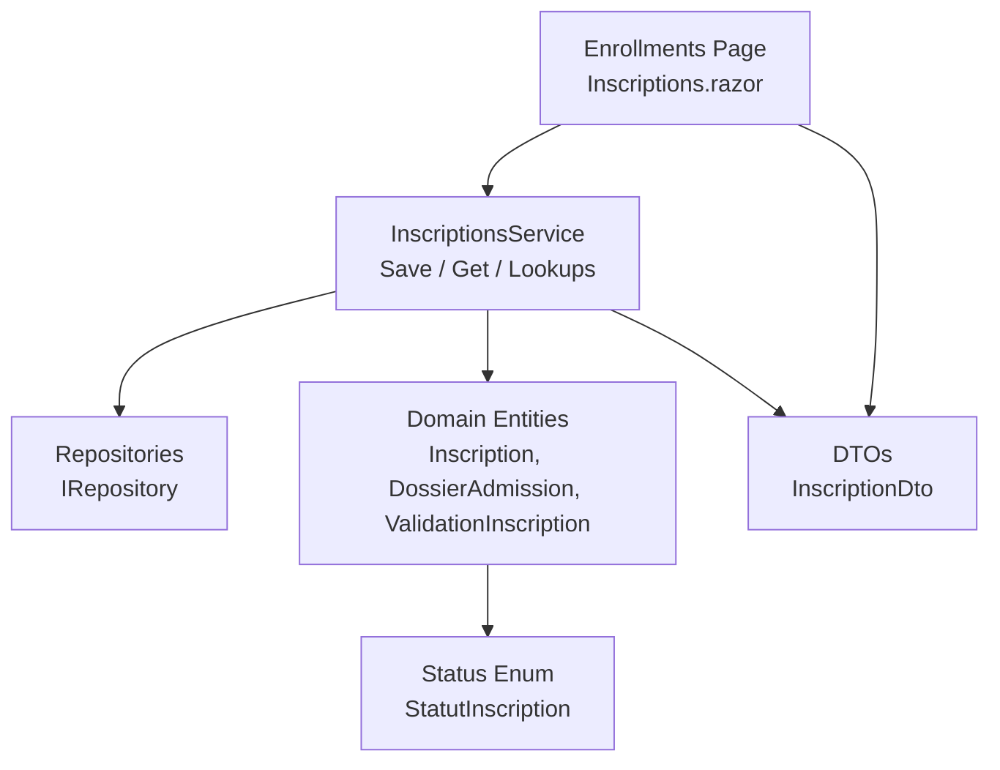
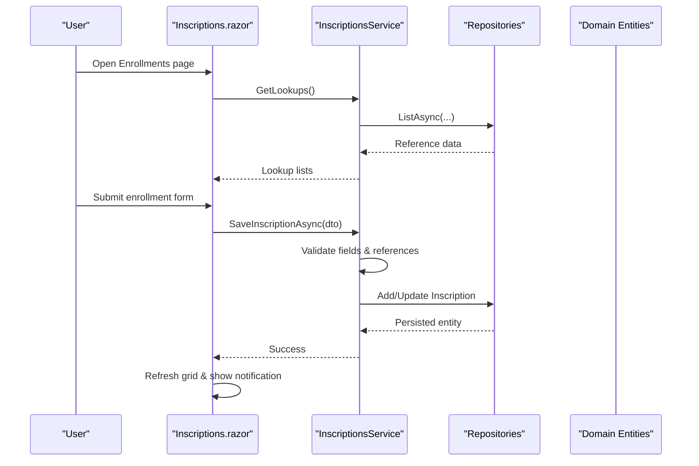
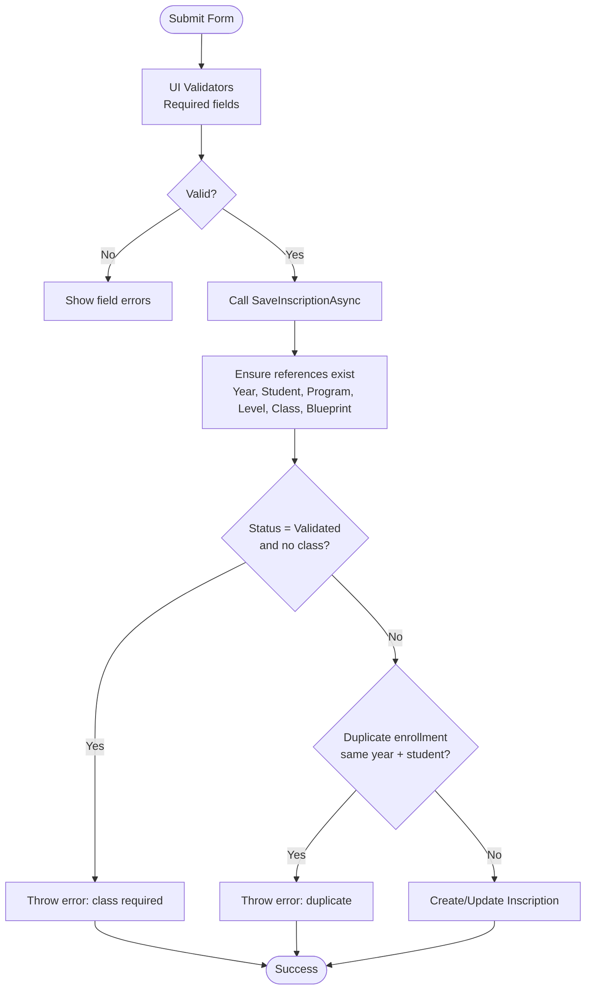
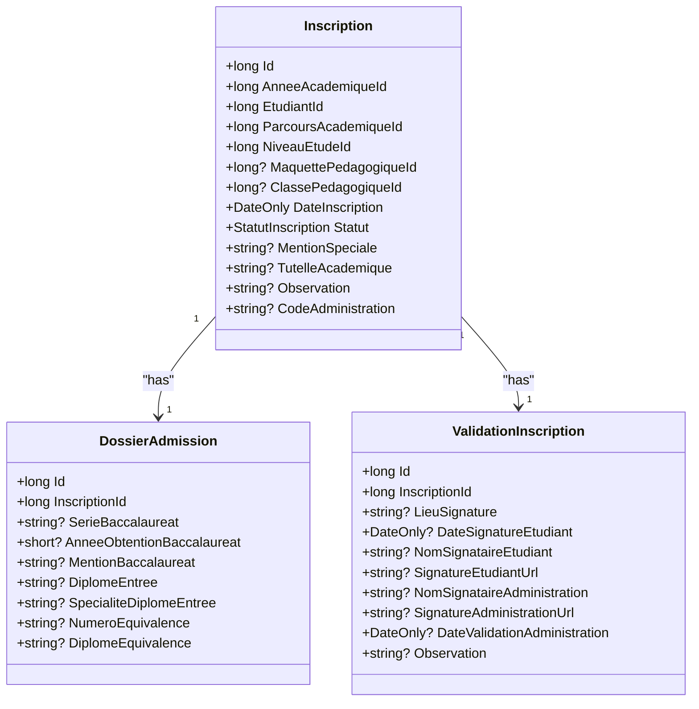
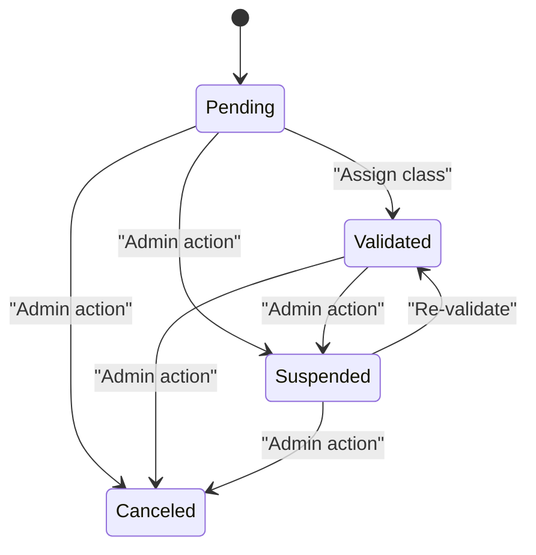
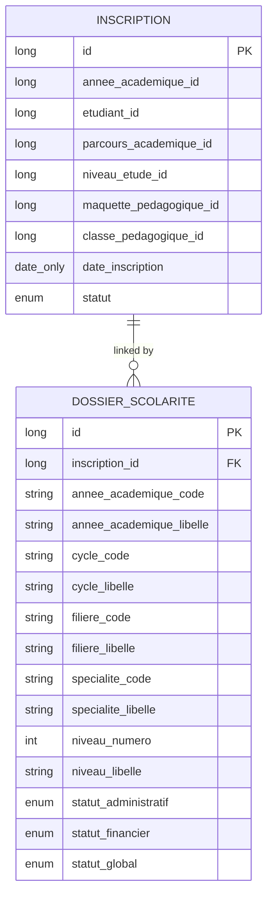
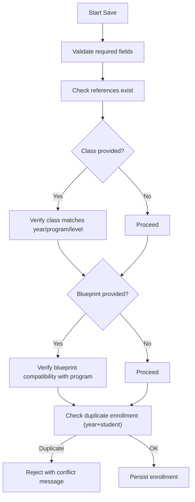
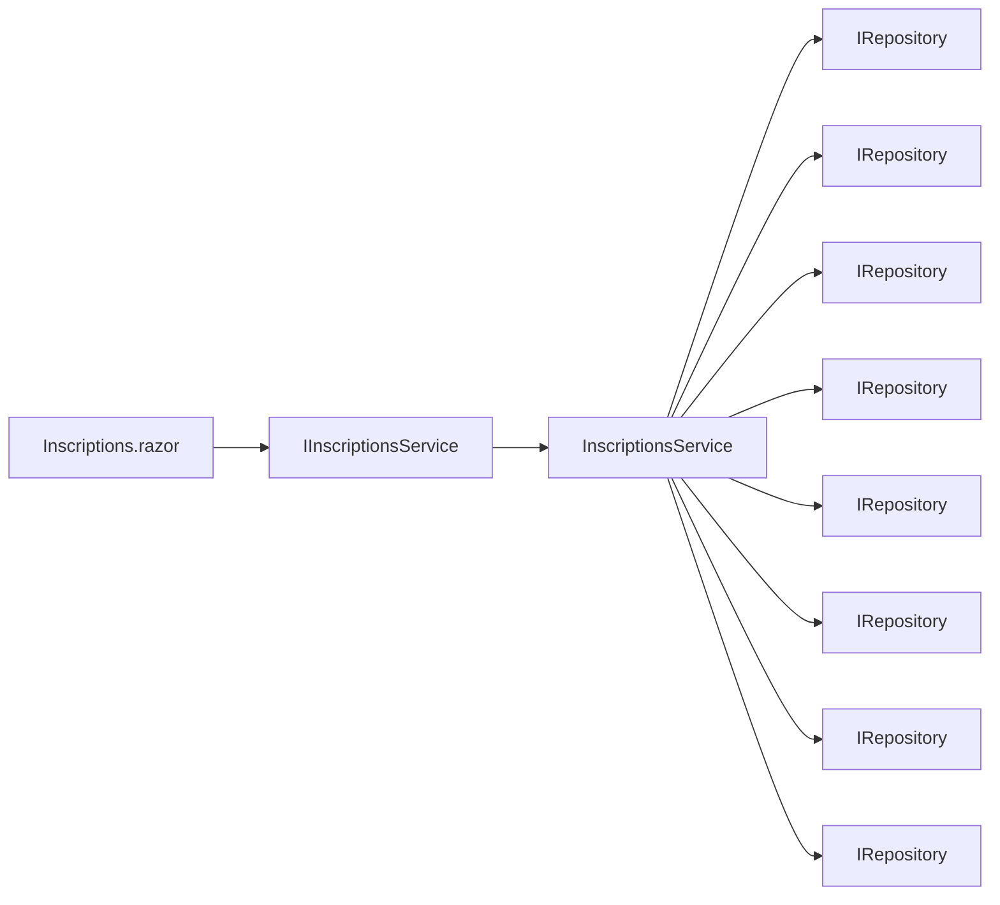

# Enrollment System UI

<cite>
**Referenced Files in This Document**
- [Inscriptions.razor](file://RIIS.Academic.Web/Components/Pages/Inscriptions.razor)
- [IInscriptionsService.cs](file://RIIS.Academic.Application/Inscriptions/Services/IInscriptionsService.cs)
- [InscriptionsService.cs](file://RIIS.Academic.Application/Inscriptions/Services/InscriptionsService.cs)
- [InscriptionDto.cs](file://RIIS.Academic.Application/Inscriptions/Dtos/InscriptionDto.cs)
- [Inscription.cs](file://RIIS.Academic.Domain/Inscriptions/Inscription.cs)
- [DossierAdmission.cs](file://RIIS.Academic.Domain/Inscriptions/DossierAdmission.cs)
- [ValidationInscription.cs](file://RIIS.Academic.Domain/Inscriptions/ValidationInscription.cs)
- [StatutInscription.cs](file://RIIS.Academic.Domain/Enums/StatutInscription.cs)
- [DossierScolarite.cs](file://RIIS.Academic.Domain/Scolarite/DossierScolarite.cs)
</cite>

## Table of Contents
1. Introduction
2. Project Structure
3. Core Components
4. Architecture Overview
5. Detailed Component Analysis
6. Dependency Analysis
7. Performance Considerations
8. Troubleshooting Guide
9. Conclusion

## Introduction
This document describes the enrollment system user interface and its integration with backend services. It explains the admission workflow, registration forms, validation processes, status tracking, and how enrollment data connects to administrative dossiers and approvals. It also covers examples for batch enrollment processing, eligibility checks, and conflict resolution based on the implemented logic.

## Project Structure
The enrollment feature spans three layers:
- Web UI (Blazor): A page that lists enrollments, filters them, and provides a form to create or edit an enrollment.
- Application Services: Business rules for loading lookups, saving enrollments, enforcing constraints, and transforming domain entities to DTOs.
- Domain Models: Core entities representing enrollments, admission files, validations, and related academic references.

**Diagram sources**
- [Inscriptions.razor:1-351](file://RIIS.Academic.Web/Components/Pages/Inscriptions.razor#L1-L351)
- [InscriptionsService.cs:1-457](file://RIIS.Academic.Application/Inscriptions/Services/InscriptionsService.cs#L1-L457)
- [Inscription.cs:1-37](file://RIIS.Academic.Domain/Inscriptions/Inscription.cs#L1-L37)
- [InscriptionDto.cs:1-28](file://RIIS.Academic.Application/Inscriptions/Dtos/InscriptionDto.cs#L1-L28)
- [StatutInscription.cs:1-10](file://RIIS.Academic.Domain/Enums/StatutInscription.cs#L1-L10)

**Section sources**
- [Inscriptions.razor:1-351](file://RIIS.Academic.Web/Components/Pages/Inscriptions.razor#L1-L351)
- [InscriptionsService.cs:1-457](file://RIIS.Academic.Application/Inscriptions/Services/InscriptionsService.cs#L1-L457)
- [Inscription.cs:1-37](file://RIIS.Academic.Domain/Inscriptions/Inscription.cs#L1-L37)
- [InscriptionDto.cs:1-28](file://RIIS.Academic.Application/Inscriptions/Dtos/InscriptionDto.cs#L1-L28)
- [StatutInscription.cs:1-10](file://RIIS.Academic.Domain/Enums/StatutInscription.cs#L1-L10)

## Core Components
- Enrollment list and filter: The UI displays enrollments with columns for academic year, student, program, class, level, status, and date. Filters include academic year, cycle, level, and class.
- Registration form: Fields include academic year, student, date, status, program, level, class, pedagogical blueprint, administrative code, special mention, academic supervision, and observation.
- Status tracking: Enrollments have statuses such as pending, validated, suspended, and canceled. Validated enrollments must be assigned to a pedagogical class.
- Lookup management: The service provides dropdowns for years, students, cycles, programs, levels, classes, and blueprints.

Key responsibilities:
- UI binds form inputs to InscriptionDto and calls InscriptionsService methods to save or delete enrollments.
- Service enforces required fields, reference integrity, and business rules before persisting changes.
- Domain models define relationships between enrollment, admission file, validation record, and school dossier.

**Section sources**
- [Inscriptions.razor:16-189](file://RIIS.Academic.Web/Components/Pages/Inscriptions.razor#L16-L189)
- [Inscriptions.razor:62-165](file://RIIS.Academic.Web/Components/Pages/Inscriptions.razor#L62-L165)
- [InscriptionsService.cs:108-191](file://RIIS.Academic.Application/Inscriptions/Services/InscriptionsService.cs#L108-L191)
- [Inscription.cs:1-37](file://RIIS.Academic.Domain/Inscriptions/Inscription.cs#L1-L37)
- [StatutInscription.cs:1-10](file://RIIS.Academic.Domain/Enums/StatutInscription.cs#L1-L10)

## Architecture Overview
The UI uses dependency injection to call application services. The service coordinates repository access to read/write domain entities and returns DTOs to the UI.

**Diagram sources**
- [Inscriptions.razor:219-247](file://RIIS.Academic.Web/Components/Pages/Inscriptions.razor#L219-L247)
- [Inscriptions.razor:308-322](file://RIIS.Academic.Web/Components/Pages/Inscriptions.razor#L308-L322)
- [InscriptionsService.cs:18-73](file://RIIS.Academic.Application/Inscriptions/Services/InscriptionsService.cs#L18-L73)
- [InscriptionsService.cs:108-191](file://RIIS.Academic.Application/Inscriptions/Services/InscriptionsService.cs#L108-L191)

## Detailed Component Analysis

### Enrollment Form and Validation Flow
The form collects enrollment data and validates it both at the UI layer (required fields) and at the service layer (business rules).

**Diagram sources**
- [Inscriptions.razor:62-165](file://RIIS.Academic.Web/Components/Pages/Inscriptions.razor#L62-L165)
- [InscriptionsService.cs:108-191](file://RIIS.Academic.Application/Inscriptions/Services/InscriptionsService.cs#L108-L191)
- [InscriptionsService.cs:313-382](file://RIIS.Academic.Application/Inscriptions/Services/InscriptionsService.cs#L313-L382)

**Section sources**
- [Inscriptions.razor:62-165](file://RIIS.Academic.Web/Components/Pages/Inscriptions.razor#L62-L165)
- [InscriptionsService.cs:108-191](file://RIIS.Academic.Application/Inscriptions/Services/InscriptionsService.cs#L108-L191)
- [InscriptionsService.cs:313-382](file://RIIS.Academic.Application/Inscriptions/Services/InscriptionsService.cs#L313-L382)

### Admission Workflow and Approval Records
An enrollment can be linked to an admission file and a validation record. These support signature capture and administrative approval dates.

**Diagram sources**
- [Inscription.cs:1-37](file://RIIS.Academic.Domain/Inscriptions/Inscription.cs#L1-L37)
- [DossierAdmission.cs:1-17](file://RIIS.Academic.Domain/Inscriptions/DossierAdmission.cs#L1-L17)
- [ValidationInscription.cs:1-18](file://RIIS.Academic.Domain/Inscriptions/ValidationInscription.cs#L1-L18)

**Section sources**
- [Inscription.cs:1-37](file://RIIS.Academic.Domain/Inscriptions/Inscription.cs#L1-L37)
- [DossierAdmission.cs:1-17](file://RIIS.Academic.Domain/Inscriptions/DossierAdmission.cs#L1-L17)
- [ValidationInscription.cs:1-18](file://RIIS.Academic.Domain/Inscriptions/ValidationInscription.cs#L1-L18)

### Status Tracking and Rules
Enrollment status drives workflow visibility and constraints:
- Pending: Default when creating a new enrollment.
- Validated: Requires assignment to a pedagogical class.
- Suspended/Canceled: Administrative states used to pause or cancel enrollment.

**Diagram sources**
- [StatutInscription.cs:1-10](file://RIIS.Academic.Domain/Enums/StatutInscription.cs#L1-L10)
- [InscriptionsService.cs:130-133](file://RIIS.Academic.Application/Inscriptions/Services/InscriptionsService.cs#L130-L133)

**Section sources**
- [StatutInscription.cs:1-10](file://RIIS.Academic.Domain/Enums/StatutInscription.cs#L1-L10)
- [InscriptionsService.cs:130-133](file://RIIS.Academic.Application/Inscriptions/Services/InscriptionsService.cs#L130-L133)

### Integration with School Administration Dossiers
Enrollments are linked to school dossiers which track administrative and financial status. This enables end-to-end tracking from enrollment to full administrative completion.

**Diagram sources**
- [Inscription.cs:1-37](file://RIIS.Academic.Domain/Inscriptions/Inscription.cs#L1-L37)
- [DossierScolarite.cs:1-29](file://RIIS.Academic.Domain/Scolarite/DossierScolarite.cs#L1-L29)

**Section sources**
- [DossierScolarite.cs:1-29](file://RIIS.Academic.Domain/Scolarite/DossierScolarite.cs#L1-L29)

### Eligibility Checks and Conflict Resolution
Eligibility is enforced through reference validation and uniqueness constraints:
- References must exist: academic year, student, program, level, class, and blueprint.
- Class must belong to the same academic year, program, and level as the enrollment.
- Blueprint must be compatible with the selected program.
- Duplicate enrollment prevention: An enrollment cannot exist for the same student and academic year.

**Diagram sources**
- [InscriptionsService.cs:313-382](file://RIIS.Academic.Application/Inscriptions/Services/InscriptionsService.cs#L313-L382)
- [InscriptionsService.cs:142-151](file://RIIS.Academic.Application/Inscriptions/Services/InscriptionsService.cs#L142-L151)

**Section sources**
- [InscriptionsService.cs:313-382](file://RIIS.Academic.Application/Inscriptions/Services/InscriptionsService.cs#L313-L382)
- [InscriptionsService.cs:142-151](file://RIIS.Academic.Application/Inscriptions/Services/InscriptionsService.cs#L142-L151)

### Batch Enrollment Processing Example
While the UI supports single enrollment creation/edit, batch operations can be implemented by iterating over a collection of InscriptionDto instances and calling the save method for each item. Typical steps:
- Load lookup data once per batch.
- For each row in the batch:
  - Map input to InscriptionDto.
  - Call SaveInscriptionAsync.
  - Capture success or error messages.
- Present aggregated results to the user.

Note: This pattern leverages the existing save method; no additional endpoint is required.

**Section sources**
- [InscriptionsService.cs:108-191](file://RIIS.Academic.Application/Inscriptions/Services/InscriptionsService.cs#L108-L191)

### Document Upload Capabilities
Document upload functionality is not present in the enrollment page. However, the domain includes structures for school documents and validations that can be associated with school dossiers. If needed, document uploads would integrate with the school administration module rather than the enrollment form directly.

**Section sources**
- [DossierScolarite.cs:1-29](file://RIIS.Academic.Domain/Scolarite/DossierScolarite.cs#L1-L29)

## Dependency Analysis
The enrollment feature depends on multiple domain entities and repositories. The UI depends on the service interface, while the service composes repositories to access domain data.

**Diagram sources**
- [IInscriptionsService.cs:1-32](file://RIIS.Academic.Application/Inscriptions/Services/IInscriptionsService.cs#L1-L32)
- [InscriptionsService.cs:8-16](file://RIIS.Academic.Application/Inscriptions/Services/InscriptionsService.cs#L8-L16)

**Section sources**
- [IInscriptionsService.cs:1-32](file://RIIS.Academic.Application/Inscriptions/Services/IInscriptionsService.cs#L1-L32)
- [InscriptionsService.cs:8-16](file://RIIS.Academic.Application/Inscriptions/Services/InscriptionsService.cs#L8-L16)

## Performance Considerations
- Lookups are loaded once per page initialization and reused across filters and form dropdowns.
- Filtering applies client-side state to service queries; consider server-side filtering if datasets grow large.
- Avoid repeated full-list loads inside tight loops; reuse cached lookups where possible.
- Use pagination and sorting on the grid to reduce rendering overhead.

[No sources needed since this section provides general guidance]

## Troubleshooting Guide
Common issues and resolutions:
- Missing required fields: Ensure academic year, student, program, and level are selected. The UI validators enforce these fields.
- Invalid references: Errors will indicate missing or mismatched references (year, student, program, level, class, blueprint).
- Class assignment rule: When setting status to validated, assign a pedagogical class.
- Duplicate enrollment: Prevents creating another enrollment for the same student and academic year.
- Network or persistence errors: The UI catches exceptions and shows error notifications.

Operational tips:
- Reset filters to restore default dropdowns and reload data.
- After saving, the page refreshes lookups and the enrollment list automatically.

**Section sources**
- [Inscriptions.razor:62-165](file://RIIS.Academic.Web/Components/Pages/Inscriptions.razor#L62-L165)
- [Inscriptions.razor:308-335](file://RIIS.Academic.Web/Components/Pages/Inscriptions.razor#L308-L335)
- [InscriptionsService.cs:108-191](file://RIIS.Academic.Application/Inscriptions/Services/InscriptionsService.cs#L108-L191)
- [InscriptionsService.cs:313-382](file://RIIS.Academic.Application/Inscriptions/Services/InscriptionsService.cs#L313-L382)

## Conclusion
The enrollment UI provides a clear workflow for creating and managing student enrollments with robust validation and status tracking. The service layer enforces eligibility and conflict resolution, ensuring data integrity. While document uploads are not part of the enrollment page, the domain supports linking enrollments to school dossiers for comprehensive administrative workflows. Batch operations can be implemented using the existing save method to process multiple enrollments efficiently.

[No sources needed since this section summarizes without analyzing specific files]