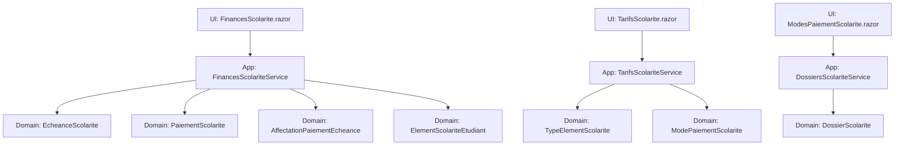
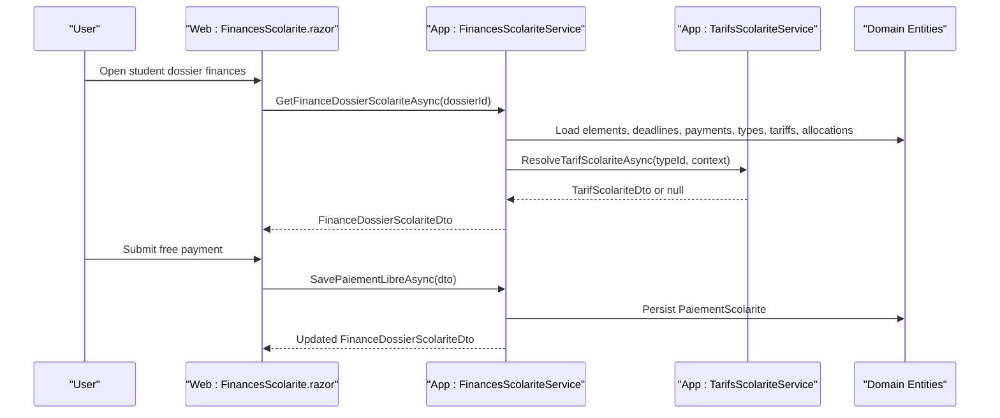
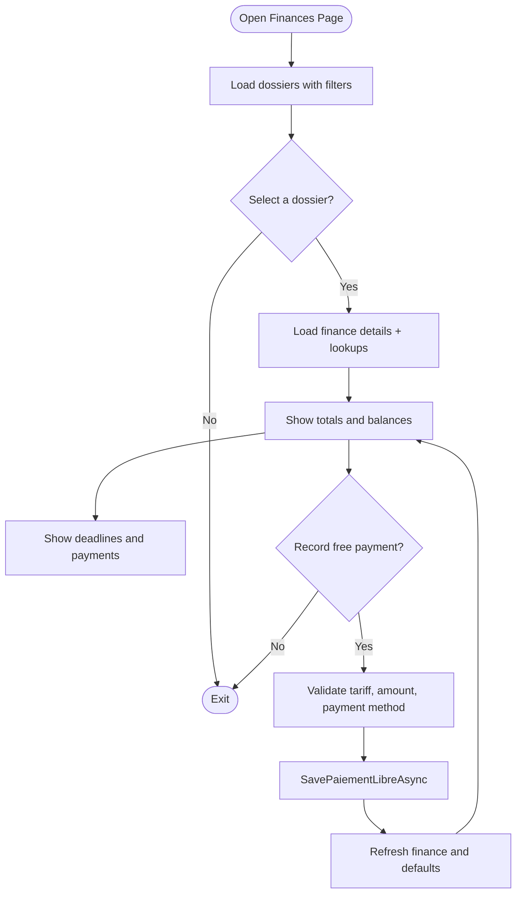
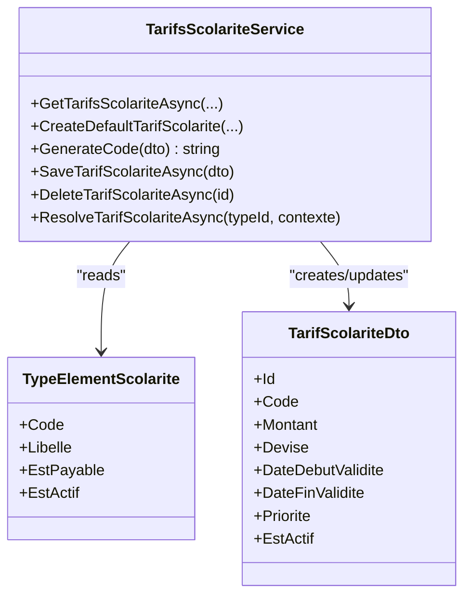
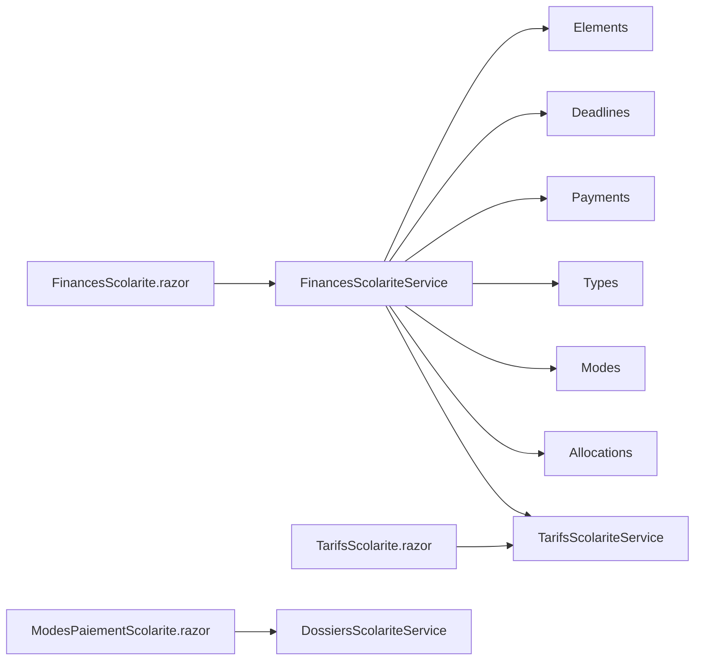

# Financial Administration UI

<cite>
**Referenced Files in This Document**
- [FinancesScolarite.razor](file://RIIS.Academic.Web/Components/Pages/Scolarite/FinancesScolarite.razor)
- [TarifsScolarite.razor](file://RIIS.Academic.Web/Components/Pages/Scolarite/TarifsScolarite.razor)
- [ModesPaiementScolarite.razor](file://RIIS.Academic.Web/Components/Pages/Scolarite/ModesPaiementScolarite.razor)
- [FinancesScolariteService.cs](file://RIIS.Academic.Application/Scolarite/Services/FinancesScolariteService.cs)
- [ITarifsScolariteService.cs](file://RIIS.Academic.Application/Scolarite/Services/ITarifsScolariteService.cs)
- [TarifsScolariteService.cs](file://RIIS.Academic.Application/Scolarite/Services/TarifsScolariteService.cs)
- [DossiersScolariteService.cs](file://RIIS.Academic.Application/Scolarite/Services/DossiersScolariteService.cs)
- [FinanceDossierScolariteDto.cs](file://RIIS.Academic.Application/Scolarite/Dtos/FinanceDossierScolariteDto.cs)
- [EcheanceScolarite.cs](file://RIIS.Academic.Domain/Scolarite/EcheanceScolarite.cs)
- [PaiementScolarite.cs](file://RIIS.Academic.Domain/Scolarite/PaiementScolarite.cs)
- [AffectationPaiementEcheance.cs](file://RIIS.Academic.Domain/Scolarite/AffectationPaiementEcheance.cs)
- [ElementScolariteEtudiant.cs](file://RIIS.Academic.Domain/Scolarite/ElementScolariteEtudiant.cs)
- [TypeElementScolarite.cs](file://RIIS.Academic.Domain/Scolarite/TypeElementScolarite.cs)
- [ModePaiementScolarite.cs](file://RIIS.Academic.Domain/Scolarite/ModePaiementScolarite.cs)
- [DossierScolarite.cs](file://RIIS.Academic.Domain/Scolarite/DossierScolarite.cs)
</cite>

## Table of Contents
1. Introduction
2. Project Structure
3. Core Components
4. Architecture Overview
5. Detailed Component Analysis
6. Dependency Analysis
7. Performance Considerations
8. Troubleshooting Guide
9. Conclusion

## Introduction
This document explains the financial administration user interface and its supporting services for tuition fee management, payment processing, invoice generation (via deadlines), and financial reporting. It covers how fees are structured, payments are recorded and allocated, and how financial status is tracked per student dossier. It also provides guidance for bulk operations and compliance reporting patterns based on the implemented domain and application logic.

## Project Structure
The financial administration feature spans three layers:
- Web UI (Blazor pages):
  - FinancesScolarite.razor: Student dossier financial overview, free payments, deadlines, and payments list.
  - TarifsScolarite.razor: Tuition fee configuration by academic year, cycle, level, department, and specialty.
  - ModesPaiementScolarite.razor: Payment method configuration used when recording payments.
- Application Services:
  - FinancesScolariteService: Reads/writes payments, builds financial summaries, resolves applicable tariffs.
  - TarifsScolariteService: CRUD and resolution of tariffs with context-based selection and code generation.
  - DossiersScolariteService: Dossier lifecycle, administrative validation, and status recalculation that influences financial status.
- Domain Models:
  - EcheanceScolarite: Installment/deadline per student element.
  - PaiementScolarite: Recorded payment with amounts and status.
  - AffectationPaiementEcheance: Allocation of a payment to a deadline.
  - ElementScolariteEtudiant: Per-student financial elements with expected, allocated, and remaining amounts.
  - TypeElementScolarite: Fee categories and flags (e.g., payable).
  - ModePaiementScolarite: Payment methods.
  - DossierScolarite: Student dossier with financial/administrative/global statuses.

**Diagram sources**
- [FinancesScolarite.razor:1-20](file://RIIS.Academic.Web/Components/Pages/Scolarite/FinancesScolarite.razor#L1-L20)
- [TarifsScolarite.razor:1-15](file://RIIS.Academic.Web/Components/Pages/Scolarite/TarifsScolarite.razor#L1-L15)
- [ModesPaiementScolarite.razor:1-13](file://RIIS.Academic.Web/Components/Pages/Scolarite/ModesPaiementScolarite.razor#L1-L13)
- [FinancesScolariteService.cs:7-15](file://RIIS.Academic.Application/Scolarite/Services/FinancesScolariteService.cs#L7-L15)
- [TarifsScolariteService.cs:10-12](file://RIIS.Academic.Application/Scolarite/Services/TarifsScolariteService.cs#L10-L12)
- [DossiersScolariteService.cs:7-21](file://RIIS.Academic.Application/Scolarite/Services/DossiersScolariteService.cs#L7-L21)
- [EcheanceScolarite.cs:1-20](file://RIIS.Academic.Domain/Scolarite/EcheanceScolarite.cs#L1-L20)
- [PaiementScolarite.cs:1-29](file://RIIS.Academic.Domain/Scolarite/PaiementScolarite.cs#L1-L29)
- [AffectationPaiementEcheance.cs:1-15](file://RIIS.Academic.Domain/Scolarite/AffectationPaiementEcheance.cs#L1-L15)
- [ElementScolariteEtudiant.cs:1-26](file://RIIS.Academic.Domain/Scolarite/ElementScolariteEtudiant.cs#L1-L26)
- [TypeElementScolarite.cs:1-19](file://RIIS.Academic.Domain/Scolarite/TypeElementScolarite.cs#L1-L19)
- [ModePaiementScolarite.cs:1-13](file://RIIS.Academic.Domain/Scolarite/ModePaiementScolarite.cs#L1-L13)
- [DossierScolarite.cs:1-29](file://RIIS.Academic.Domain/Scolarite/DossierScolarite.cs#L1-L29)

**Section sources**
- [FinancesScolarite.razor:1-20](file://RIIS.Academic.Web/Components/Pages/Scolarite/FinancesScolarite.razor#L1-L20)
- [TarifsScolarite.razor:1-15](file://RIIS.Academic.Web/Components/Pages/Scolarite/TarifsScolarite.razor#L1-L15)
- [ModesPaiementScolarite.razor:1-13](file://RIIS.Academic.Web/Components/Pages/Scolarite/ModesPaiementScolarite.razor#L1-L13)
- [FinancesScolariteService.cs:7-15](file://RIIS.Academic.Application/Scolarite/Services/FinancesScolariteService.cs#L7-L15)
- [TarifsScolariteService.cs:10-12](file://RIIS.Academic.Application/Scolarite/Services/TarifsScolariteService.cs#L10-L12)
- [DossiersScolariteService.cs:7-21](file://RIIS.Academic.Application/Scolarite/Services/DossiersScolariteService.cs#L7-L21)

## Core Components
- Financial dashboard per student dossier:
  - Displays totals expected, paid, remaining balance, and unallocated payments.
  - Lists deadlines and payments; supports free payment entry tied to an applicable tariff and payment method.
- Tariff management:
  - Create/edit/delete tariffs scoped by academic year, cycle, level, department, specialty.
  - Generates stable codes and enforces uniqueness and validity windows.
- Payment methods:
  - Configure active/inactive modes used when recording payments.
- Status tracking:
  - Dossier financial status reflects administrative completeness and initial payment presence.

Key behaviors:
- Free payment creation validates amount, type/tarif applicability, and active payment mode.
- Financial summary aggregates payments, deadlines, and allocations.
- Tariff resolution selects the most specific active tariff valid at reference date.

**Section sources**
- [FinancesScolarite.razor:105-284](file://RIIS.Academic.Web/Components/Pages/Scolarite/FinancesScolarite.razor#L105-L284)
- [FinancesScolariteService.cs:17-141](file://RIIS.Academic.Application/Scolarite/Services/FinancesScolariteService.cs#L17-L141)
- [TarifsScolariteService.cs:14-238](file://RIIS.Academic.Application/Scolarite/Services/TarifsScolariteService.cs#L14-L238)
- [DossiersScolariteService.cs:254-275](file://RIIS.Academic.Application/Scolarite/Services/DossiersScolariteService.cs#L254-L275)

## Architecture Overview
The UI calls application services which coordinate domain entities and repositories. The financial service composes data from multiple domain tables to present a unified view and persists new payments. Tariff service encapsulates business rules for tariff selection and persistence.

**Diagram sources**
- [FinancesScolarite.razor:312-439](file://RIIS.Academic.Web/Components/Pages/Scolarite/FinancesScolarite.razor#L312-L439)
- [FinancesScolariteService.cs:17-141](file://RIIS.Academic.Application/Scolarite/Services/FinancesScolariteService.cs#L17-L141)
- [TarifsScolariteService.cs:195-238](file://RIIS.Academic.Application/Scolarite/Services/TarifsScolariteService.cs#L195-L238)

## Detailed Component Analysis

### Financial Dashboard (FinancesScolarite.razor)
Responsibilities:
- Filter student dossiers by name/matricule, academic year, cycle, level, department, specialty.
- Show financial KPIs: total expected, total paid, remaining balance, unallocated payments.
- Display deadlines and payments; enable free payment entry with tariff and payment method selection.
- Refresh lookups and defaults after saving payments.

Key interactions:
- Loads dossier list via DossiersScolariteService.
- Loads finance details and payment options via FinancesScolariteService.
- Loads available payment methods via ModesPaiementScolariteService.

**Diagram sources**
- [FinancesScolarite.razor:312-439](file://RIIS.Academic.Web/Components/Pages/Scolarite/FinancesScolarite.razor#L312-L439)
- [FinancesScolariteService.cs:58-141](file://RIIS.Academic.Application/Scolarite/Services/FinancesScolariteService.cs#L58-L141)

**Section sources**
- [FinancesScolarite.razor:105-284](file://RIIS.Academic.Web/Components/Pages/Scolarite/FinancesScolarite.razor#L105-L284)
- [FinancesScolarite.razor:312-439](file://RIIS.Academic.Web/Components/Pages/Scolarite/FinancesScolarite.razor#L312-L439)

### Tariff Management (TarifsScolarite.razor + TarifsScolariteService)
Responsibilities:
- List, create, edit, delete tariffs filtered by type, academic year, and inclusion of inactive entries.
- Generate stable tariff codes and enforce uniqueness per context and start date.
- Resolve the applicable tariff for a given student context and reference date.

Business rules:
- Amount must be positive; currency required; validity window enforced.
- Specificity scoring prioritizes narrower contexts (cycle, level, department, specialty).
- Duplicate prevention across identical context and start date.

**Diagram sources**
- [TarifsScolariteService.cs:10-12](file://RIIS.Academic.Application/Scolarite/Services/TarifsScolariteService.cs#L10-L12)
- [TarifsScolariteService.cs:14-238](file://RIIS.Academic.Application/Scolarite/Services/TarifsScolariteService.cs#L14-L238)
- [TypeElementScolarite.cs:1-19](file://RIIS.Academic.Domain/Scolarite/TypeElementScolarite.cs#L1-L19)

**Section sources**
- [TarifsScolarite.razor:223-256](file://RIIS.Academic.Web/Components/Pages/Scolarite/TarifsScolarite.razor#L223-L256)
- [TarifsScolarite.razor:275-373](file://RIIS.Academic.Web/Components/Pages/Scolarite/TarifsScolarite.razor#L275-L373)
- [TarifsScolariteService.cs:14-238](file://RIIS.Academic.Application/Scolarite/Services/TarifsScolariteService.cs#L14-L238)

### Payment Methods (ModesPaiementScolarite.razor)
Responsibilities:
- Configure payment methods with code, label, display order, and active flag.
- Used when recording payments to capture how funds were received.

Usage:
- Listed in the financial dashboard to select during free payment entry.

**Section sources**
- [ModesPaiementScolarite.razor:64-81](file://RIIS.Academic.Web/Components/Pages/Scolarite/ModesPaiementScolarite.razor#L64-L81)
- [ModesPaiementScolarite.razor:92-142](file://RIIS.Academic.Web/Components/Pages/Scolarite/ModesPaiementScolarite.razor#L92-L142)

### Financial Status Tracking (DossiersScolariteService)
Responsibilities:
- Recalculate administrative and financial statuses based on mandatory documents and initial payments.
- Influence global progression permissions based on completion and payments.

Status logic highlights:
- Financial status transitions reflect whether an initial payment exists.
- Administrative completeness drives “regular” vs “incomplete”.

**Section sources**
- [DossiersScolariteService.cs:254-275](file://RIIS.Academic.Application/Scolarite/Services/DossiersScolariteService.cs#L254-L275)

## Dependency Analysis
- FinancesScolarite.razor depends on:
  - IDossiersScolariteService for listing dossiers.
  - IFinancesScolariteService for finance details and payment operations.
  - IModesPaiementScolariteService for available payment methods.
- FinancesScolariteService depends on:
  - Repositories for elements, deadlines, payments, types, modes, allocations.
  - ITarifsScolariteService to resolve applicable tariffs.
- TarifsScolariteService depends on:
  - Repositories for tariffs and types.
  - Encapsulates tariff code generation and specificity rules.

**Diagram sources**
- [FinancesScolarite.razor:1-6](file://RIIS.Academic.Web/Components/Pages/Scolarite/FinancesScolarite.razor#L1-L6)
- [FinancesScolariteService.cs:7-15](file://RIIS.Academic.Application/Scolarite/Services/FinancesScolariteService.cs#L7-L15)
- [TarifsScolariteService.cs:10-12](file://RIIS.Academic.Application/Scolarite/Services/TarifsScolariteService.cs#L10-L12)
- [DossiersScolariteService.cs:7-21](file://RIIS.Academic.Application/Scolarite/Services/DossiersScolariteService.cs#L7-L21)

**Section sources**
- [FinancesScolarite.razor:1-6](file://RIIS.Academic.Web/Components/Pages/Scolarite/FinancesScolarite.razor#L1-L6)
- [FinancesScolariteService.cs:7-15](file://RIIS.Academic.Application/Scolarite/Services/FinancesScolariteService.cs#L7-L15)
- [TarifsScolariteService.cs:10-12](file://RIIS.Academic.Application/Scolarite/Services/TarifsScolariteService.cs#L10-L12)
- [DossiersScolariteService.cs:7-21](file://RIIS.Academic.Application/Scolarite/Services/DossiersScolariteService.cs#L7-L21)

## Performance Considerations
- Data loading strategy:
  - The financial service loads all related entities into memory and filters locally. For large datasets, consider server-side filtering/pagination or query composition to reduce memory usage.
- Tariff resolution:
  - Resolution scans active tariffs and applies specificity scoring. Indexing by type, academic year, and context fields can improve lookup performance.
- UI responsiveness:
  - Debounce filter changes and avoid unnecessary reloads when selecting the same dossier.
- Bulk operations:
  - For bulk payment processing, batch DTO submissions and minimize round-trips by grouping operations on the service layer.

[No sources needed since this section provides general guidance]

## Troubleshooting Guide
Common issues and resolutions:
- No payable elements available:
  - Ensure at least one active, payable type element exists and has an applicable tariff for the selected dossier context.
- No active payment methods:
  - Create an active payment method before recording payments.
- Invalid tariff selection:
  - The selected tariff must match the currently applicable tariff for the dossier; re-select if it changed.
- Negative or zero payment amount:
  - Amount must be greater than zero.
- Inconsistent tariff after save:
  - Re-fetch finance details to refresh defaults and ensure UI state consistency.

Error handling references:
- Validation errors thrown during payment saving and tariff operations propagate to the UI notifications.

**Section sources**
- [FinancesScolarite.razor:174-187](file://RIIS.Academic.Web/Components/Pages/Scolarite/FinancesScolarite.razor#L174-L187)
- [FinancesScolariteService.cs:58-141](file://RIIS.Academic.Application/Scolarite/Services/FinancesScolariteService.cs#L58-L141)
- [TarifsScolariteService.cs:107-185](file://RIIS.Academic.Application/Scolarite/Services/TarifsScolariteService.cs#L107-L185)

## Conclusion
The financial administration UI provides a comprehensive workflow for managing tuition fees, recording payments, generating deadlines, and tracking financial status. Tariff resolution ensures correct fee application based on academic context, while status recalculation keeps dossiers aligned with administrative and financial requirements. For scalability and compliance, consider enhancing server-side queries for large datasets and adding export/reporting endpoints for audit and reconciliation.

[No sources needed since this section summarizes without analyzing specific files]