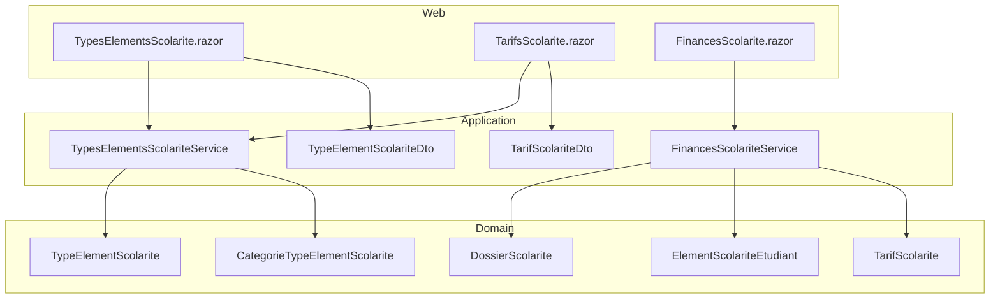
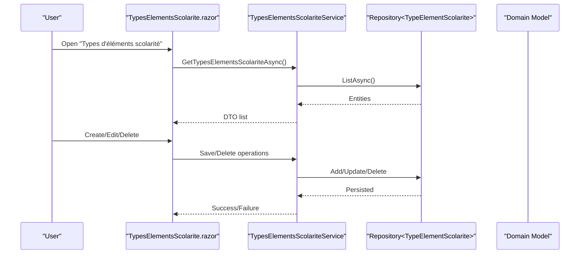
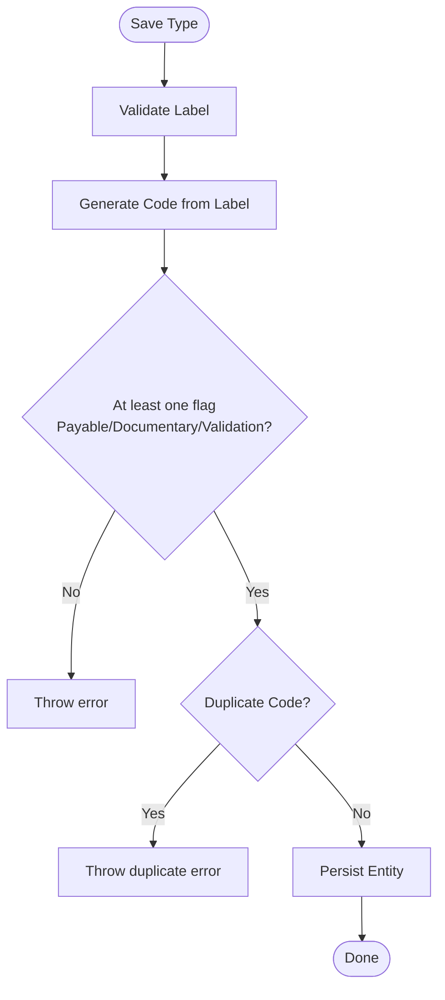
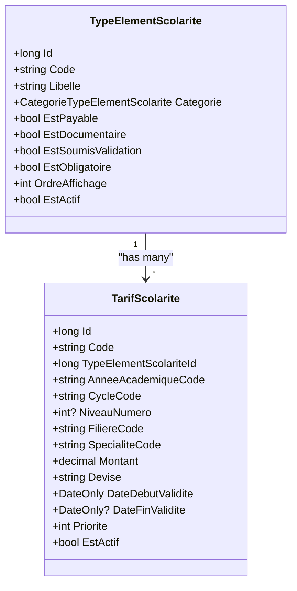
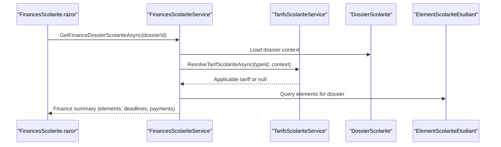
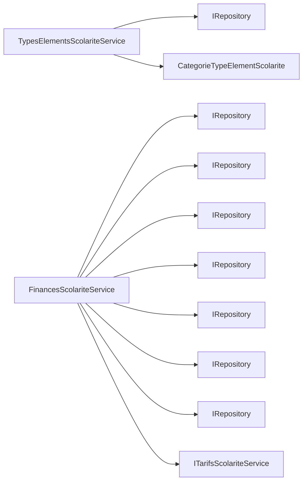

# Financial Elements Types

<cite>
**Referenced Files in This Document**
- [TypeElementScolarite.cs](file://RIIS.Academic.Domain/Scolarite/TypeElementScolarite.cs)
- [CategorieTypeElementScolarite.cs](file://RIIS.Academic.Domain/Enums/CategorieTypeElementScolarite.cs)
- [TarifScolarite.cs](file://RIIS.Academic.Domain/Scolarite/TarifScolarite.cs)
- [ElementScolariteEtudiant.cs](file://RIIS.Academic.Domain/Scolarite/ElementScolariteEtudiant.cs)
- [DossierScolarite.cs](file://RIIS.Academic.Domain/Scolarite/DossierScolarite.cs)
- [TypeElementScolariteDto.cs](file://RIIS.Academic.Application/Scolarite/Dtos/TypeElementScolariteDto.cs)
- [TarifScolariteDto.cs](file://RIIS.Academic.Application/Scolarite/Dtos/TarifScolariteDto.cs)
- [ITypesElementsScolariteService.cs](file://RIIS.Academic.Application/Scolarite/Services/ITypesElementsScolariteService.cs)
- [TypesElementsScolariteService.cs](file://RIIS.Academic.Application/Scolarite/Services/TypesElementsScolariteService.cs)
- [FinancesScolariteService.cs](file://RIIS.Academic.Application/Scolarite/Services/FinancesScolariteService.cs)
- [TypesElementsScolarite.razor](file://RIIS.Academic.Web/Components/Pages/Scolarite/TypesElementsScolarite.razor)
- [TarifsScolarite.razor](file://RIIS.Academic.Web/Components/Pages/Scolarite/TarifsScolarite.razor)
- [FinancesScolarite.razor](file://RIIS.Academic.Web/Components/Pages/Scolarite/FinancesScolarite.razor)
</cite>

## Table of Contents
1. [Introduction](#introduction)
2. [Project Structure](#project-structure)
3. [Core Components](#core-components)
4. [Architecture Overview](#architecture-overview)
5. [Detailed Component Analysis](#detailed-component-analysis)
6. [Dependency Analysis](#dependency-analysis)
7. [Performance Considerations](#performance-considerations)
8. [Troubleshooting Guide](#troubleshooting-guide)
9. [Conclusion](#conclusion)
10. [Appendices](#appendices)

## Introduction
This document explains the financial elements types management interface and how it integrates with student profiles to automatically assign fees based on academic program context (academic year, cycle, level, major, specialization). It covers:
- Configuration of element categories (tuition fees, registration fees, examination fees, miscellaneous charges)
- Categorization system and default values
- Calculation rules for applicable amounts via tariffs
- Creating new element types and configuring recurring charges
- Defining conditional fee applications by academic context
- Integration points with student dossiers and automatic fee assignment

## Project Structure
The feature spans Domain, Application, and Web layers:
- Domain models define element types, tariffs, and student financial elements
- Application services implement CRUD, validation, code generation, and tariff resolution
- Web pages provide UI for managing element types, tariffs, and student finances

**Diagram sources**
- [TypesElementsScolarite.razor:1-265](file://RIIS.Academic.Web/Components/Pages/Scolarite/TypesElementsScolarite.razor#L1-L265)
- [TarifsScolarite.razor:1-560](file://RIIS.Academic.Web/Components/Pages/Scolarite/TarifsScolarite.razor#L1-L560)
- [FinancesScolarite.razor:1-604](file://RIIS.Academic.Web/Components/Pages/Scolarite/FinancesScolarite.razor#L1-L604)
- [TypesElementsScolariteService.cs:1-172](file://RIIS.Academic.Application/Scolarite/Services/TypesElementsScolariteService.cs#L1-L172)
- [FinancesScolariteService.cs:1-361](file://RIIS.Academic.Application/Scolarite/Services/FinancesScolariteService.cs#L1-L361)
- [TypeElementScolarite.cs:1-19](file://RIIS.Academic.Domain/Scolarite/TypeElementScolarite.cs#L1-L19)
- [TarifScolarite.cs:1-22](file://RIIS.Academic.Domain/Scolarite/TarifScolarite.cs#L1-L22)
- [ElementScolariteEtudiant.cs:1-26](file://RIIS.Academic.Domain/Scolarite/ElementScolariteEtudiant.cs#L1-L26)
- [DossierScolarite.cs:1-29](file://RIIS.Academic.Domain/Scolarite/DossierScolarite.cs#L1-L29)
- [CategorieTypeElementScolarite.cs:1-11](file://RIIS.Academic.Domain/Enums/CategorieTypeElementScolarite.cs#L1-L11)

**Section sources**
- [TypesElementsScolarite.razor:1-265](file://RIIS.Academic.Web/Components/Pages/Scolarite/TypesElementsScolarite.razor#L1-L265)
- [TarifsScolarite.razor:1-560](file://RIIS.Academic.Web/Components/Pages/Scolarite/TarifsScolarite.razor#L1-L560)
- [FinancesScolarite.razor:1-604](file://RIIS.Academic.Web/Components/Pages/Scolarite/FinancesScolarite.razor#L1-L604)
- [TypesElementsScolariteService.cs:1-172](file://RIIS.Academic.Application/Scolarite/Services/TypesElementsScolariteService.cs#L1-L172)
- [FinancesScolariteService.cs:1-361](file://RIIS.Academic.Application/Scolarite/Services/FinancesScolariteService.cs#L1-L361)
- [TypeElementScolarite.cs:1-19](file://RIIS.Academic.Domain/Scolarite/TypeElementScolarite.cs#L1-L19)
- [TarifScolarite.cs:1-22](file://RIIS.Academic.Domain/Scolarite/TarifScolarite.cs#L1-L22)
- [ElementScolariteEtudiant.cs:1-26](file://RIIS.Academic.Domain/Scolarite/ElementScolariteEtudiant.cs#L1-L26)
- [DossierScolarite.cs:1-29](file://RIIS.Academic.Domain/Scolarite/DossierScolarite.cs#L1-L29)
- [CategorieTypeElementScolarite.cs:1-11](file://RIIS.Academic.Domain/Enums/CategorieTypeElementScolarite.cs#L1-L11)

## Core Components
- Element type model defines the financial element category and behavior flags (payable, documentary, validation-required, mandatory, active, display order).
- Tariff model binds an element type to a monetary amount with contextual filters (academic year, cycle, level, major, specialization), validity dates, priority, and currency.
- Student financial element records track expected, assigned, and remaining amounts per student dossier, along with status and audit timestamps.
- Student dossier aggregates academic context used to resolve applicable tariffs.

Key responsibilities:
- TypesElementsScolariteService: CRUD for element types, default creation, code generation from label, validation constraints, persistence.
- FinancesScolariteService: Resolves applicable tariffs per student dossier, builds finance summaries, handles free payments, and links payments to deadlines and elements.

**Section sources**
- [TypeElementScolarite.cs:1-19](file://RIIS.Academic.Domain/Scolarite/TypeElementScolarite.cs#L1-L19)
- [TarifScolarite.cs:1-22](file://RIIS.Academic.Domain/Scolarite/TarifScolarite.cs#L1-L22)
- [ElementScolariteEtudiant.cs:1-26](file://RIIS.Academic.Domain/Scolarite/ElementScolariteEtudiant.cs#L1-L26)
- [DossierScolarite.cs:1-29](file://RIIS.Academic.Domain/Scolarite/DossierScolarite.cs#L1-L29)
- [TypesElementsScolariteService.cs:1-172](file://RIIS.Academic.Application/Scolarite/Services/TypesElementsScolariteService.cs#L1-L172)
- [FinancesScolariteService.cs:1-361](file://RIIS.Academic.Application/Scolarite/Services/FinancesScolariteService.cs#L1-L361)

## Architecture Overview
The system follows clean architecture:
- Web pages orchestrate user interactions and call application services
- Application services enforce business rules, coordinate repositories, and map between DTOs and domain entities
- Domain models encapsulate core concepts and relationships

**Diagram sources**
- [TypesElementsScolarite.razor:1-265](file://RIIS.Academic.Web/Components/Pages/Scolarite/TypesElementsScolarite.razor#L1-L265)
- [TypesElementsScolariteService.cs:1-172](file://RIIS.Academic.Application/Scolarite/Services/TypesElementsScolariteService.cs#L1-L172)
- [TypeElementScolarite.cs:1-19](file://RIIS.Academic.Domain/Scolarite/TypeElementScolarite.cs#L1-L19)

## Detailed Component Analysis

### Element Types Management
- Categories: Fees, Documents, Validation, Service, Other.
- Behavior flags: Payable, Documentary, Submission-to-validation, Mandatory, Active.
- Display ordering controls presentation sequence.
- Default creation sets category to Fees, payable and mandatory true, active true.
- Code auto-generation derives a short code from the label; uniqueness is enforced.
- Validation ensures at least one behavior flag is set (payable/documentary/validation).

**Diagram sources**
- [TypesElementsScolariteService.cs:64-119](file://RIIS.Academic.Application/Scolarite/Services/TypesElementsScolariteService.cs#L64-L119)

**Section sources**
- [CategorieTypeElementScolarite.cs:1-11](file://RIIS.Academic.Domain/Enums/CategorieTypeElementScolarite.cs#L1-L11)
- [TypeElementScolarite.cs:1-19](file://RIIS.Academic.Domain/Scolarite/TypeElementScolarite.cs#L1-L19)
- [TypesElementsScolariteService.cs:35-85](file://RIIS.Academic.Application/Scolarite/Services/TypesElementsScolariteService.cs#L35-L85)
- [TypesElementsScolarite.razor:143-151](file://RIIS.Academic.Web/Components/Pages/Scolarite/TypesElementsScolarite.razor#L143-L151)

### Tariffs and Conditional Fee Application
- Tariffs bind an element type to a monetary amount with:
  - Academic year code
  - Cycle, level number, major, specialization codes
  - Validity start/end dates
  - Priority for selection when multiple match
  - Currency
- The UI supports filtering by element type and academic year, and displays computed context labels.
- Tariff code generation depends on selected fields; defaults include today’s date for validity start.

**Diagram sources**
- [TarifScolarite.cs:1-22](file://RIIS.Academic.Domain/Scolarite/TarifScolarite.cs#L1-L22)
- [TypeElementScolarite.cs:1-19](file://RIIS.Academic.Domain/Scolarite/TypeElementScolarite.cs#L1-L19)

**Section sources**
- [TarifsScolarite.razor:1-560](file://RIIS.Academic.Web/Components/Pages/Scolarite/TarifsScolarite.razor#L1-L560)
- [TarifScolarite.cs:1-22](file://RIIS.Academic.Domain/Scolarite/TarifScolarite.cs#L1-L22)
- [TarifScolariteDto.cs:1-23](file://RIIS.Academic.Application/Scolarite/Dtos/TarifScolariteDto.cs#L1-L23)

### Student Financial Elements and Automatic Assignment
- Each student dossier holds academic context (year, cycle, level, major, specialization).
- For each active, payable element type, the system resolves the applicable tariff using the dossier’s context and current date.
- The finance service builds a summary including total expected, paid, unpaid, and non-assigned amounts, plus deadlines and payments.

**Diagram sources**
- [FinancesScolariteService.cs:17-56](file://RIIS.Academic.Application/Scolarite/Services/FinancesScolariteService.cs#L17-L56)
- [FinancesScolariteService.cs:143-193](file://RIIS.Academic.Application/Scolarite/Services/FinancesScolariteService.cs#L143-L193)
- [FinancesScolariteService.cs:264-279](file://RIIS.Academic.Application/Scolarite/Services/FinancesScolariteService.cs#L264-L279)
- [FinancesScolarite.razor:367-390](file://RIIS.Academic.Web/Components/Pages/Scolarite/FinancesScolarite.razor#L367-L390)

**Section sources**
- [DossierScolarite.cs:1-29](file://RIIS.Academic.Domain/Scolarite/DossierScolarite.cs#L1-L29)
- [ElementScolariteEtudiant.cs:1-26](file://RIIS.Academic.Domain/Scolarite/ElementScolariteEtudiant.cs#L1-L26)
- [FinancesScolariteService.cs:17-56](file://RIIS.Academic.Application/Scolarite/Services/FinancesScolariteService.cs#L17-L56)
- [FinancesScolariteService.cs:143-193](file://RIIS.Academic.Application/Scolarite/Services/FinancesScolariteService.cs#L143-L193)
- [FinancesScolarite.razor:367-390](file://RIIS.Academic.Web/Components/Pages/Scolarite/FinancesScolarite.razor#L367-L390)

## Dependency Analysis
- TypesElementsScolariteService depends on repository abstraction for persistence and uses enums for categorization.
- FinancesScolariteService depends on multiple repositories and the tariff resolution service to compute applicable amounts per student dossier.
- Web components depend on services for data loading and actions; they also rely on reference services for dropdown options (academic years, cycles, majors, specializations).

**Diagram sources**
- [TypesElementsScolariteService.cs:9-11](file://RIIS.Academic.Application/Scolarite/Services/TypesElementsScolariteService.cs#L9-L11)
- [FinancesScolariteService.cs:7-15](file://RIIS.Academic.Application/Scolarite/Services/FinancesScolariteService.cs#L7-L15)

**Section sources**
- [TypesElementsScolariteService.cs:1-172](file://RIIS.Academic.Application/Scolarite/Services/TypesElementsScolariteService.cs#L1-L172)
- [FinancesScolariteService.cs:1-361](file://RIIS.Academic.Application/Scolarite/Services/FinancesScolariteService.cs#L1-L361)

## Performance Considerations
- Listing element types applies server-side filtering and ordering; ensure indexes on active flag and display order if datasets grow large.
- Tariff resolution per dossier may involve multiple lookups; consider caching active tariffs per academic year/context where appropriate.
- Building finance summaries aggregates multiple entity collections; batch queries and avoid N+1 patterns by preloading related data.

[No sources needed since this section provides general guidance]

## Troubleshooting Guide
Common issues and resolutions:
- Saving element type fails due to missing behavior flags: Ensure at least one of payable, documentary, or submission-to-validation is enabled.
- Duplicate code error: The generated code must be unique across existing element types.
- No payment options available for a student dossier: Verify that there are active, payable element types with tariffs matching the dossier’s academic context and validity dates.
- Payment mode inactive: Only active payment modes can be used to record payments.

**Section sources**
- [TypesElementsScolariteService.cs:71-85](file://RIIS.Academic.Application/Scolarite/Services/TypesElementsScolariteService.cs#L71-L85)
- [FinancesScolariteService.cs:62-94](file://RIIS.Academic.Application/Scolarite/Services/FinancesScolariteService.cs#L62-L94)
- [FinancesScolarite.razor:176-186](file://RIIS.Academic.Web/Components/Pages/Scolarite/FinancesScolarite.razor#L176-L186)

## Conclusion
The financial elements types management interface enables administrators to configure categories of fees and administrative requirements, attach conditional tariffs based on academic context, and integrate seamlessly with student dossiers to compute expected amounts and manage payments. Proper configuration of element types, tariffs, and academic references ensures accurate automatic fee assignment and streamlined financial workflows.

[No sources needed since this section summarizes without analyzing specific files]

## Appendices

### Configuration Examples

- Creating a new element type:
  - Navigate to “Types d’éléments scolarité” and click “Nouveau type”.
  - Provide a label; the code will be generated automatically.
  - Select category (Fees/Documents/Validation/Service/Other).
  - Enable behavior flags (Payable/Documentary/Submission-to-validation) and set Mandatory/Active as needed.
  - Save to persist.

- Setting up recurring charges:
  - Configure tariffs for the element type with:
    - Academic year code
    - Cycle, level, major, specialization codes
    - Validity start/end dates
    - Amount and currency
    - Priority to resolve conflicts
  - Use the “Tarifs scolarité” page to create/edit tariffs and filter by element type and academic year.

- Defining conditional fee applications:
  - Use tariff context fields (cycle, level, major, specialization) to restrict applicability.
  - Set validity dates to control time-based conditions.
  - Adjust priority to determine which tariff applies when multiple match.

- Integrating with student profiles and automatic assignment:
  - Ensure student dossiers have correct academic context (year, cycle, level, major, specialization).
  - The finance service resolves applicable tariffs per element type based on dossier context and current date.
  - Payments can be recorded against resolved tariffs; the system validates that selected tariffs still apply.

**Section sources**
- [TypesElementsScolarite.razor:165-204](file://RIIS.Academic.Web/Components/Pages/Scolarite/TypesElementsScolarite.razor#L165-L204)
- [TarifsScolarite.razor:292-359](file://RIIS.Academic.Web/Components/Pages/Scolarite/TarifsScolarite.razor#L292-L359)
- [FinancesScolariteService.cs:28-56](file://RIIS.Academic.Application/Scolarite/Services/FinancesScolariteService.cs#L28-L56)
- [FinancesScolariteService.cs:264-279](file://RIIS.Academic.Application/Scolarite/Services/FinancesScolariteService.cs#L264-L279)