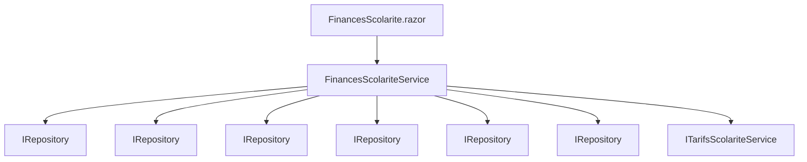
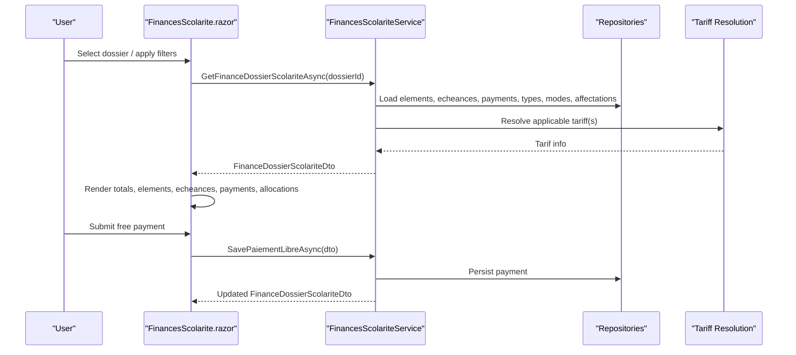
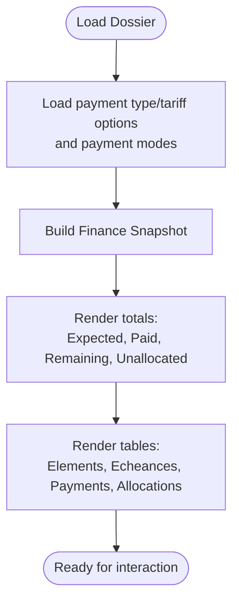
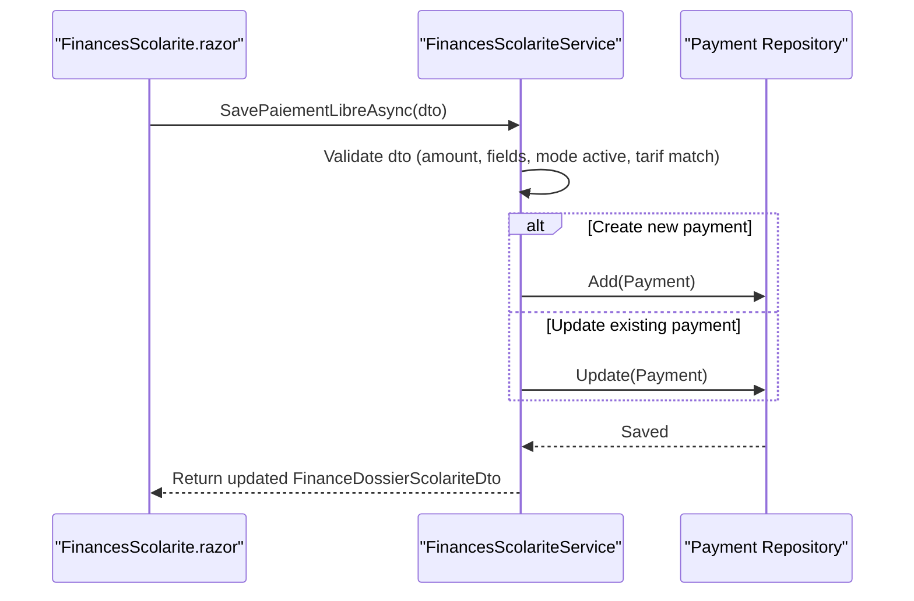
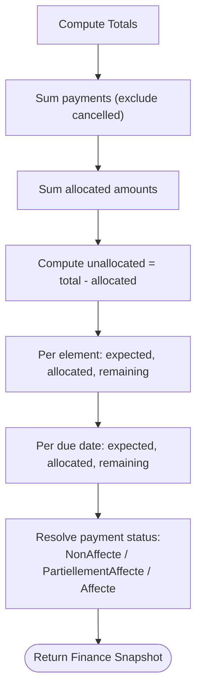
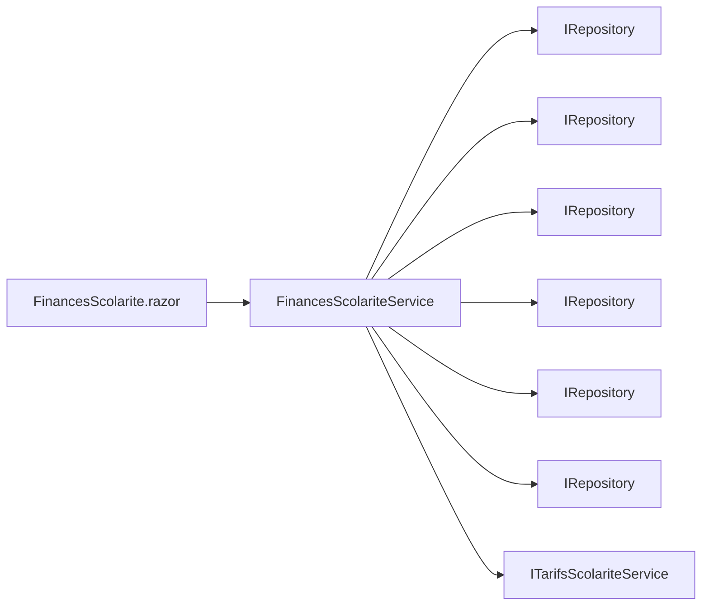

# Financial Overview Dashboard

<cite>
**Referenced Files in This Document**
- [FinancesScolarite.razor](file://RIIS.Academic.Web/Components/Pages/Scolarite/FinancesScolarite.razor)
- [FinancesScolariteService.cs](file://RIIS.Academic.Application/Scolarite/Services/FinancesScolariteService.cs)
- [FinanceDossierScolariteDto.cs](file://RIIS.Academic.Application/Scolarite/Dtos/FinanceDossierScolariteDto.cs)
- [EcheanceScolarite.cs](file://RIIS.Academic.Domain/Scolarite/EcheanceScolarite.cs)
- [PaiementScolarite.cs](file://RIIS.Academic.Domain/Scolarite/PaiementScolarite.cs)
- [ElementScolariteEtudiant.cs](file://RIIS.Academic.Domain/Scolarite/ElementScolariteEtudiant.cs)
- [AffectationPaiementEcheance.cs](file://RIIS.Academic.Domain/Scolarite/AffectationPaiementEcheance.cs)
- [ModePaiementScolariteDto.cs](file://RIIS.Academic.Application/Scolarite/Dtos/ModePaiementScolariteDto.cs)
- [RiisAcademicExportEndpointExtensions.cs](file://RIIS.Academic.Web/Extensions/RiisAcademicExportEndpointExtensions.cs)
</cite>

## Table of Contents
1. [Introduction](#introduction)
2. [Project Structure](#project-structure)
3. [Core Components](#core-components)
4. [Architecture Overview](#architecture-overview)
5. [Detailed Component Analysis](#detailed-component-analysis)
6. [Dependency Analysis](#dependency-analysis)
7. [Performance Considerations](#performance-considerations)
8. [Troubleshooting Guide](#troubleshooting-guide)
9. [Conclusion](#conclusion)
10. [Appendices](#appendices)

## Introduction
This document explains the Financial Overview Dashboard that provides real-time financial monitoring for student dossiers, including payment tracking, balance calculations, and visualization of financial statuses across all dossiers. It covers how users can filter and drill down from summary views to individual student details, record free-form payments, view due dates and remaining balances, and understand payment allocations. It also documents integration points with tariff resolution and payment modes, and clarifies current export capabilities and where future financial reporting exports could be added.

## Project Structure
The financial dashboard is implemented as a Blazor page backed by an application service and domain models:
- UI layer: FinancesScolarite.razor presents filters, a summary grid of dossiers, and a detailed panel for the selected dossier showing totals, elements, due dates, payments, and allocation history.
- Application layer: FinancesScolariteService orchestrates data retrieval and business rules for building financial summaries and saving payments.
- Domain layer: Entities such as ElementScolariteEtudiant, EcheanceScolarite, PaiementScolarite, and AffectationPaiementEcheance represent the core financial concepts.
- Dtos: FinanceDossierScolariteDto and related DTOs carry structured financial data between layers.
- Export endpoints: The web project exposes generic export endpoints; financial-specific export endpoints are not currently defined.



**Diagram sources**
- [FinancesScolarite.razor:1-604](file://RIIS.Academic.Web/Components/Pages/Scolarite/FinancesScolarite.razor#L1-L604)
- [FinancesScolariteService.cs:7-360](file://RIIS.Academic.Application/Scolarite/Services/FinancesScolariteService.cs#L7-L360)

**Section sources**
- [FinancesScolarite.razor:1-604](file://RIIS.Academic.Web/Components/Pages/Scolarite/FinancesScolarite.razor#L1-L604)
- [FinancesScolariteService.cs:7-360](file://RIIS.Academic.Application/Scolarite/Services/FinancesScolariteService.cs#L7-L360)

## Core Components
- Financial summary and detail UI: Presents filtered lists of dossiers and per-dossier financial details including totals, elements, due dates, payments, and allocations.
- Payment recording: Allows recording free-form payments with validation against active payment modes and applicable tariffs.
- Balance calculation: Computes expected amounts, paid amounts, allocated amounts, and remaining balances based on entities and allocations.
- Status visualization: Displays financial status badges and color-coded indicators for quick comprehension.

Key responsibilities:
- Load and filter dossiers for overview.
- Build finance snapshots per dossier (elements, echeances, payments, affectations).
- Validate and persist new or updated payments.
- Provide lookup options for payment types/tariffs and payment modes.

**Section sources**
- [FinancesScolarite.razor:105-284](file://RIIS.Academic.Web/Components/Pages/Scolarite/FinancesScolarite.razor#L105-L284)
- [FinancesScolariteService.cs:17-193](file://RIIS.Academic.Application/Scolarite/Services/FinancesScolariteService.cs#L17-L193)

## Architecture Overview
The dashboard follows a layered architecture:
- Presentation (Blazor): Handles user interactions, filtering, and displays financial data.
- Application: Encapsulates business logic for building financial summaries and processing payments.
- Domain: Defines entities and relationships for financial elements, due dates, payments, and allocations.
- Infrastructure (repositories): Provides persistence access via generic repository abstractions.



**Diagram sources**
- [FinancesScolarite.razor:324-439](file://RIIS.Academic.Web/Components/Pages/Scolarite/FinancesSolarite.razor#L324-L439)
- [FinancesScolariteService.cs:17-193](file://RIIS.Academic.Application/Scolarite/Services/FinancesScolariteService.cs#L17-L193)
- [FinancesScolariteService.cs:58-141](file://RIIS.Academic.Application/Scolarite/Services/FinancesScolariteService.cs#L58-L141)

## Detailed Component Analysis

### Financial Summary and Detail UI
- Filters: Name/matricule, academic year, cycle, level, filiere, specialty. Filtering updates the dossier list and resets selections when needed.
- Summary grid: Shows student name, matricule, academic year, parcours, financial status badge, and action to manage finances.
- Detail panel: When a dossier is selected, shows:
  - Totals: Expected total, received payments, remaining balance, unallocated payments.
  - Elements: Per-element expected, allocated, and remaining amounts.
  - Echeances: Due date schedule with remaining amounts.
  - Payments: List of recorded payments with mode, reference, and non-allocated amounts.
  - Allocations: History of payment-to-due-date allocations.



**Diagram sources**
- [FinancesScolarite.razor:367-401](file://RIIS.Academic.Web/Components/Pages/Scolarite/FinancesScolarite.razor#L367-L401)
- [FinancesScolariteService.cs:143-193](file://RIIS.Academic.Application/Scolarite/Services/FinancesScolariteService.cs#L143-L193)

**Section sources**
- [FinancesScolarite.razor:105-284](file://RIIS.Academic.Web/Components/Pages/Scolarite/FinancesScolarite.razor#L105-L284)

### Payment Recording and Validation
- Free-form payment entry: Users select a payable element/tarif, set date, amount, payment mode, reference, and observation.
- Validation: Ensures positive amount, required fields, active payment mode, and matching applicable tariff for the dossier context.
- Persistence: Creates or updates payment records and recalculates financial snapshot.



**Diagram sources**
- [FinancesScolarite.razor:403-439](file://RIIS.Academic.Web/Components/Pages/Scolarite/FinancesScolarite.razor#L403-L439)
- [FinancesScolariteService.cs:58-141](file://RIIS.Academic.Application/Scolarite/Services/FinancesScolariteService.cs#L58-L141)

**Section sources**
- [FinancesScolarite.razor:174-244](file://RIIS.Academic.Web/Components/Pages/Scolarite/FinancesScolarite.razor#L174-L244)
- [FinancesScolariteService.cs:58-141](file://RIIS.Academic.Application/Scolarite/Services/FinancesScolariteService.cs#L58-L141)

### Balance Calculations and Status Visualization
- Totals:
  - Total payments: Sum of payment amounts excluding cancelled entries.
  - Total allocated: Sum of amounts assigned to due dates.
  - Total unallocated: Remaining amounts not yet assigned.
- Elements:
  - Expected amount per element, allocated amount, and remaining balance.
- Echeances:
  - Due date schedule with expected, allocated, and remaining amounts.
- Statuses:
  - Payment status resolved based on allocated vs total amount.
  - Dossier financial status displayed via badges.



**Diagram sources**
- [FinancesScolariteService.cs:143-193](file://RIIS.Academic.Application/Scolarite/Services/FinancesScolariteService.cs#L143-L193)
- [FinancesScolariteService.cs:332-342](file://RIIS.Academic.Application/Scolarite/Services/FinancesScolariteService.cs#L332-L342)

**Section sources**
- [FinancesScolariteService.cs:143-193](file://RIIS.Academic.Application/Scolarite/Services/FinancesScolariteService.cs#L143-L193)
- [FinancesScolariteService.cs:332-342](file://RIIS.Academic.Application/Scolarite/Services/FinancesScolariteService.cs#L332-L342)

### Data Models and Relationships
```mermaid
erDiagram
ELEMENT {
long Id PK
long DossierScolariteId FK
long TypeElementScolariteId FK
string Code
string Libelle
decimal MontantAttendu
decimal MontantAffecte
decimal MontantRestant
enum Statut
}
ECHEANCE {
long Id PK
long ElementScolariteEtudiantId FK
int Numero
string Libelle
date DateExigibilite
decimal MontantAttendu
decimal MontantAffecte
decimal MontantRestant
enum Statut
}
PAIEMENT {
long Id PK
long DossierScolariteId FK
long? TypeElementScolariteId FK
long? TarifScolariteId FK
long? ModePaiementScolariteId FK
date DatePaiement
decimal Montant
string ModePaiement
string ReferencePaiement
string EncaissePar
string Observation
decimal MontantAffecte
decimal MontantNonAffecte
enum Statut
}
AFFECTATION {
long Id PK
long PaiementScolariteId FK
long EcheanceScolariteId FK
decimal MontantAffecte
datetime DateAffectationUtc
string AffectePar
}
ELEMENT ||--o{ ECHEANCE : "has"
PAIEMENT ||--o{ AFFECTATION : "allocates to"
ECHEANCE ||--o{ AFFECTATION : "receives"
```

**Diagram sources**
- [ElementScolariteEtudiant.cs:1-26](file://RIIS.Academic.Domain/Scolarite/ElementScolariteEtudiant.cs#L1-L26)
- [EcheanceScolarite.cs:1-20](file://RIIS.Academic.Domain/Scolarite/EcheanceScolarite.cs#L1-L20)
- [PaiementScolarite.cs:1-29](file://RIIS.Academic.Domain/Scolarite/PaiementScolarite.cs#L1-L29)
- [AffectationPaiementEcheance.cs:1-15](file://RIIS.Academic.Domain/Scolarite/AffectationPaiementEcheance.cs#L1-L15)

**Section sources**
- [ElementScolariteEtudiant.cs:1-26](file://RIIS.Academic.Domain/Scolarite/ElementScolariteEtudiant.cs#L1-L26)
- [EcheanceScolarite.cs:1-20](file://RIIS.Academic.Domain/Scolarite/EcheanceScolarite.cs#L1-L20)
- [PaiementScolarite.cs:1-29](file://RIIS.Academic.Domain/Scolarite/PaiementScolarite.cs#L1-L29)
- [AffectationPaiementEcheance.cs:1-15](file://RIIS.Academic.Domain/Scolarite/AffectationPaiementEcheance.cs#L1-L15)

### Integration Points
- Tariff resolution: The service resolves applicable tariffs per dossier using context (academic year, cycle, level, filiere, specialty, reference date).
- Payment modes: Only active payment modes are allowed for recording payments.
- Lookups: Payment type/tarif options are derived from active and payable element types with resolved tariffs.

**Section sources**
- [FinancesScolariteService.cs:28-56](file://RIIS.Academic.Application/Scolarite/Services/FinancesScolariteService.cs#L28-L56)
- [FinancesScolariteService.cs:264-279](file://RIIS.Academic.Application/Scolarite/Services/FinancesScolariteService.cs#L264-L279)
- [ModePaiementScolariteDto.cs:1-11](file://RIIS.Academic.Application/Scolarite/Dtos/ModePaiementScolariteDto.cs#L1-L11)

## Dependency Analysis
- UI depends on services for data loading and actions.
- Service depends on multiple repositories and tariff resolution service.
- Domain entities define relationships and state transitions for financial data.



**Diagram sources**
- [FinancesScolarite.razor:1-604](file://RIIS.Academic.Web/Components/Pages/Scolarite/FinancesScolarite.razor#L1-L604)
- [FinancesScolariteService.cs:7-360](file://RIIS.Academic.Application/Scolarite/Services/FinancesScolariteService.cs#L7-L360)

**Section sources**
- [FinancesScolariteService.cs:7-360](file://RIIS.Academic.Application/Scolarite/Services/FinancesScolariteService.cs#L7-L360)

## Performance Considerations
- Aggregation queries: Totals and sums are computed over collections; consider indexing on foreign keys (DossierScolariteId, ElementScolariteEtudiantId) for faster filtering.
- N+1 risks: Tariff lookups are batched by distinct IDs to reduce repeated calls.
- Caching opportunities: Lookup options (payment modes, element types) could be cached if frequently accessed.
- Pagination: UI uses paging for grids to limit rendering overhead.

[No sources needed since this section provides general guidance]

## Troubleshooting Guide
Common issues and resolutions:
- Missing payment modes: Ensure at least one active payment mode exists before recording payments.
- Invalid tariff selection: The system validates that the selected tariff matches the applicable tariff for the dossier; errors will indicate mismatch.
- Negative or zero amounts: Payment amounts must be greater than zero; validation prevents invalid entries.
- Unavailable payable elements: If no payable element types have an applicable tariff for the dossier, warnings inform the user.

Error handling paths:
- Service throws explicit exceptions for invalid inputs or missing references; UI catches and notifies users.

**Section sources**
- [FinancesScolariteService.cs:65-94](file://RIIS.Academic.Application/Scolarite/Services/FinancesScolariteService.cs#L65-L94)
- [FinancesScolarite.razor:174-244](file://RIIS.Academic.Web/Components/Pages/Scolarite/FinancesScolarite.razor#L174-L244)

## Conclusion
The Financial Overview Dashboard provides a comprehensive view of student financial statuses, enabling administrators to monitor balances, track payments, and manage due dates efficiently. It integrates with tariff resolution and payment modes to ensure accurate calculations and valid transactions. While export functionality for financial reports is not currently exposed, the architecture supports adding dedicated endpoints similar to existing export patterns.

[No sources needed since this section summarizes without analyzing specific files]

## Appendices

### Real-Time Monitoring Capabilities
- Live updates: After saving a payment, the dashboard reloads the finance snapshot to reflect new totals and balances.
- Status badges: Visual indicators show financial status at a glance.

**Section sources**
- [FinancesScolarite.razor:403-439](file://RIIS.Academic.Web/Components/Pages/Scolarite/FinancesScolarite.razor#L403-L439)
- [FinancesScolarite.razor:116-131](file://RIIS.Academic.Web/Components/Pages/Scolarite/FinancesScolarite.razor#L116-L131)

### Payment Tracking and Drill-Down
- From summary to detail: Clicking “Manage” opens the selected dossier’s financial panel.
- Drill-down: Within the detail panel, users can inspect elements, due dates, payments, and allocation history.

**Section sources**
- [FinancesScolarite.razor:121-131](file://RIIS.Academic.Web/Components/Pages/Scolarite/FinancesScolarite.razor#L121-L131)
- [FinancesScolarite.razor:135-284](file://RIIS.Academic.Web/Components/Pages/Scolarite/FinancesScolarite.razor#L135-L284)

### Export Functionality
- Current exports: The web project exposes export endpoints for other modules (e.g., PV, relevés). Financial-specific export endpoints are not defined in the referenced code.
- Future extension: Similar endpoint pattern can be used to add financial report exports (e.g., Excel summaries of balances and payments).

**Section sources**
- [RiisAcademicExportEndpointExtensions.cs:9-93](file://RIIS.Academic.Web/Extensions/RiisAcademicExportEndpointExtensions.cs#L9-L93)