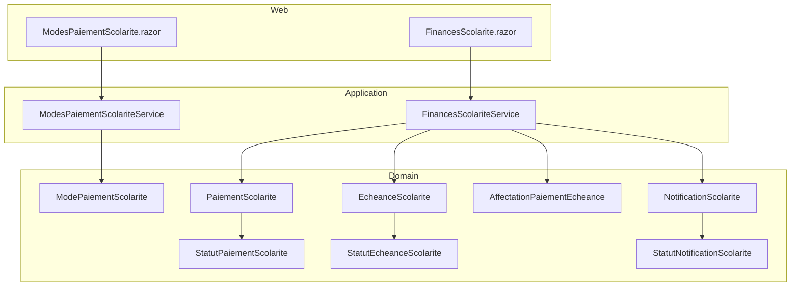
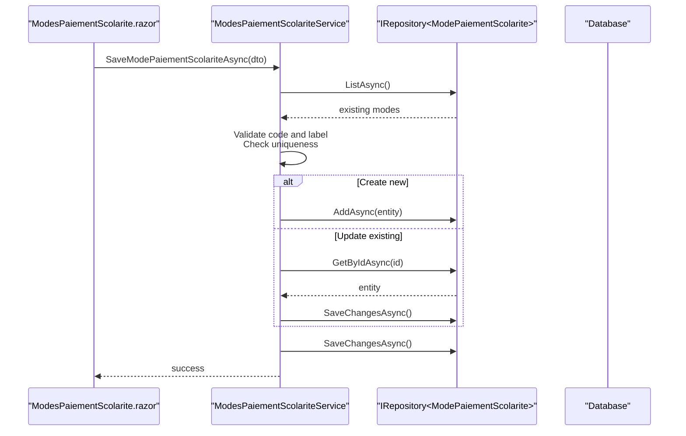
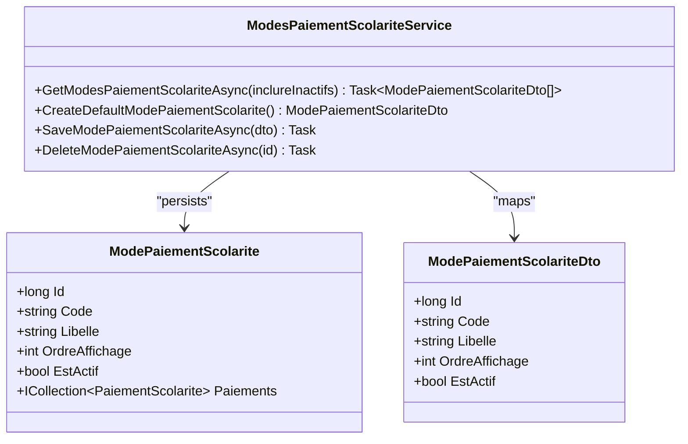
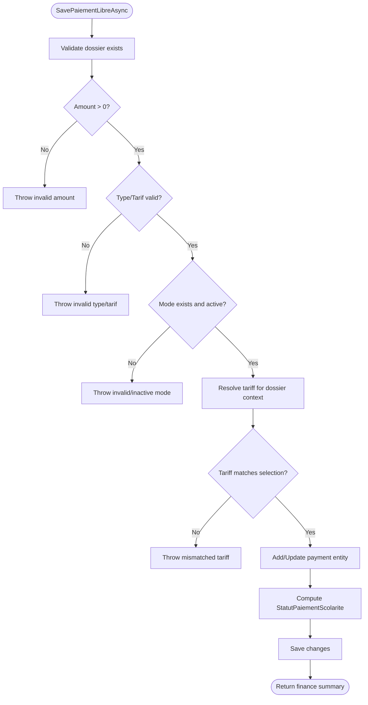
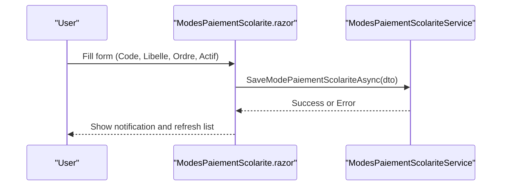
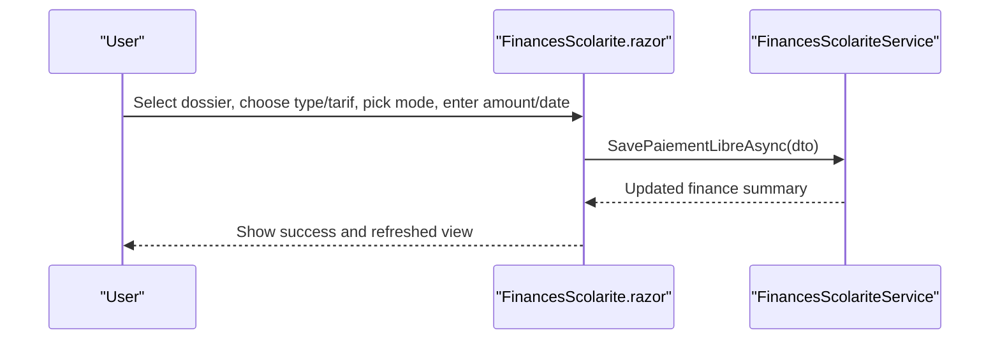
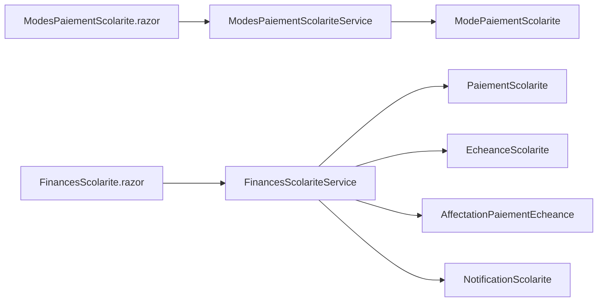

# Payment Methods Configuration

<cite>
**Referenced Files in This Document**
- [ModePaiementScolarite.cs](file://RIIS.Academic.Domain/Scolarite/ModePaiementScolarite.cs)
- [PaiementScolarite.cs](file://RIIS.Academic.Domain/Scolarite/PaiementScolarite.cs)
- [EcheanceScolarite.cs](file://RIIS.Academic.Domain/Scolarite/EcheanceScolarite.cs)
- [AffectationPaiementEcheance.cs](file://RIIS.Academic.Domain/Scolarite/AffectationPaiementEcheance.cs)
- [StatutPaiementScolarite.cs](file://RIIS.Academic.Domain/Enums/StatutPaiementScolarite.cs)
- [StatutEcheanceScolarite.cs](file://RIIS.Academic.Domain/Enums/StatutEcheanceScolarite.cs)
- [NotificationScolarite.cs](file://RIIS.Academic.Domain/Scolarite/NotificationScolarite.cs)
- [StatutNotificationScolarite.cs](file://RIIS.Academic.Domain/Enums/StatutNotificationScolarite.cs)
- [ModePaiementScolariteDto.cs](file://RIIS.Academic.Application/Scolarite/Dtos/ModePaiementScolariteDto.cs)
- [ModesPaiementScolariteService.cs](file://RIIS.Academic.Application/Scolarite/Services/ModesPaiementScolariteService.cs)
- [FinancesScolariteService.cs](file://RIIS.Academic.Application/Scolarite/Services/FinancesScolariteService.cs)
- [ModesPaiementScolarite.razor](file://RIIS.Academic.Web/Components/Pages/Scolarite/ModesPaiementScolarite.razor)
- [FinancesScolarite.razor](file://RIIS.Academic.Web/Components/Pages/Scolarite/FinancesScolarite.razor)
</cite>

## Table of Contents
1. Introduction
2. Project Structure
3. Core Components
4. Architecture Overview
5. Detailed Component Analysis
6. Dependency Analysis
7. Performance Considerations
8. Troubleshooting Guide
9. Conclusion

## Introduction
This document explains how to configure and manage payment methods, channels, and processing rules within the academic administration system. It covers:
- Defining and maintaining payment methods (codes, labels, display order, active status).
- Recording payments against student files, selecting payment types/tariffs, and associating payments with deadlines.
- Managing payment deadlines, statuses, and notifications.
- Validating inputs and enforcing business rules during payment creation and updates.
- Extending workflows for external payment processors via service boundaries.
- Security and compliance considerations relevant to handling financial data.

## Project Structure
The payment configuration spans three layers:
- Domain: Entities and enums that model payment methods, payments, deadlines, allocations, and notifications.
- Application: Services that implement business logic for listing/saving payment methods and recording payments, plus DTOs for UI binding.
- Web: Razor pages that provide the user interface for configuring payment methods and managing finances per student file.



**Diagram sources**
- [ModesPaiementScolarite.razor:1-148](file://RIIS.Academic.Web/Components/Pages/Scolarite/ModesPaiementScolarite.razor#L1-L148)
- [FinancesScolarite.razor:1-604](file://RIIS.Academic.Web/Components/Pages/Scolarite/FinancesScolarite.razor#L1-L604)
- [ModesPaiementScolariteService.cs:1-96](file://RIIS.Academic.Application/Scolarite/Services/ModesPaiementScolariteService.cs#L1-L96)
- [FinancesScolariteService.cs:1-361](file://RIIS.Academic.Application/Scolarite/Services/FinancesScolariteService.cs#L1-L361)
- [ModePaiementScolarite.cs:1-13](file://RIIS.Academic.Domain/Scolarite/ModePaiementScolarite.cs#L1-L13)
- [PaiementScolarite.cs:1-29](file://RIIS.Academic.Domain/Scolarite/PaiementScolarite.cs#L1-L29)
- [EcheanceScolarite.cs:1-20](file://RIIS.Academic.Domain/Scolarite/EcheanceScolarite.cs#L1-L20)
- [AffectationPaiementEcheance.cs:1-15](file://RIIS.Academic.Domain/Scolarite/AffectationPaiementEcheance.cs#L1-L15)
- [NotificationScolarite.cs:1-21](file://RIIS.Academic.Domain/Scolarite/NotificationScolarite.cs#L1-L21)
- [StatutPaiementScolarite.cs:1-10](file://RIIS.Academic.Domain/Enums/StatutPaiementScolarite.cs#L1-L10)
- [StatutEcheanceScolarite.cs:1-12](file://RIIS.Academic.Domain/Enums/StatutEcheanceScolarite.cs#L1-L12)
- [StatutNotificationScolarite.cs:1-10](file://RIIS.Academic.Domain/Enums/StatutNotificationScolarite.cs#L1-L10)

**Section sources**
- [ModePaiementScolarite.cs:1-13](file://RIIS.Academic.Domain/Scolarite/ModePaiementScolarite.cs#L1-L13)
- [PaiementScolarite.cs:1-29](file://RIIS.Academic.Domain/Scolarite/PaiementScolarite.cs#L1-L29)
- [EcheanceScolarite.cs:1-20](file://RIIS.Academic.Domain/Scolarite/EcheanceScolarite.cs#L1-L20)
- [AffectationPaiementEcheance.cs:1-15](file://RIIS.Academic.Domain/Scolarite/AffectationPaiementEcheance.cs#L1-L15)
- [NotificationScolarite.cs:1-21](file://RIIS.Academic.Domain/Scolarite/NotificationScolarite.cs#L1-L21)
- [StatutPaiementScolarite.cs:1-10](file://RIIS.Academic.Domain/Enums/StatutPaiementScolarite.cs#L1-L10)
- [StatutEcheanceScolarite.cs:1-12](file://RIIS.Academic.Domain/Enums/StatutEcheanceScolarite.cs#L1-L12)
- [StatutNotificationScolarite.cs:1-10](file://RIIS.Academic.Domain/Enums/StatutNotificationScolarite.cs#L1-L10)
- [ModePaiementScolariteDto.cs:1-11](file://RIIS.Academic.Application/Scolarite/Dtos/ModePaiementScolariteDto.cs#L1-L11)
- [ModesPaiementScolariteService.cs:1-96](file://RIIS.Academic.Application/Scolarite/Services/ModesPaiementScolariteService.cs#L1-L96)
- [FinancesScolariteService.cs:1-361](file://RIIS.Academic.Application/Scolarite/Services/FinancesScolariteService.cs#L1-L361)
- [ModesPaiementScolarite.razor:1-148](file://RIIS.Academic.Web/Components/Pages/Scolarite/ModesPaiementScolarite.razor#L1-L148)
- [FinancesScolarite.razor:1-604](file://RIIS.Academic.Web/Components/Pages/Scolarite/FinancesScolarite.razor#L1-L604)

## Core Components
- Payment method entity: Represents a configured payment channel with code, label, display order, and active flag; linked to payments.
- Payment entity: Records each transaction including date, amount, selected mode, reference, cashier, observation, and allocation amounts; tracks status.
- Deadline entity: Models due dates, expected amounts, allocated amounts, remaining balances, and deadline status; linked to notifications.
- Allocation entity: Bridges payments to deadlines with allocated amounts and timestamps.
- Notification entity: Tracks generated, sent, error, or ignored notifications related to deadlines and student files.
- Status enums: Define lifecycle states for payments, deadlines, and notifications.
- Application services: Provide CRUD for payment methods and orchestrate payment recording, validation, and finance summaries.
- Web pages: Offer UI for creating/editing payment methods and recording free-form payments against student files.

**Section sources**
- [ModePaiementScolarite.cs:1-13](file://RIIS.Academic.Domain/Scolarite/ModePaiementScolarite.cs#L1-L13)
- [PaiementScolarite.cs:1-29](file://RIIS.Academic.Domain/Scolarite/PaiementScolarite.cs#L1-L29)
- [EcheanceScolarite.cs:1-20](file://RIIS.Academic.Domain/Scolarite/EcheanceScolarite.cs#L1-L20)
- [AffectationPaiementEcheance.cs:1-15](file://RIIS.Academic.Domain/Scolarite/AffectationPaiementEcheance.cs#L1-L15)
- [NotificationScolarite.cs:1-21](file://RIIS.Academic.Domain/Scolarite/NotificationScolarite.cs#L1-L21)
- [StatutPaiementScolarite.cs:1-10](file://RIIS.Academic.Domain/Enums/StatutPaiementScolarite.cs#L1-L10)
- [StatutEcheanceScolarite.cs:1-12](file://RIIS.Academic.Domain/Enums/StatutEcheanceScolarite.cs#L1-L12)
- [StatutNotificationScolarite.cs:1-10](file://RIIS.Academic.Domain/Enums/StatutNotificationScolarite.cs#L1-L10)
- [ModesPaiementScolariteService.cs:1-96](file://RIIS.Academic.Application/Scolarite/Services/ModesPaiementScolariteService.cs#L1-L96)
- [FinancesScolariteService.cs:1-361](file://RIIS.Academic.Application/Scolarite/Services/FinancesScolariteService.cs#L1-L361)
- [ModesPaiementScolarite.razor:1-148](file://RIIS.Academic.Web/Components/Pages/Scolarite/ModesPaiementScolarite.razor#L1-L148)
- [FinancesScolarite.razor:1-604](file://RIIS.Academic.Web/Components/Pages/Scolarite/FinancesScolarite.razor#L1-L604)

## Architecture Overview
The system follows clean architecture principles:
- The Web layer renders Razor pages that call application services.
- Application services enforce business rules, validate inputs, and coordinate persistence through repositories.
- Domain models define entities and enumerations; no infrastructure concerns are present here.



**Diagram sources**
- [ModesPaiementScolarite.razor:116-129](file://RIIS.Academic.Web/Components/Pages/Scolarite/ModesPaiementScolarite.razor#L116-L129)
- [ModesPaiementScolariteService.cs:30-65](file://RIIS.Academic.Application/Scolarite/Services/ModesPaiementScolariteService.cs#L30-L65)

**Section sources**
- [ModesPaiementScolariteService.cs:10-22](file://RIIS.Academic.Application/Scolarite/Services/ModesPaiementScolariteService.cs#L10-L22)
- [ModesPaiementScolariteService.cs:30-65](file://RIIS.Academic.Application/Scolarite/Services/ModesPaiementScolariteService.cs#L30-L65)
- [ModesPaiementScolarite.razor:92-129](file://RIIS.Academic.Web/Components/Pages/Scolarite/ModesPaiementScolarite.razor#L92-L129)

## Detailed Component Analysis

### Payment Method Management
- Purpose: Configure available payment channels used when recording payments.
- Key fields: Code (unique), Libelle (display name), OrdreAffichage (sort order), EstActif (active toggle).
- Operations:
  - List active/inactive methods with sorting by display order and label.
  - Create default method template.
  - Save method with validation and uniqueness checks.
  - Delete method by id.



**Diagram sources**
- [ModePaiementScolarite.cs:1-13](file://RIIS.Academic.Domain/Scolarite/ModePaiementScolarite.cs#L1-L13)
- [ModePaiementScolariteDto.cs:1-11](file://RIIS.Academic.Application/Scolarite/Dtos/ModePaiementScolariteDto.cs#L1-L11)
- [ModesPaiementScolariteService.cs:1-96](file://RIIS.Academic.Application/Scolarite/Services/ModesPaiementScolariteService.cs#L1-L96)

**Section sources**
- [ModesPaiementScolariteService.cs:10-22](file://RIIS.Academic.Application/Scolarite/Services/ModesPaiementScolariteService.cs#L10-L22)
- [ModesPaiementScolariteService.cs:24-28](file://RIIS.Academic.Application/Scolarite/Services/ModesPaiementScolariteService.cs#L24-L28)
- [ModesPaiementScolariteService.cs:30-65](file://RIIS.Academic.Application/Scolarite/Services/ModesPaiementScolariteService.cs#L30-L65)
- [ModesPaiementScolariteService.cs:67-73](file://RIIS.Academic.Application/Scolarite/Services/ModesPaiementScolariteService.cs#L67-L73)
- [ModesPaiementScolarite.razor:26-82](file://RIIS.Academic.Web/Components/Pages/Scolarite/ModesPaiementScolarite.razor#L26-L82)
- [ModesPaiementScolarite.razor:97-145](file://RIIS.Academic.Web/Components/Pages/Scolarite/ModesPaiementScolarite.razor#L97-L145)

### Payment Recording and Validation
- Purpose: Record free-form payments against a student file, linking to a payment type/tariff and an active payment method.
- Business rules enforced:
  - Student file must exist.
  - Amount must be greater than zero.
  - Type element and tariff must be provided and valid for the dossier context.
  - Selected payment method must exist and be active.
  - Tariff must match the applicable tariff for the dossier at the reference date.
  - When updating, total cannot drop below already allocated amount.
  - Payment status is computed based on allocated vs total amount.



**Diagram sources**
- [FinancesScolariteService.cs:58-141](file://RIIS.Academic.Application/Scolarite/Services/FinancesScolariteService.cs#L58-L141)
- [FinancesScolariteService.cs:332-342](file://RIIS.Academic.Application/Scolarite/Services/FinancesScolariteService.cs#L332-L342)

**Section sources**
- [FinancesScolariteService.cs:58-141](file://RIIS.Academic.Application/Scolarite/Services/FinancesScolariteService.cs#L58-L141)
- [FinancesScolariteService.cs:264-279](file://RIIS.Academic.Application/Scolarite/Services/FinancesScolariteService.cs#L264-L279)
- [FinancesScolariteService.cs:332-342](file://RIIS.Academic.Application/Scolarite/Services/FinancesScolariteService.cs#L332-L342)
- [FinancesScolarite.razor:403-439](file://RIIS.Academic.Web/Components/Pages/Scolarite/FinancesScolarite.razor#L403-L439)

### Deadlines, Allocations, and Notifications
- Deadlines: Model due dates, expected amounts, allocated amounts, remaining balance, and status transitions.
- Allocations: Link payments to specific deadlines with allocated amounts and timestamps.
- Notifications: Track generation, sending, errors, and ignore actions for deadline-related communications.

```mermaid
erDiagram
PAIEMENT_SCOLARITE {
long Id PK
long DossierScolariteId FK
long? ElementScolariteEtudiantId FK
long? TypeElementScolariteId FK
long? TarifScolariteId FK
long? ModePaiementScolariteId FK
DateOnly DatePaiement
decimal Montant
string ModePaiement
string ReferencePaiement
string EncaissePar
string Observation
decimal MontantAffecte
decimal MontantNonAffecte
enum StatutPaiementScolarite Statut
DateTime DateCreationUtc
}
ECHEANCE_SCOLARITE {
long Id PK
long ElementScolariteEtudiantId FK
int Numero
string Libelle
DateOnly DateExigibilite
decimal MontantAttendu
decimal MontantAffecte
decimal MontantRestant
enum StatutEcheanceScolarite Statut
DateTime DateDernierRecalculUtc
}
AFFECTATION_PAIEMENT_ECHEANCE {
long Id PK
long PaiementScolariteId FK
long EcheanceScolariteId FK
decimal MontantAffecte
DateTime DateAffectationUtc
string AffectePar
}
NOTIFICATION_SCOLARITE {
long Id PK
long DossierScolariteId FK
long? ElementScolariteEtudiantId FK
long? EcheanceScolariteId FK
enum TypeNotificationScolarite Type
enum CanalNotificationScolarite Canal
string Titre
string Message
DateTime DateGenerationUtc
DateTime DateEnvoiUtc
enum StatutNotificationScolarite Statut
}
PAIEMENT_SCOLARITE ||--o{ AFFECTATION_PAIEMENT_ECHEANCE : "has"
ECHEANCE_SCOLARITE ||--o{ AFFECTATION_PAIEMENT_ECHEANCE : "receives"
NOTIFICATION_SCOLARITE }o--|| ECHEANCE_SCOLARITE : "related"
```

**Diagram sources**
- [PaiementScolarite.cs:1-29](file://RIIS.Academic.Domain/Scolarite/PaiementScolarite.cs#L1-L29)
- [EcheanceScolarite.cs:1-20](file://RIIS.Academic.Domain/Scolarite/EcheanceScolarite.cs#L1-L20)
- [AffectationPaiementEcheance.cs:1-15](file://RIIS.Academic.Domain/Scolarite/AffectationPaiementEcheance.cs#L1-L15)
- [NotificationScolarite.cs:1-21](file://RIIS.Academic.Domain/Scolarite/NotificationScolarite.cs#L1-L21)
- [StatutPaiementScolarite.cs:1-10](file://RIIS.Academic.Domain/Enums/StatutPaiementScolarite.cs#L1-L10)
- [StatutEcheanceScolarite.cs:1-12](file://RIIS.Academic.Domain/Enums/StatutEcheanceScolarite.cs#L1-L12)
- [StatutNotificationScolarite.cs:1-10](file://RIIS.Academic.Domain/Enums/StatutNotificationScolarite.cs#L1-L10)

**Section sources**
- [EcheanceScolarite.cs:1-20](file://RIIS.Academic.Domain/Scolarite/EcheanceScolarite.cs#L1-L20)
- [AffectationPaiementEcheance.cs:1-15](file://RIIS.Academic.Domain/Scolarite/AffectationPaiementEcheance.cs#L1-L15)
- [NotificationScolarite.cs:1-21](file://RIIS.Academic.Domain/Scolarite/NotificationScolarite.cs#L1-L21)
- [StatutEcheanceScolarite.cs:1-12](file://RIIS.Academic.Domain/Enums/StatutEcheanceScolarite.cs#L1-L12)
- [StatutNotificationScolarite.cs:1-10](file://RIIS.Academic.Domain/Enums/StatutNotificationScolarite.cs#L1-L10)

### Adding New Payment Methods
Steps:
1. Navigate to the payment methods page and open the create form.
2. Enter a unique code and a descriptive label.
3. Set display order and ensure the method is active.
4. Save; the service validates uniqueness and persists the method.



**Diagram sources**
- [ModesPaiementScolarite.razor:26-82](file://RIIS.Academic.Web/Components/Pages/Scolarite/ModesPaiementScolarite.razor#L26-L82)
- [ModesPaiementScolarite.razor:97-145](file://RIIS.Academic.Web/Components/Pages/Scolarite/ModesPaiementScolarite.razor#L97-L145)
- [ModesPaiementScolariteService.cs:30-65](file://RIIS.Academic.Application/Scolarite/Services/ModesPaiementScolariteService.cs#L30-L65)

**Section sources**
- [ModesPaiementScolarite.razor:26-82](file://RIIS.Academic.Web/Components/Pages/Scolarite/ModesPaiementScolarite.razor#L26-L82)
- [ModesPaiementScolarite.razor:97-145](file://RIIS.Academic.Web/Components/Pages/Scolarite/ModesPaiementScolarite.razor#L97-L145)
- [ModesPaiementScolariteService.cs:30-65](file://RIIS.Academic.Application/Scolarite/Services/ModesPaiementScolariteService.cs#L30-L65)

### Setting Up Payment Workflows
- Select a student file from the finances page.
- Choose a payable element type and its applicable tariff for the dossier context.
- Pick an active payment method and enter payment details (date, amount, reference, observation).
- Submit to record the payment; the system validates and updates totals and statuses.



**Diagram sources**
- [FinancesScolarite.razor:174-244](file://RIIS.Academic.Web/Components/Pages/Scolarite/FinancesScolarite.razor#L174-L244)
- [FinancesScolarite.razor:403-439](file://RIIS.Academic.Web/Components/Pages/Scolarite/FinancesScolarite.razor#L403-L439)
- [FinancesScolariteService.cs:58-141](file://RIIS.Academic.Application/Scolarite/Services/FinancesScolariteService.cs#L58-L141)

**Section sources**
- [FinancesScolarite.razor:174-244](file://RIIS.Academic.Web/Components/Pages/Scolarite/FinancesScolarite.razor#L174-L244)
- [FinancesScolarite.razor:403-439](file://RIIS.Academic.Web/Components/Pages/Scolarite/FinancesScolarite.razor#L403-L439)
- [FinancesScolariteService.cs:58-141](file://RIIS.Academic.Application/Scolarite/Services/FinancesScolariteService.cs#L58-L141)

### Integrating with External Payment Processors
- The current implementation records payments internally with a chosen payment method and optional reference/observation.
- To integrate external processors:
  - Extend the payment method entity or add processor-specific fields if needed.
  - Implement additional validation and mapping in the application service before persisting.
  - Use the existing repository pattern to persist changes consistently.
  - Surface integration points via the web layer while keeping domain and application layers free of infrastructure specifics.

[No sources needed since this section provides conceptual guidance]

## Dependency Analysis
- Web pages depend on application services for all operations.
- Application services depend on domain entities and repository abstractions.
- Domain entities are independent of infrastructure and expose relationships between payments, deadlines, allocations, and notifications.



**Diagram sources**
- [ModesPaiementScolarite.razor:1-148](file://RIIS.Academic.Web/Components/Pages/Scolarite/ModesPaiementScolarite.razor#L1-L148)
- [FinancesScolarite.razor:1-604](file://RIIS.Academic.Web/Components/Pages/Scolarite/FinancesScolarite.razor#L1-L604)
- [ModesPaiementScolariteService.cs:1-96](file://RIIS.Academic.Application/Scolarite/Services/ModesPaiementScolariteService.cs#L1-L96)
- [FinancesScolariteService.cs:1-361](file://RIIS.Academic.Application/Scolarite/Services/FinancesScolariteService.cs#L1-L361)
- [ModePaiementScolarite.cs:1-13](file://RIIS.Academic.Domain/Scolarite/ModePaiementScolarite.cs#L1-L13)
- [PaiementScolarite.cs:1-29](file://RIIS.Academic.Domain/Scolarite/PaiementScolarite.cs#L1-L29)
- [EcheanceScolarite.cs:1-20](file://RIIS.Academic.Domain/Scolarite/EcheanceScolarite.cs#L1-L20)
- [AffectationPaiementEcheance.cs:1-15](file://RIIS.Academic.Domain/Scolarite/AffectationPaiementEcheance.cs#L1-L15)
- [NotificationScolarite.cs:1-21](file://RIIS.Academic.Domain/Scolarite/NotificationScolarite.cs#L1-L21)

**Section sources**
- [ModesPaiementScolariteService.cs:1-96](file://RIIS.Academic.Application/Scolarite/Services/ModesPaiementScolariteService.cs#L1-L96)
- [FinancesScolariteService.cs:1-361](file://RIIS.Academic.Application/Scolarite/Services/FinancesScolariteService.cs#L1-L361)
- [ModesPaiementScolarite.razor:1-148](file://RIIS.Academic.Web/Components/Pages/Scolarite/ModesPaiementScolarite.razor#L1-L148)
- [FinancesScolarite.razor:1-604](file://RIIS.Academic.Web/Components/Pages/Scolarite/FinancesScolarite.razor#L1-L604)

## Performance Considerations
- Listing payment methods filters and sorts in memory after retrieval; consider server-side filtering if datasets grow large.
- Finance summaries aggregate multiple collections; batch queries where possible and avoid N+1 patterns by loading related data efficiently.
- Avoid unnecessary recomputation of totals; cache lookups like tariffs and modes per session when appropriate.
- Use pagination in UI grids to reduce rendering overhead.

[No sources needed since this section provides general guidance]

## Troubleshooting Guide
Common issues and resolutions:
- Duplicate payment method code: Ensure codes are unique; the service enforces uniqueness and throws an error if a duplicate is detected.
- Inactive payment method: Only active methods can be used for payments; activate the method or select another.
- Invalid tariff selection: The tariff must match the one applicable to the dossier context; reselect the correct option.
- Negative or zero payment amount: Amounts must be greater than zero; adjust input accordingly.
- Updating payment reduces allocated amount: Cannot set total below already allocated amount; revise allocation or total carefully.

**Section sources**
- [ModesPaiementScolariteService.cs:34-41](file://RIIS.Academic.Application/Scolarite/Services/ModesPaiementScolariteService.cs#L34-L41)
- [FinancesScolariteService.cs:65-94](file://RIIS.Academic.Application/Scolarite/Services/FinancesScolariteService.cs#L65-L94)
- [FinancesScolariteService.cs:121-124](file://RIIS.Academic.Application/Scolarite/Services/FinancesScolariteService.cs#L121-L124)

## Conclusion
The payment methods configuration interface enables administrators to define and maintain payment channels, while the finances workflow supports recording and validating payments against student files and deadlines. The system enforces robust business rules around uniqueness, activity status, tariff applicability, and allocation integrity. Extensions for external processors can be introduced by augmenting domain models and application services without disrupting the clean separation of concerns.

[No sources needed since this section summarizes without analyzing specific files]