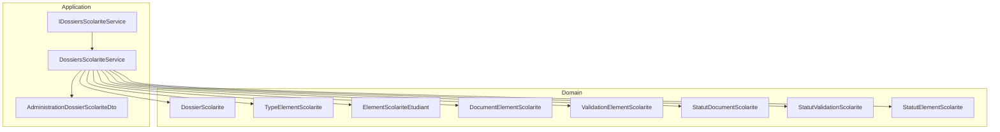
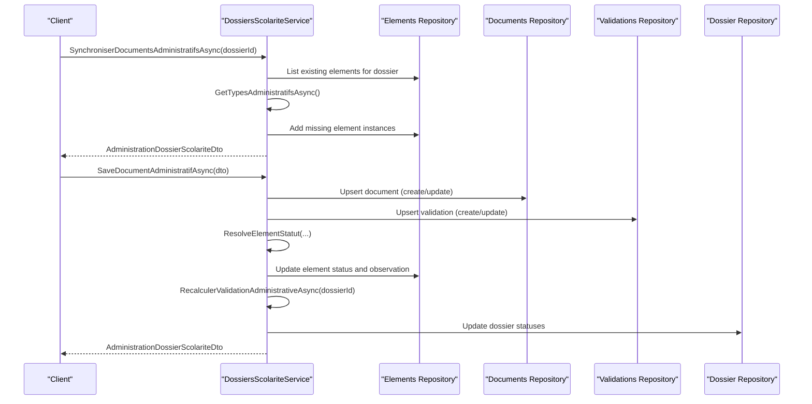
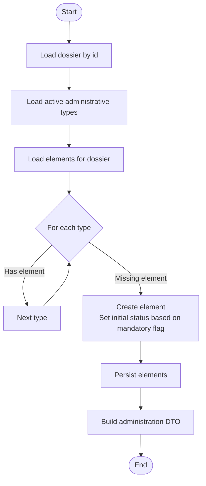
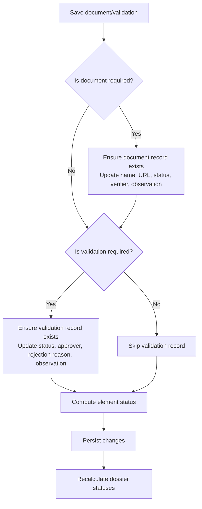
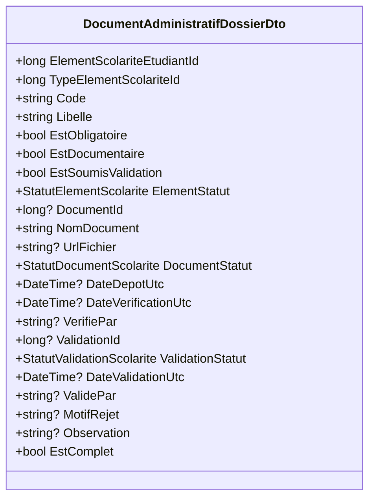
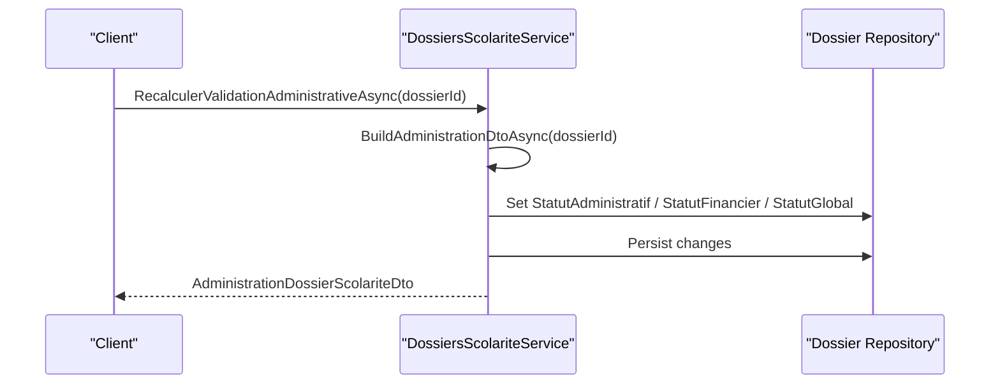
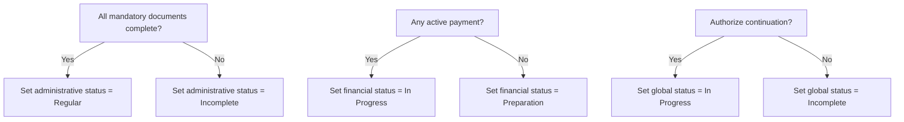
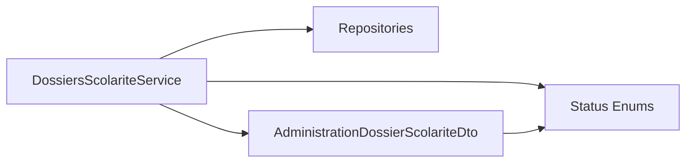

# Administrative Document Management

<cite>
**Referenced Files in This Document**
- [DossiersScolariteService.cs](file://RIIS.Academic.Application/Scolarite/Services/DossiersScolariteService.cs)
- [IDossiersScolariteService.cs](file://RIIS.Academic.Application/Scolarite/Services/IDossiersScolariteService.cs)
- [AdministrationDossierScolariteDto.cs](file://RIIS.Academic.Application/Scolarite/Dtos/AdministrationDossierScolariteDto.cs)
- [DossierScolarite.cs](file://RIIS.Academic.Domain/Scolarite/DossierScolarite.cs)
- [ElementScolariteEtudiant.cs](file://RIIS.Academic.Domain/Scolarite/ElementScolariteEtudiant.cs)
- [DocumentElementScolarite.cs](file://RIIS.Academic.Domain/Scolarite/DocumentElementScolarite.cs)
- [ValidationElementScolarite.cs](file://RIIS.Academic.Domain/Scolarite/ValidationElementScolarite.cs)
- [TypeElementScolarite.cs](file://RIIS.Academic.Domain/Scolarite/TypeElementScolarite.cs)
- [StatutDocumentScolarite.cs](file://RIIS.Academic.Domain/Enums/StatutDocumentScolarite.cs)
- [StatutValidationScolarite.cs](file://RIIS.Academic.Domain/Enums/StatutValidationScolarite.cs)
- [StatutElementScolarite.cs](file://RIIS.Academic.Domain/Enums/StatutElementScolarite.cs)
</cite>

## Table of Contents
1. Introduction
2. Project Structure
3. Core Components
4. Architecture Overview
5. Detailed Component Analysis
6. Dependency Analysis
7. Performance Considerations
8. Troubleshooting Guide
9. Conclusion

## Introduction
This document explains administrative document management within student dossiers. It covers how document requirements are synchronized from configured element types, the validation workflow for documents and validations, status tracking, and how completion affects overall dossier status. It also describes the interface for managing document URLs, observations, and completion status, including bulk operations and recalculation of administrative validation. Finally, it outlines integration points with templates and file storage systems.

## Project Structure
Administrative document management is implemented in the Application layer service and modeled by Domain entities and enums:
- Service orchestration and business logic: DossiersScolariteService
- Public API surface: IDossiersScolariteService
- Data transfer objects for administration views: AdministrationDossierScolariteDto
- Domain models for dossiers, elements, documents, validations, and type configuration: DossierScolarite, ElementScolariteEtudiant, DocumentElementScolarite, ValidationElementScolarite, TypeElementScolarite
- Status enums: StatutDocumentScolarite, StatutValidationScolarite, StatutElementScolarite

**Diagram sources**
- [DossiersScolariteService.cs:128-275](file://RIIS.Academic.Application/Scolarite/Services/DossiersScolariteService.cs#L128-L275)
- [IDossiersScolariteService.cs:25-39](file://RIIS.Academic.Application/Scolarite/Services/IDossiersScolariteService.cs#L25-L39)
- [AdministrationDossierScolariteDto.cs:5-42](file://RIIS.Academic.Application/Scolarite/Dtos/AdministrationDossierScolariteDto.cs#L5-L42)
- [DossierScolarite.cs:1-28](file://RIIS.Academic.Domain/Scolarite/DossierScolarite.cs#L1-L28)
- [TypeElementScolarite.cs:1-18](file://RIIS.Academic.Domain/Scolarite/TypeElementScolarite.cs#L1-L18)
- [ElementScolariteEtudiant.cs:1-25](file://RIIS.Academic.Domain/Scolarite/ElementScolariteEtudiant.cs#L1-L25)
- [DocumentElementScolarite.cs:1-16](file://RIIS.Academic.Domain/Scolarite/DocumentElementScolarite.cs#L1-L16)
- [ValidationElementScolarite.cs:1-14](file://RIIS.Academic.Domain/Scolarite/ValidationElementScolarite.cs#L1-L14)
- [StatutDocumentScolarite.cs:1-10](file://RIIS.Academic.Domain/Enums/StatutDocumentScolarite.cs#L1-L10)
- [StatutValidationScolarite.cs:1-9](file://RIIS.Academic.Domain/Enums/StatutValidationScolarite.cs#L1-L9)
- [StatutElementScolarite.cs:1-13](file://RIIS.Academic.Domain/Enums/StatutElementScolarite.cs#L1-L13)

**Section sources**
- [DossiersScolariteService.cs:128-275](file://RIIS.Academic.Application/Scolarite/Services/DossiersScolariteService.cs#L128-L275)
- [IDossiersScolariteService.cs:25-39](file://RIIS.Academic.Application/Scolarite/Services/IDossiersScolariteService.cs#L25-L39)
- [AdministrationDossierScolariteDto.cs:5-42](file://RIIS.Academic.Application/Scolarite/Dtos/AdministrationDossierScolariteDto.cs#L5-L42)
- [DossierScolarite.cs:1-28](file://RIIS.Academic.Domain/Scolarite/DossierScolarite.cs#L1-L28)
- [TypeElementScolarite.cs:1-18](file://RIIS.Academic.Domain/Scolarite/TypeElementScolarite.cs#L1-L18)
- [ElementScolariteEtudiant.cs:1-25](file://RIIS.Academic.Domain/Scolarite/ElementScolariteEtudiant.cs#L1-L25)
- [DocumentElementScolarite.cs:1-16](file://RIIS.Academic.Domain/Scolarite/DocumentElementScolarite.cs#L1-L16)
- [ValidationElementScolarite.cs:1-14](file://RIIS.Academic.Domain/Scolarite/ValidationElementScolarite.cs#L1-L14)
- [StatutDocumentScolarite.cs:1-10](file://RIIS.Academic.Domain/Enums/StatutDocumentScolarite.cs#L1-L10)
- [StatutValidationScolarite.cs:1-9](file://RIIS.Academic.Domain/Enums/StatutValidationScolarite.cs#L1-L9)
- [StatutElementScolarite.cs:1-13](file://RIIS.Academic.Domain/Enums/StatutElementScolarite.cs#L1-L13)

## Core Components
- Synchronization: Creates missing administrative element instances per configured active types for a dossier.
- Save: Persists document metadata (name, URL), verification details, and validation records; updates statuses and timestamps.
- Recalculation: Recomputes administrative validation and updates dossier statuses based on completeness and payments.
- DTOs: Provide a unified view of documents, validations, and aggregate completion metrics for UI or APIs.

Key responsibilities:
- SynchroniserDocumentsAdministratifsAsync: Ensures each active administrative type has an instance per dossier.
- SaveDocumentAdministratifAsync: Updates document and validation records, computes element status, and triggers recalculation.
- RecalculerValidationAdministrativeAsync: Sets dossier administrative, financial, and global statuses based on aggregated data.

**Section sources**
- [DossiersScolariteService.cs:128-162](file://RIIS.Academic.Application/Scolarite/Services/DossiersScolariteService.cs#L128-L162)
- [DossiersScolariteService.cs:164-252](file://RIIS.Academic.Application/Scolarite/Services/DossiersScolariteService.cs#L164-L252)
- [DossiersScolariteService.cs:254-275](file://RIIS.Academic.Application/Scolarite/Services/DossiersScolariteService.cs#L254-L275)
- [AdministrationDossierScolariteDto.cs:5-42](file://RIIS.Academic.Application/Scolarite/Dtos/AdministrationDossierScolariteDto.cs#L5-L42)

## Architecture Overview
The service coordinates between repositories to synchronize, save, and recalculate administrative items. It uses domain models and enums to enforce rules and maintain consistent state.

**Diagram sources**
- [DossiersScolariteService.cs:128-162](file://RIIS.Academic.Application/Scolarite/Services/DossiersScolariteService.cs#L128-L162)
- [DossiersScolariteService.cs:164-252](file://RIIS.Academic.Application/Scolarite/Services/DossiersScolariteService.cs#L164-L252)
- [DossiersScolariteService.cs:254-275](file://RIIS.Academic.Application/Scolarite/Services/DossiersScolariteService.cs#L254-L275)

## Detailed Component Analysis

### Synchronization Process: SynchroniserDocumentsAdministratifsAsync
- Loads the target dossier and retrieves all active administrative types (document-type or validation-type).
- For each type, if no element instance exists for the dossier, creates one with initial status derived from whether the type is mandatory.
- Persists new elements and returns the updated administration view.

**Diagram sources**
- [DossiersScolariteService.cs:128-162](file://RIIS.Academic.Application/Scolarite/Services/DossiersScolariteService.cs#L128-L162)
- [DossiersScolariteService.cs:329-342](file://RIIS.Academic.Application/Scolarite/Services/DossiersScolariteService.cs#L329-L342)

**Section sources**
- [DossiersScolariteService.cs:128-162](file://RIIS.Academic.Application/Scolarite/Services/DossiersScolariteService.cs#L128-L162)
- [DossiersScolariteService.cs:329-342](file://RIIS.Academic.Application/Scolarite/Services/DossiersScolariteService.cs#L329-L342)

### Document Validation Workflow
- Mandatory vs optional: Elements inherit mandatory flags from their type. Missing mandatory elements prevent full completion.
- Document lifecycle: Documents can be deposited, validated, rejected, or expired. Timestamps are set when transitioning to deposited/validated or verified states.
- Validation lifecycle: Validations can be approved or rejected with reasons and observations.
- Element status resolution: Combines document and validation states to compute element status (blocked, valid, partial, pending, not applicable).

**Diagram sources**
- [DossiersScolariteService.cs:164-252](file://RIIS.Academic.Application/Scolarite/Services/DossiersScolariteService.cs#L164-L252)
- [DossiersScolariteService.cs:527-567](file://RIIS.Academic.Application/Scolarite/Services/DossiersScolariteService.cs#L527-L567)

**Section sources**
- [DossiersScolariteService.cs:164-252](file://RIIS.Academic.Application/Scolarite/Services/DossiersScolariteService.cs#L164-L252)
- [DossiersScolariteService.cs:527-567](file://RIIS.Academic.Application/Scolarite/Services/DossiersScolariteService.cs#L527-L567)
- [StatutDocumentScolarite.cs:1-10](file://RIIS.Academic.Domain/Enums/StatutDocumentScolarite.cs#L1-L10)
- [StatutValidationScolarite.cs:1-9](file://RIIS.Academic.Domain/Enums/StatutValidationScolarite.cs#L1-L9)
- [StatutElementScolarite.cs:1-13](file://RIIS.Academic.Domain/Enums/StatutElementScolarite.cs#L1-L13)

### Interface for Managing Document URLs, Observations, and Completion
- Document fields: Name, URL, status, verifier, observation, deposit and verification timestamps.
- Validation fields: Status, approver, rejection reason, observation, validation timestamp.
- Completion: Computed per item based on type configuration and current states; exposed via DTO for UI display and decision-making.

**Diagram sources**
- [AdministrationDossierScolariteDto.cs:18-42](file://RIIS.Academic.Application/Scolarite/Dtos/AdministrationDossierScolariteDto.cs#L18-L42)

**Section sources**
- [AdministrationDossierScolariteDto.cs:18-42](file://RIIS.Academic.Application/Scolarite/Dtos/AdministrationDossierScolariteDto.cs#L18-L42)
- [DocumentElementScolarite.cs:1-16](file://RIIS.Academic.Domain/Scolarite/DocumentElementScolarite.cs#L1-L16)
- [ValidationElementScolarite.cs:1-14](file://RIIS.Academic.Domain/Scolarite/ValidationElementScolarite.cs#L1-L14)

### Bulk Operations and Batch Synchronization
- Synchronize once per dossier to ensure all configured administrative types have corresponding element instances.
- To perform bulk synchronization across multiple dossiers, call the synchronization method for each dossier identifier in a loop or batch process.
- After saving multiple documents/validations, invoke recalculation per affected dossier to refresh statuses.

Practical pattern:
- Iterate over a list of dossier IDs and call SynchroniserDocumentsAdministratifsAsync for each.
- Collect results or handle errors individually to support partial success scenarios.

**Section sources**
- [DossiersScolariteService.cs:128-162](file://RIIS.Academic.Application/Scolarite/Services/DossiersScolariteService.cs#L128-L162)
- [IDossiersScolariteService.cs:29-31](file://RIIS.Academic.Application/Scolarite/Services/IDossiersScolariteService.cs#L29-L31)

### Recalculation Using RecalculerValidationAdministrativeAsync
- Aggregates document and payment information to determine:
  - Whether all mandatory pieces are complete.
  - Whether an initial payment has been made.
  - Whether continuation of the academic path is authorized.
- Updates dossier statuses accordingly and persists changes.

**Diagram sources**
- [DossiersScolariteService.cs:254-275](file://RIIS.Academic.Application/Scolarite/Services/DossiersScolariteService.cs#L254-L275)
- [DossiersScolariteService.cs:344-395](file://RIIS.Academic.Application/Scolarite/Services/DossiersScolariteService.cs#L344-L395)

**Section sources**
- [DossiersScolariteService.cs:254-275](file://RIIS.Academic.Application/Scolarite/Services/DossiersScolariteService.cs#L254-L275)
- [DossiersScolariteService.cs:344-395](file://RIIS.Academic.Application/Scolarite/Services/DossiersScolariteService.cs#L344-L395)

### Relationship Between Document Completion and Overall Dossier Status
- Dossier administrative status becomes regular when all mandatory documents are complete; otherwise incomplete.
- Dossier financial status depends on presence of active payments.
- Global status reflects authorization to continue the academic path, which requires either complete mandatory documents or an initial payment.

**Diagram sources**
- [DossiersScolariteService.cs:254-275](file://RIIS.Academic.Application/Scolarite/Services/DossiersScolariteService.cs#L254-L275)
- [DossiersScolariteService.cs:375-395](file://RIIS.Academic.Application/Scolarite/Services/DossiersScolariteService.cs#L375-L395)

**Section sources**
- [DossiersScolariteService.cs:254-275](file://RIIS.Academic.Application/Scolarite/Services/DossiersScolariteService.cs#L254-L275)
- [DossiersScolariteService.cs:375-395](file://RIIS.Academic.Application/Scolarite/Services/DossiersScolariteService.cs#L375-L395)

### Integration with Document Templates and File Storage Systems
- Document records store a file URL and metadata (name, status, verifier, observation). Actual files are stored externally; the system references them via URL.
- Template generation for other artifacts (e.g., transcripts, minutes) exists in the infrastructure layer but is separate from administrative document management.
- When integrating with external storage:
  - Upload files to your storage backend and persist the resulting URL in the document record.
  - Ensure URLs are accessible and correctly formatted before saving.
  - Optionally validate file existence or accessibility during upload workflows.

Note: The administrative document flow does not directly generate templates; it manages references to uploaded files and tracks their validation lifecycle.

**Section sources**
- [DocumentElementScolarite.cs:1-16](file://RIIS.Academic.Domain/Scolarite/DocumentElementScolarite.cs#L1-L16)
- [DossiersScolariteService.cs:164-206](file://RIIS.Academic.Application/Scolarite/Services/DossiersScolariteService.cs#L164-L206)

## Dependency Analysis
- Service depends on repositories for dossiers, elements, documents, validations, payments, and reference data (types).
- DTOs depend on domain enums to represent statuses consistently.
- Status computation relies on type configuration (mandatory, documentary, validation-required).

**Diagram sources**
- [DossiersScolariteService.cs:128-275](file://RIIS.Academic.Application/Scolarite/Services/DossiersScolariteService.cs#L128-L275)
- [AdministrationDossierScolariteDto.cs:5-42](file://RIIS.Academic.Application/Scolarite/Dtos/AdministrationDossierScolariteDto.cs#L5-L42)
- [StatutDocumentScolarite.cs:1-10](file://RIIS.Academic.Domain/Enums/StatutDocumentScolarite.cs#L1-L10)
- [StatutValidationScolarite.cs:1-9](file://RIIS.Academic.Domain/Enums/StatutValidationScolarite.cs#L1-L9)
- [StatutElementScolarite.cs:1-13](file://RIIS.Academic.Domain/Enums/StatutElementScolarite.cs#L1-L13)

**Section sources**
- [DossiersScolariteService.cs:128-275](file://RIIS.Academic.Application/Scolarite/Services/DossiersScolariteService.cs#L128-L275)
- [AdministrationDossierScolariteDto.cs:5-42](file://RIIS.Academic.Application/Scolarite/Dtos/AdministrationDossierScolariteDto.cs#L5-L42)

## Performance Considerations
- Synchronization loads all active types and existing elements; consider filtering by dossier context where possible to reduce memory usage.
- Saving operations persist documents and validations separately; batching saves can reduce round-trips if needed.
- Recalculation aggregates documents, validations, and payments; caching frequently accessed reference data may improve performance in high-throughput scenarios.

[No sources needed since this section provides general guidance]

## Troubleshooting Guide
Common issues and resolutions:
- Missing element instances after configuration changes: Run synchronization for the affected dossier to create missing entries.
- Incorrect element status: Verify document and validation statuses; blocked occurs if any are rejected; valid only when fully complete per type rules.
- Dossier status not updating: Ensure recalculation is invoked after saving documents or validations; verify that mandatory items are truly complete and payments are active.
- Invalid or missing document URL: Validate URL format and accessibility; ensure the document record is persisted with correct metadata.

Operational tips:
- Always call recalculation after bulk saves to keep dossier statuses consistent.
- Use the administration DTO to inspect per-item completion and aggregate metrics before making decisions.

**Section sources**
- [DossiersScolariteService.cs:164-252](file://RIIS.Academic.Application/Scolarite/Services/DossiersScolariteService.cs#L164-L252)
- [DossiersScolariteService.cs:254-275](file://RIIS.Academic.Application/Scolarite/Services/DossiersScolariteService.cs#L254-L275)
- [DossiersScolariteService.cs:527-567](file://RIIS.Academic.Application/Scolarite/Services/DossiersScolariteService.cs#L527-L567)

## Conclusion
Administrative document management centers on synchronizing configured element types into actionable items, validating documents and approvals, and computing statuses that reflect compliance and readiness. The service provides clear interfaces for saving document metadata and validations, and for recalculating overall dossier status. Integrations with external storage rely on URL references, while template generation remains a separate concern. Following the outlined workflows ensures consistent, auditable, and accurate administrative processing for student dossiers.