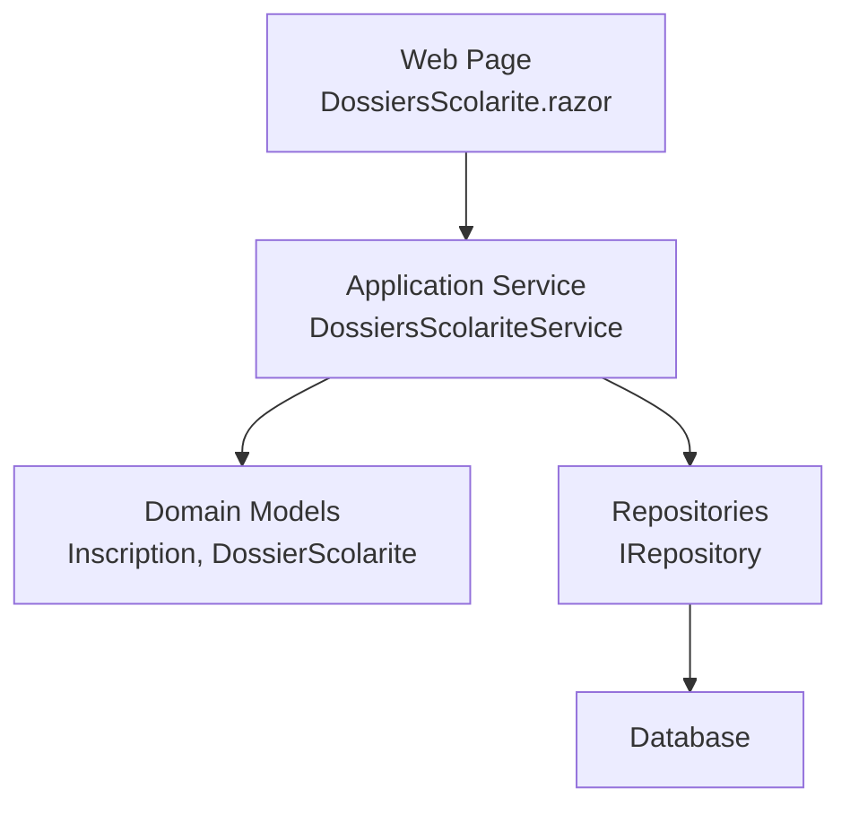
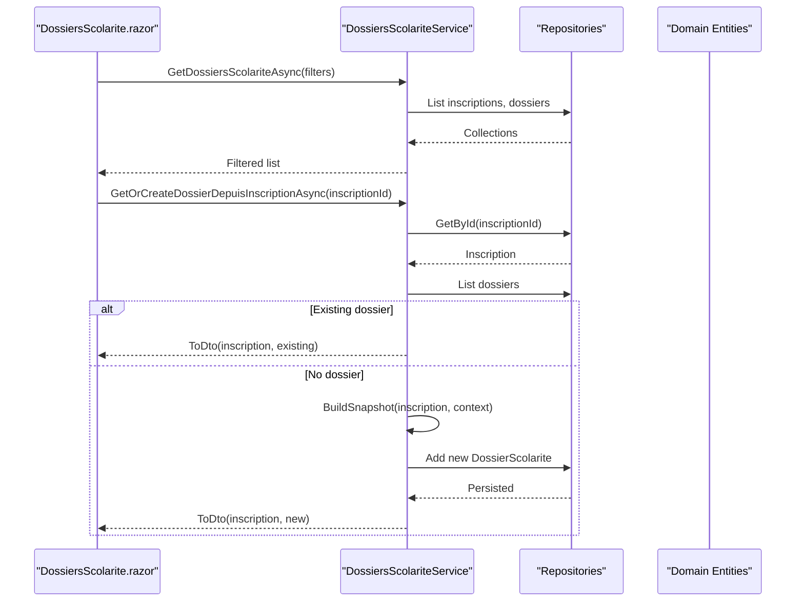
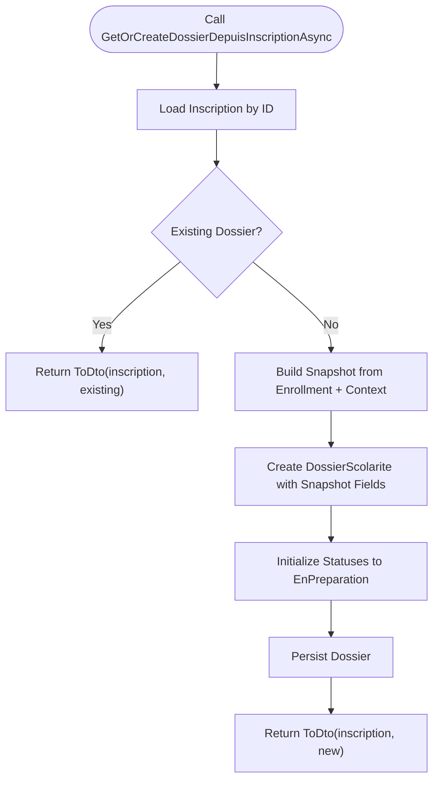
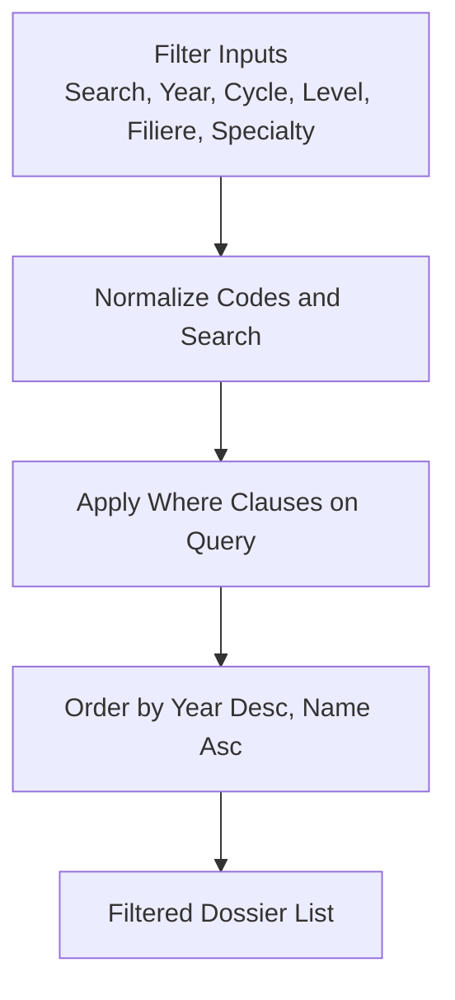
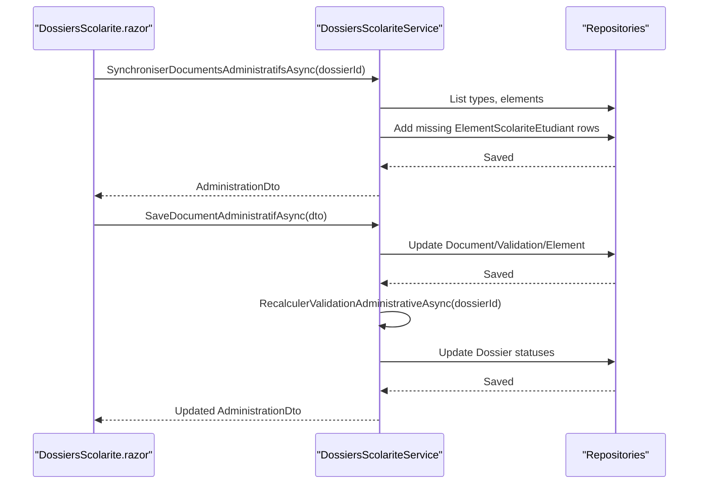
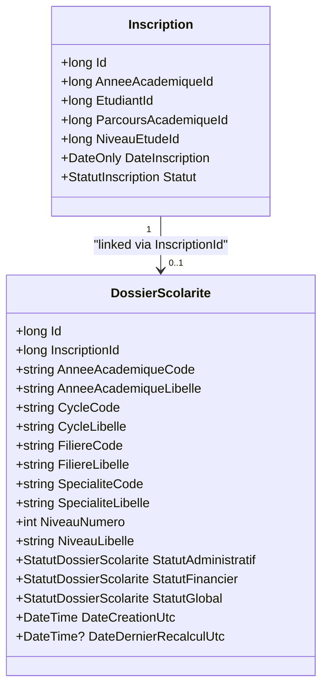
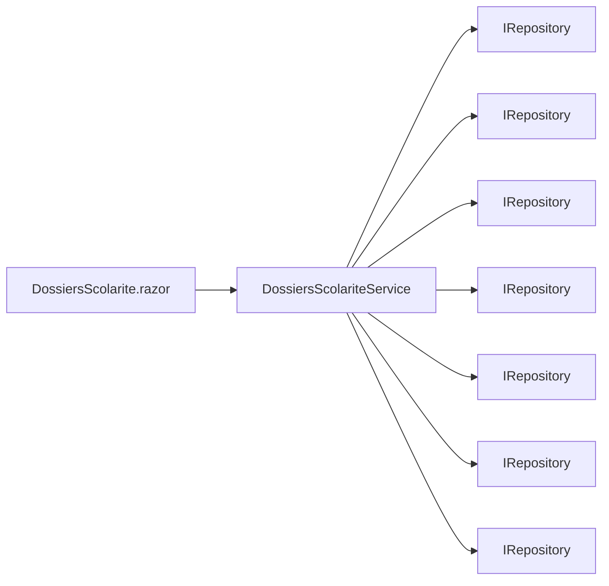

# Dossier Creation Workflow

<cite>
**Referenced Files in This Document**
- [DossiersScolariteService.cs](file://RIIS.Academic.Application/Scolarite/Services/DossiersScolariteService.cs)
- [IDossiersScolariteService.cs](file://RIIS.Academic.Application/Scolarite/Services/IDossiersScolariteService.cs)
- [DossierScolariteDto.cs](file://RIIS.Academic.Application/Scolarite/Dtos/DossierScolariteDto.cs)
- [AdministrationDossierScolariteDto.cs](file://RIIS.Academic.Application/Scolarite/Dtos/AdministrationDossierScolariteDto.cs)
- [DossierScolarite.cs](file://RIIS.Academic.Domain/Scolarite/DossierScolarite.cs)
- [Inscription.cs](file://RIIS.Academic.Domain/Inscriptions/Inscription.cs)
- [StatutDossierScolarite.cs](file://RIIS.Academic.Domain/Enums/StatutDossierScolarite.cs)
- [DossiersScolarite.razor](file://RIIS.Academic.Web/Components/Pages/Scolarite/DossiersScolarite.razor)
</cite>

## Table of Contents
1. [Introduction](#introduction)
2. [Project Structure](#project-structure)
3. [Core Components](#core-components)
4. [Architecture Overview](#architecture-overview)
5. [Detailed Component Analysis](#detailed-component-analysis)
6. [Dependency Analysis](#dependency-analysis)
7. [Performance Considerations](#performance-considerations)
8. [Troubleshooting Guide](#troubleshooting-guide)
9. [Conclusion](#conclusion)

## Introduction
This document explains the student dossier creation workflow that automatically creates or retrieves a financial dossier from an existing enrollment record. It focuses on:
- The GetOrCreateDossierDepuisInscriptionAsync method and how it opens existing dossiers or creates new ones from enrollment data.
- The filtering system enabling administrators to search and filter dossiers by academic year, cycle, level, program (filière), and specialty.
- Data flow from enrollment to dossier creation, including validation rules applied during creation and status initialization.
- Integration with the enrollment system and how student information is transferred to build complete financial dossiers.

## Project Structure
The workflow spans three layers:
- Application layer: service orchestration, DTOs, and business logic for dossier operations and filtering.
- Domain layer: entities representing enrollments, dossiers, statuses, and related references.
- Web layer: UI components that expose filters and actions to open/create dossiers and manage administrative documents and finances.

**Diagram sources**
- [DossiersScolarite.razor:370-393](file://RIIS.Academic.Web/Components/Pages/Scolarite/DossiersScolarite.razor#L370-L393)
- [DossiersScolariteService.cs:23-93](file://RIIS.Academic.Application/Scolarite/Services/DossiersScolariteService.cs#L23-L93)
- [DossiersScolariteService.cs:277-317](file://RIIS.Academic.Application/Scolarite/Services/DossiersScolariteService.cs#L277-L317)
- [DossierScolarite.cs:3-28](file://RIIS.Academic.Domain/Scolarite/DossierScolarite.cs#L3-L28)
- [Inscription.cs:3-36](file://RIIS.Academic.Domain/Inscriptions/Inscription.cs#L3-L36)

**Section sources**
- [DossiersScolarite.razor:370-393](file://RIIS.Academic.Web/Components/Pages/Scolarite/DossiersScolarite.razor#L370-L393)
- [DossiersScolariteService.cs:23-93](file://RIIS.Academic.Application/Scolarite/Services/DossiersScolariteService.cs#L23-L93)
- [DossierScolarite.cs:3-28](file://RIIS.Academic.Domain/Scolarite/DossierScolarite.cs#L3-L28)
- [Inscription.cs:3-36](file://RIIS.Academic.Domain/Inscriptions/Inscription.cs#L3-L36)

## Core Components
- DossiersScolariteService: Implements filtering, retrieval, and creation of dossiers from enrollments; manages administrative synchronization and recalculations.
- IDossiersScolariteService: Defines the API surface for listing dossiers with filters and creating/retrieving dossiers from enrollments.
- DossierScolarite entity: Represents a student’s financial dossier with snapshot fields capturing academic context at creation time and status flags.
- Inscription entity: Enrollment record linking a student to an academic year, program path, and level.
- Web page DossiersScolarite.razor: Provides the user interface for filtering, opening/creating dossiers, and managing administrative documents and finances.

Key responsibilities:
- Filtering: Search by name/matricule and filter by academic year, cycle, level, filière, and specialty.
- Creation: Build a snapshot from enrollment and reference data to initialize a new dossier with default statuses.
- Administration: Synchronize required documents and validations, then recalculate overall statuses based on completeness and payments.

**Section sources**
- [IDossiersScolariteService.cs:7-23](file://RIIS.Academic.Application/Scolarite/Services/IDossiersScolariteService.cs#L7-L23)
- [DossiersScolariteService.cs:23-93](file://RIIS.Academic.Application/Scolarite/Services/DossiersScolariteService.cs#L23-L93)
- [DossiersScolariteService.cs:277-317](file://RIIS.Academic.Application/Scolarite/Services/DossiersScolariteService.cs#L277-L317)
- [DossierScolarite.cs:3-28](file://RIIS.Academic.Domain/Scolarite/DossierScolarite.cs#L3-L28)
- [Inscription.cs:3-36](file://RIIS.Academic.Domain/Inscriptions/Inscription.cs#L3-L36)
- [DossiersScolarite.razor:370-393](file://RIIS.Academic.Web/Components/Pages/Scolarite/DossiersScolarite.razor#L370-L393)

## Architecture Overview
The workflow integrates enrollment data into financial dossiers through a clear sequence:
- The web page loads filtered lists of enrollments/dossiers using service methods.
- When an administrator clicks “Open” for an enrollment, the service checks if a dossier exists; if not, it builds a snapshot from enrollment and reference data and creates a new dossier with initial statuses.
- Administrative documents are synchronized and validated; statuses are recalculated based on completeness and payments.

**Diagram sources**
- [DossiersScolarite.razor:444-463](file://RIIS.Academic.Web/Components/Pages/Scolarite/DossiersScolarite.razor#L444-L463)
- [DossiersScolariteService.cs:277-317](file://RIIS.Academic.Application/Scolarite/Services/DossiersScolariteService.cs#L277-L317)
- [DossiersScolariteService.cs:397-441](file://RIIS.Academic.Application/Scolarite/Services/DossiersScolariteService.cs#L397-L441)
- [DossierScolarite.cs:3-28](file://RIIS.Academic.Domain/Scolarite/DossierScolarite.cs#L3-L28)
- [Inscription.cs:3-36](file://RIIS.Academic.Domain/Inscriptions/Inscription.cs#L3-L36)

## Detailed Component Analysis

### GetOrCreateDossierDepuisInscriptionAsync: Opening or Creating Dossiers
- Retrieves the enrollment by ID; throws if not found.
- Checks for an existing dossier linked to the enrollment.
- If none exists, builds a snapshot from enrollment and reference data (academic year, cycle, filière, specialty, level) and creates a new DossierScolarite with:
  - All statuses initialized to “EnPreparation”.
  - Timestamps set to current UTC time.
- Returns a DTO combining enrollment and dossier data.

Validation and error handling:
- Throws when enrollment is missing.
- Snapshot building validates presence of academic year, program path, specialty, and level; throws if any are missing or invalid.

Status initialization:
- New dossiers start with StatutAdministratif, StatutFinancier, and StatutGlobal all set to “EnPreparation”.

Data transfer from enrollment to dossier:
- Snapshot captures codes and labels for academic year, cycle, filière, specialty, and level to persist a stable historical view tied to the enrollment context.

**Diagram sources**
- [DossiersScolariteService.cs:277-317](file://RIIS.Academic.Application/Scolarite/Services/DossiersScolariteService.cs#L277-L317)
- [DossiersScolariteService.cs:397-441](file://RIIS.Academic.Application/Scolarite/Services/DossiersScolariteService.cs#L397-L441)
- [DossierScolarite.cs:3-28](file://RIIS.Academic.Domain/Scolarite/DossierScolarite.cs#L3-L28)

**Section sources**
- [DossiersScolariteService.cs:277-317](file://RIIS.Academic.Application/Scolarite/Services/DossiersScolariteService.cs#L277-L317)
- [DossiersScolariteService.cs:397-441](file://RIIS.Academic.Application/Scolarite/Services/DossiersScolariteService.cs#L397-L441)
- [DossierScolarite.cs:3-28](file://RIIS.Academic.Domain/Scolarite/DossierScolarite.cs#L3-L28)
- [Inscription.cs:3-36](file://RIIS.Academic.Domain/Inscriptions/Inscription.cs#L3-L36)

### Filtering System: Academic Year, Cycle, Level, Program, Specialty
- The service supports filtering by:
  - Search text: matches student full name or matricule.
  - Academic year code: normalized and compared case-insensitively.
  - Cycle code: normalized and compared case-insensitively.
  - Level number: exact match.
  - Filière code: normalized and compared case-insensitively.
  - Specialty code: normalized and compared case-insensitively.
- Results are ordered by academic year label descending, then student name ascending.
- The web page binds these filters to dropdowns and text inputs, and triggers reload on changes.

Normalization and matching:
- Codes are trimmed and uppercased before comparison to ensure consistent matching.
- Search strings are trimmed but preserve original casing for substring matching.

**Diagram sources**
- [DossiersScolariteService.cs:23-93](file://RIIS.Academic.Application/Scolarite/Services/DossiersScolariteService.cs#L23-L93)
- [DossiersScolariteService.cs:472-491](file://RIIS.Academic.Application/Scolarite/Services/DossiersScolariteService.cs#L472-L491)
- [DossiersScolarite.razor:370-393](file://RIIS.Academic.Web/Components/Pages/Scolarite/DossiersScolarite.razor#L370-L393)

**Section sources**
- [DossiersScolariteService.cs:23-93](file://RIIS.Academic.Application/Scolarite/Services/DossiersScolariteService.cs#L23-L93)
- [DossiersScolariteService.cs:472-491](file://RIIS.Academic.Application/Scolarite/Services/DossiersScolariteService.cs#L472-L491)
- [DossiersScolarite.razor:370-393](file://RIIS.Academic.Web/Components/Pages/Scolarite/DossiersScolarite.razor#L370-L393)

### Administrative Documents and Status Recalculation
- Synchronisation creates administrative elements for each active type configured for documents or validations.
- Saving administrative items updates document and validation records, timestamps, and element status.
- Recalculation computes:
  - Whether all mandatory pieces are complete.
  - Whether an initial payment exists.
  - Overall authorization to continue the academic pathway.
- Based on these computations, the dossier’s administrative, financial, and global statuses are updated accordingly.

**Diagram sources**
- [DossiersScolariteService.cs:128-162](file://RIIS.Academic.Application/Scolarite/Services/DossiersScolariteService.cs#L128-L162)
- [DossiersScolariteService.cs:164-252](file://RIIS.Academic.Application/Scolarite/Services/DossiersScolariteService.cs#L164-L252)
- [DossiersScolariteService.cs:254-275](file://RIIS.Academic.Application/Scolarite/Services/DossiersScolariteService.cs#L254-L275)

**Section sources**
- [DossiersScolariteService.cs:128-162](file://RIIS.Academic.Application/Scolarite/Services/DossiersScolariteService.cs#L128-L162)
- [DossiersScolariteService.cs:164-252](file://RIIS.Academic.Application/Scolarite/Services/DossiersScolariteService.cs#L164-L252)
- [DossiersScolariteService.cs:254-275](file://RIIS.Academic.Application/Scolarite/Services/DossiersScolariteService.cs#L254-L275)

### Data Flow: From Enrollment to Complete Financial Dossier
- Enrollment provides core identifiers and relationships:
  - Student, academic year, program path (cycle/filière/specialty), and level.
- Snapshot construction ensures the dossier retains a consistent view of the academic context at creation time.
- Initial statuses reflect preparation state; administrative synchronization populates required elements; payments influence financial status.
- Final statuses reflect completion of mandatory documents and presence of initial payments.

**Diagram sources**
- [Inscription.cs:3-36](file://RIIS.Academic.Domain/Inscriptions/Inscription.cs#L3-L36)
- [DossierScolarite.cs:3-28](file://RIIS.Academic.Domain/Scolarite/DossierScolarite.cs#L3-L28)

**Section sources**
- [Inscription.cs:3-36](file://RIIS.Academic.Domain/Inscriptions/Inscription.cs#L3-L36)
- [DossierScolarite.cs:3-28](file://RIIS.Academic.Domain/Scolarite/DossierScolarite.cs#L3-L28)
- [DossiersScolariteService.cs:397-441](file://RIIS.Academic.Application/Scolarite/Services/DossiersScolariteService.cs#L397-L441)

## Dependency Analysis
- DossiersScolariteService depends on multiple repositories to load reference data and perform CRUD operations on dossiers, elements, documents, validations, and payments.
- The service composes a context object to efficiently map IDs to codes and labels for snapshots and DTOs.
- The web page depends on the service interface and other services (referentiels, finances) to populate filters and display financial summaries.

**Diagram sources**
- [DossiersScolariteService.cs:7-21](file://RIIS.Academic.Application/Scolarite/Services/DossiersScolariteService.cs#L7-L21)
- [DossiersScolarite.razor:370-393](file://RIIS.Academic.Web/Components/Pages/Scolarite/DossiersScolarite.razor#L370-L393)

**Section sources**
- [DossiersScolariteService.cs:7-21](file://RIIS.Academic.Application/Scolarite/Services/DossiersScolariteService.cs#L7-L21)
- [DossiersScolarite.razor:370-393](file://RIIS.Academic.Web/Components/Pages/Scolarite/DossiersScolarite.razor#L370-L393)

## Performance Considerations
- Filtering operates on in-memory collections after loading all inscriptions and dossiers; consider pagination or server-side filtering for large datasets.
- Snapshot building performs multiple lookups across reference tables; caching contexts or optimizing queries can reduce overhead.
- Administrative synchronization iterates over types and elements; batching saves and minimizing redundant reads improves performance.

[No sources needed since this section provides general guidance]

## Troubleshooting Guide
Common issues and resolutions:
- Missing enrollment: The service throws when attempting to create or retrieve a dossier for a non-existent enrollment. Verify the enrollment ID and ensure the enrollment exists before calling the method.
- Missing reference data: Snapshot building requires valid academic year, program path, specialty, and level. Ensure these references exist and are correctly linked to the enrollment.
- Duplicate dossiers: The service prevents duplicate creation by checking for an existing dossier linked to the enrollment. If duplicates appear unexpectedly, verify data integrity and deletion processes.
- Status inconsistencies: After updating administrative documents or payments, call the recalculation method to update dossier statuses consistently.

Error handling locations:
- Enrollment lookup and snapshot building throw exceptions when required data is missing.
- Administrative operations validate existence of elements and types before updates.

**Section sources**
- [DossiersScolariteService.cs:277-317](file://RIIS.Academic.Application/Scolarite/Services/DossiersScolariteService.cs#L277-L317)
- [DossiersScolariteService.cs:319-327](file://RIIS.Academic.Application/Scolarite/Services/DossiersScolariteService.cs#L319-L327)
- [DossiersScolariteService.cs:164-252](file://RIIS.Academic.Application/Scolarite/Services/DossiersScolariteService.cs#L164-L252)

## Conclusion
The dossier creation workflow seamlessly bridges enrollment records and financial administration:
- Administrators can filter and locate enrollments quickly using robust search and filter options.
- The GetOrCreateDossierDepuisInscriptionAsync method ensures idempotent creation or retrieval of dossiers, preserving a snapshot of academic context and initializing statuses appropriately.
- Administrative synchronization and recalculations maintain accurate statuses reflecting document completeness and payment activity.
- The integration between enrollment and dossier systems ensures student information is accurately transferred to support complete financial management.

[No sources needed since this section summarizes without analyzing specific files]