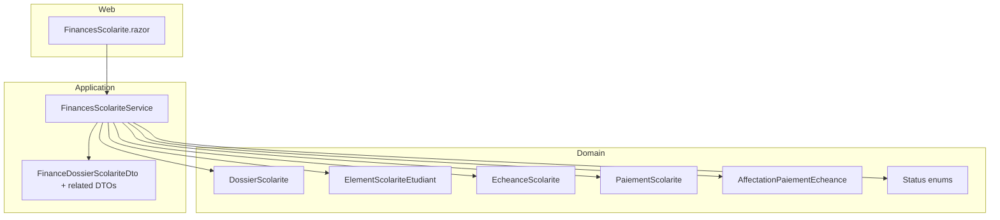
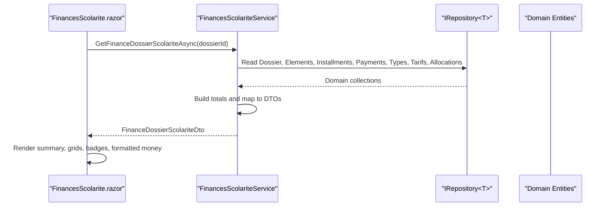
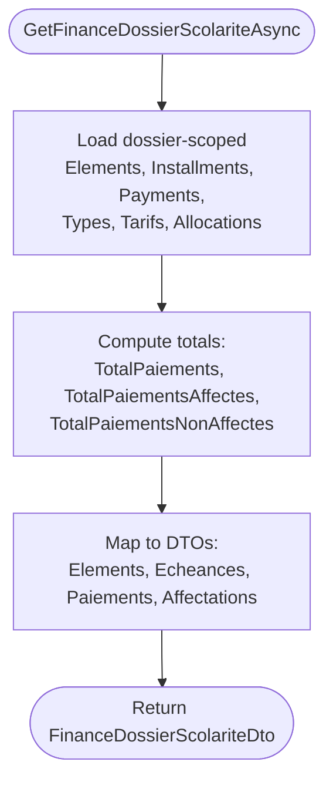
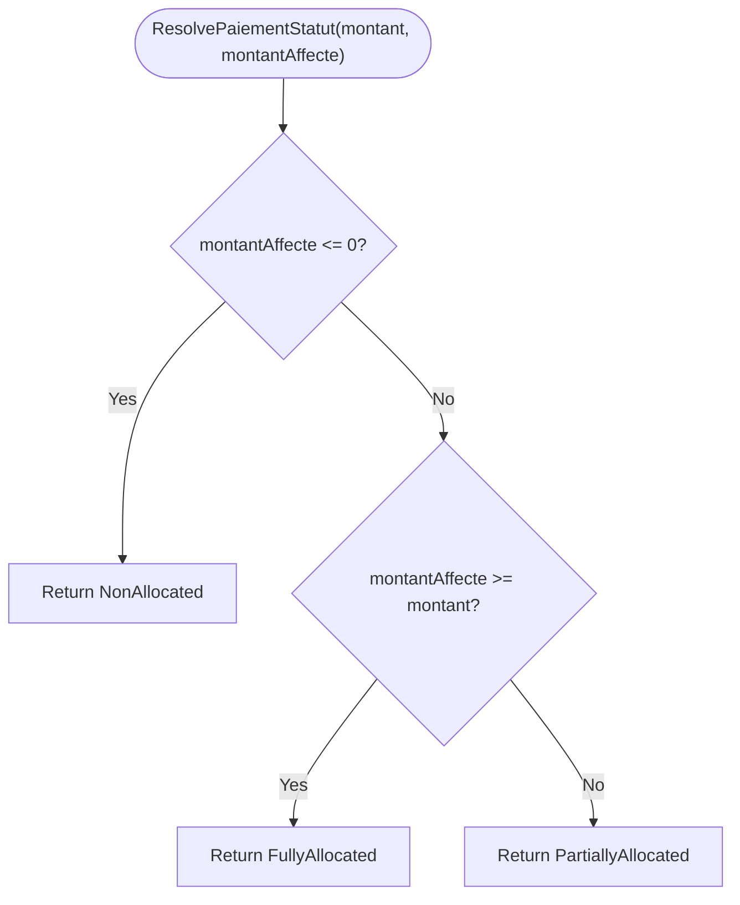
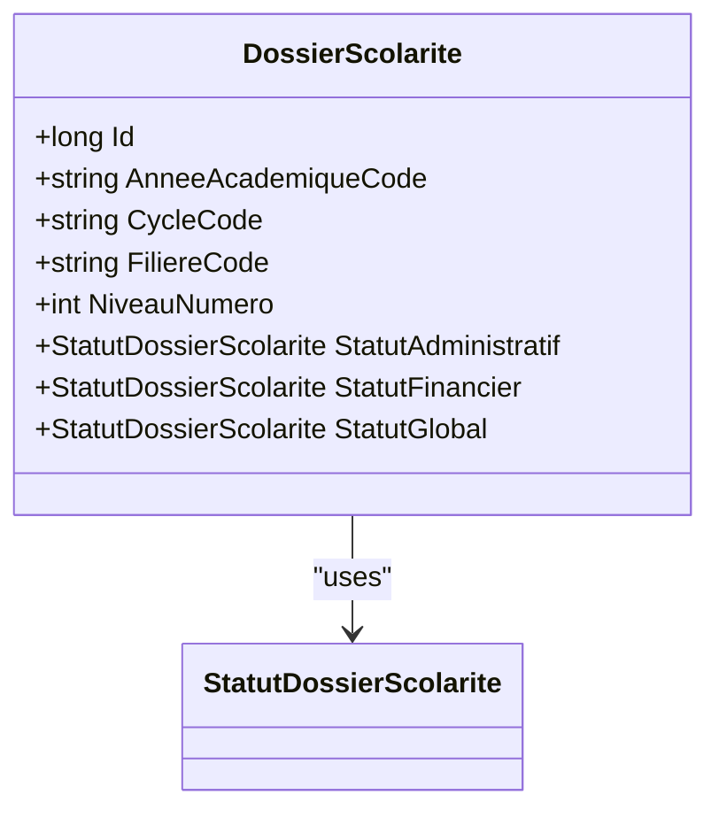
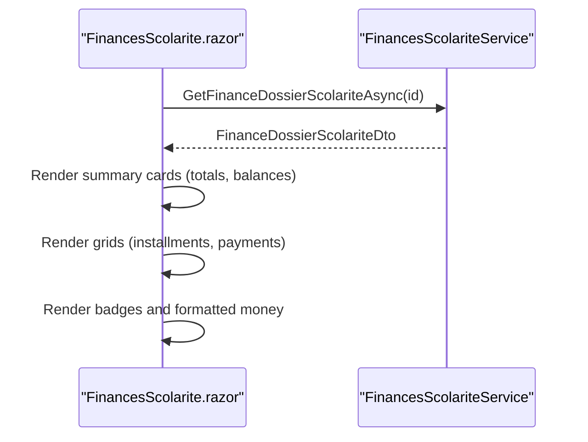
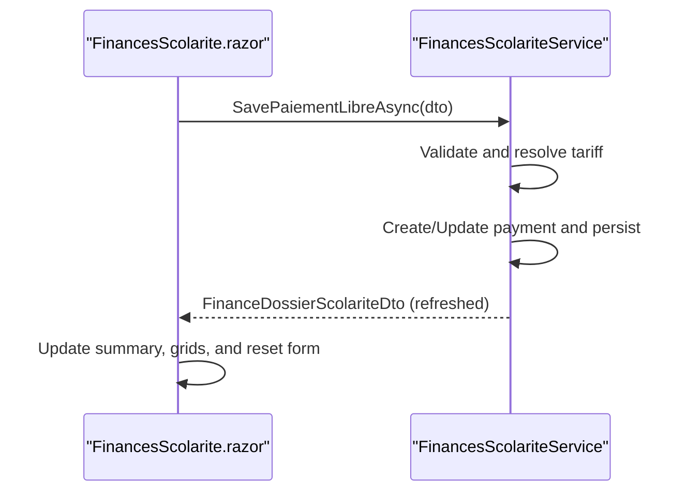
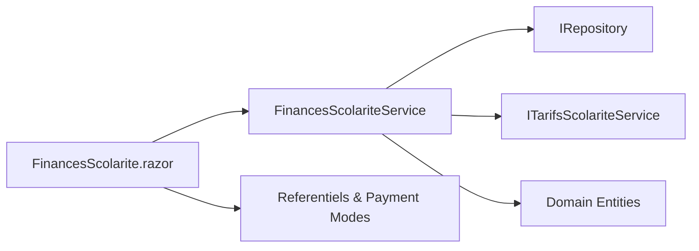

# Financial Status Tracking

<cite>
**Referenced Files in This Document**
- [FinancesScolariteService.cs](file://RIIS.Academic.Application/Scolarite/Services/FinancesScolariteService.cs)
- [FinanceDossierScolariteDto.cs](file://RIIS.Academic.Application/Scolarite/Dtos/FinanceDossierScolariteDto.cs)
- [IFinancesScolariteService.cs](file://RIIS.Academic.Application/Scolarite/Services/IFinancesScolariteService.cs)
- [DossierScolarite.cs](file://RIIS.Academic.Domain/Scolarite/DossierScolarite.cs)
- [PaiementScolarite.cs](file://RIIS.Academic.Domain/Scolarite/PaiementScolarite.cs)
- [EcheanceScolarite.cs](file://RIIS.Academic.Domain/Scolarite/EcheanceScolarite.cs)
- [ElementScolariteEtudiant.cs](file://RIIS.Academic.Domain/Scolarite/ElementScolariteEtudiant.cs)
- [AffectationPaiementEcheance.cs](file://RIIS.Academic.Domain/Scolarite/AffectationPaiementEcheance.cs)
- [StatutDossierScolarite.cs](file://RIIS.Academic.Domain/Enums/StatutDossierScolarite.cs)
- [StatutPaiementScolarite.cs](file://RIIS.Academic.Domain/Enums/StatutPaiementScolarite.cs)
- [FinancesScolarite.razor](file://RIIS.Academic.Web/Components/Pages/Scolarite/FinancesScolarite.razor)
</cite>

## Table of Contents
1. [Introduction](#introduction)
2. [Project Structure](#project-structure)
3. [Core Components](#core-components)
4. [Architecture Overview](#architecture-overview)
5. [Detailed Component Analysis](#detailed-component-analysis)
6. [Dependency Analysis](#dependency-analysis)
7. [Performance Considerations](#performance-considerations)
8. [Troubleshooting Guide](#troubleshooting-guide)
9. [Conclusion](#conclusion)

## Introduction
This document explains how financial status is tracked for student dossiers, focusing on the end-to-end flow that loads and displays financial data through GetFinanceDossierScolariteAsync. It covers total expected amounts, payments made, remaining balance, unallocated payments, and the calculation logic used to determine financial status. It also documents the interface for viewing financial summaries, calculating totals, monitoring payment progress, formatting amounts, rendering status badges, and refreshing data in real time.

## Project Structure
The financial tracking feature spans three layers:
- Domain layer: entities and enums representing dossiers, elements, installments, payments, and allocations.
- Application layer: service that aggregates data, computes totals, resolves tariffs, and exposes DTOs for UI consumption.
- Web layer: Blazor page that renders filters, summary cards, grids, and actions to record free-form payments and refresh data.



**Diagram sources**
- [FinancesScolarite.razor:1-604](file://RIIS.Academic.Web/Components/Pages/Scolarite/FinancesScolarite.razor#L1-L604)
- [FinancesScolariteService.cs:1-361](file://RIIS.Academic.Application/Scolarite/Services/FinancesScolariteService.cs#L1-L361)
- [FinanceDossierScolariteDto.cs:1-84](file://RIIS.Academic.Application/Scolarite/Dtos/FinanceDossierScolariteDto.cs#L1-L84)
- [DossierScolarite.cs:1-29](file://RIIS.Academic.Domain/Scolarite/DossierScolarite.cs#L1-L29)
- [ElementScolariteEtudiant.cs:1-26](file://RIIS.Academic.Domain/Scolarite/ElementScolariteEtudiant.cs#L1-L26)
- [EcheanceScolarite.cs:1-20](file://RIIS.Academic.Domain/Scolarite/EcheanceScolarite.cs#L1-L20)
- [PaiementScolarite.cs:1-29](file://RIIS.Academic.Domain/Scolarite/PaiementScolarite.cs#L1-L29)
- [AffectationPaiementEcheance.cs:1-15](file://RIIS.Academic.Domain/Scolarite/AffectationPaiementEcheance.cs#L1-L15)
- [StatutDossierScolarite.cs:1-13](file://RIIS.Academic.Domain/Enums/StatutDossierScolarite.cs#L1-L13)
- [StatutPaiementScolarite.cs:1-10](file://RIIS.Academic.Domain/Enums/StatutPaiementScolarite.cs#L1-L10)

**Section sources**
- [FinancesScolariteService.cs:1-361](file://RIIS.Academic.Application/Scolarite/Services/FinancesScolariteService.cs#L1-L361)
- [FinancesScolarite.razor:1-604](file://RIIS.Academic.Web/Components/Pages/Scolarite/FinancesScolarite.razor#L1-L604)

## Core Components
- FinanceDossierScolariteDto: Aggregates totals (payments received, allocated, unallocated), lists of elements, installments, payments, and allocations for a dossier.
- FinancesScolariteService: Loads all relevant domain data for a dossier, computes totals, maps to DTOs, and supports saving free-form payments.
- Domain models: Represent the financial graph (elements, installments, payments, allocations) and statuses.
- Web page: Provides filtering, selection of a dossier, display of financial summary, and recording of payments with refresh.

Key responsibilities:
- Load and aggregate financial data per dossier.
- Compute totals and balances from elements and payments.
- Resolve applicable tariffs for payments.
- Persist new or updated payments and return refreshed finance data.
- Render financial status badges and formatted currency values.

**Section sources**
- [FinanceDossierScolariteDto.cs:1-84](file://RIIS.Academic.Application/Scolarite/Dtos/FinanceDossierScolariteDto.cs#L1-L84)
- [FinancesScolariteService.cs:17-193](file://RIIS.Academic.Application/Scolarite/Services/FinancesScolariteService.cs#L17-L193)
- [DossierScolarite.cs:1-29](file://RIIS.Academic.Domain/Scolarite/DossierScolarite.cs#L1-L29)

## Architecture Overview
The system follows a layered architecture:
- The web page calls application services to load financial data and perform operations.
- The service queries repositories for domain entities and composes DTOs.
- Domain entities define the financial state and relationships.



**Diagram sources**
- [FinancesScolarite.razor:367-378](file://RIIS.Academic.Web/Components/Pages/Scolarite/FinancesScolarite.razor#L367-L378)
- [FinancesScolariteService.cs:17-193](file://RIIS.Academic.Application/Scolarite/Services/FinancesScolariteService.cs#L17-L193)

## Detailed Component Analysis

### Financial Data Loading and Display via GetFinanceDossierScolariteAsync
- Entry point: The web page selects a dossier and invokes GetFinanceDossierScolariteAsync.
- Data loading: The service reads elements, installments, payments, types, tariffs, and allocations scoped to the dossier.
- Totals computation:
  - Total payments received: sum of non-cancelled payments.
  - Total payments allocated: sum of non-cancelled payments’ allocated amounts.
  - Total payments unallocated: sum of non-cancelled payments’ unallocated amounts.
- Mapping:
  - Elements: filtered to those with expected amount > 0, ordered by label.
  - Installments: ordered by due date and number.
  - Payments: ordered by date and id descending.
  - Allocations: ordered by assignment date descending.
- Return: A FinanceDossierScolariteDto containing all lists and totals.



**Diagram sources**
- [FinancesScolariteService.cs:17-193](file://RIIS.Academic.Application/Scolarite/Services/FinancesScolariteService.cs#L17-L193)

**Section sources**
- [FinancesScolariteService.cs:17-193](file://RIIS.Academic.Application/Scolarite/Services/FinancesScolariteService.cs#L17-L193)
- [FinanceDossierScolariteDto.cs:5-15](file://RIIS.Academic.Application/Scolarite/Dtos/FinanceDossierScolariteDto.cs#L5-L15)

### Calculation Logic for Financial Status and Balances
- Expected totals: Sum of MontantAttendu across elements included in the finance view.
- Remaining balance: Sum of MontantRestant across elements.
- Payment status resolution:
  - NonAllocated when allocated amount is zero.
  - FullyAllocated when allocated amount equals or exceeds the payment amount.
  - PartiallyAllocated otherwise.
- Unallocated payments: Derived from each payment’s MontantNonAffecte; aggregated into TotalPaiementsNonAffectes.



**Diagram sources**
- [FinancesScolariteService.cs:332-342](file://RIIS.Academic.Application/Scolarite/Services/FinancesScolariteService.cs#L332-L342)
- [StatutPaiementScolarite.cs:1-10](file://RIIS.Academic.Domain/Enums/StatutPaiementScolarite.cs#L1-L10)

**Section sources**
- [FinancesScolariteService.cs:167-193](file://RIIS.Academic.Application/Scolarite/Services/FinancesScolariteService.cs#L167-L193)
- [FinancesScolariteService.cs:332-342](file://RIIS.Academic.Application/Scolarite/Services/FinancesScolariteService.cs#L332-L342)
- [StatutPaiementScolarite.cs:1-10](file://RIIS.Academic.Domain/Enums/StatutPaiementScolarite.cs#L1-L10)

### Relationship Between Administrative Completion and Payment Requirements
- The dossier entity tracks administrative, financial, and global statuses. These are part of the domain model and influence how the UI presents the dossier’s overall state.
- While the finance service focuses on monetary aggregation and payment allocation, the presence of these statuses enables higher-level business rules to gate progression based on financial completion.



**Diagram sources**
- [DossierScolarite.cs:1-29](file://RIIS.Academic.Domain/Scolarite/DossierScolarite.cs#L1-L29)
- [StatutDossierScolarite.cs:1-13](file://RIIS.Academic.Domain/Enums/StatutDossierScolarite.cs#L1-L13)

**Section sources**
- [DossierScolarite.cs:1-29](file://RIIS.Academic.Domain/Scolarite/DossierScolarite.cs#L1-L29)

### Interface for Viewing Financial Summaries, Calculating Totals, and Monitoring Progress
- Summary metrics displayed:
  - Total expected amount: computed from element expected amounts.
  - Payments received: total payments for the dossier.
  - Remaining balance: computed from element remaining amounts.
  - Unallocated payments: total unallocated payments.
- Grids:
  - Installments: show label, due date, and remaining amount.
  - Payments: show date, amount, type, mode, and unallocated amount.
- Badges:
  - Financial status badge rendered using a mapping from status enum to localized text and style.
- Amount formatting:
  - Currency values are formatted with an invariant culture numeric format.



**Diagram sources**
- [FinancesScolarite.razor:155-172](file://RIIS.Academic.Web/Components/Pages/Scolarite/FinancesScolarite.razor#L155-L172)
- [FinancesScolarite.razor:246-280](file://RIIS.Academic.Web/Components/Pages/Scolarite/FinancesScolarite.razor#L246-L280)
- [FinancesScolarite.razor:551-575](file://RIIS.Academic.Web/Components/Pages/Scolarite/FinancesScolarite.razor#L551-L575)

**Section sources**
- [FinancesScolarite.razor:155-172](file://RIIS.Academic.Web/Components/Pages/Scolarite/FinancesScolarite.razor#L155-L172)
- [FinancesScolarite.razor:246-280](file://RIIS.Academic.Web/Components/Pages/Scolarite/FinancesScolarite.razor#L246-L280)
- [FinancesScolarite.razor:551-575](file://RIIS.Academic.Web/Components/Pages/Scolarite/FinancesScolarite.razor#L551-L575)

### Recording Free-Form Payments and Refreshing Data
- The UI provides a form to record a free-form payment with type/tarif, date, amount, payment mode, reference, and observation.
- On save:
  - The service validates inputs, resolves the applicable tariff for the dossier, creates or updates the payment, and persists changes.
  - The service returns a refreshed FinanceDossierScolariteDto which the UI uses to update the view.
- Real-time updates:
  - After saving, the UI rebinds the finance data and resets form fields, ensuring the user sees the latest totals and payment list immediately.



**Diagram sources**
- [FinancesScolarite.razor:403-439](file://RIIS.Academic.Web/Components/Pages/Scolarite/FinancesScolarite.razor#L403-L439)
- [FinancesScolariteService.cs:58-141](file://RIIS.Academic.Application/Scolarite/Services/FinancesScolariteService.cs#L58-L141)

**Section sources**
- [FinancesScolarite.razor:403-439](file://RIIS.Academic.Web/Components/Pages/Scolarite/FinancesScolarite.razor#L403-L439)
- [FinancesScolariteService.cs:58-141](file://RIIS.Academic.Application/Scolarite/Services/FinancesScolariteService.cs#L58-L141)

### Data Models and Relationships
```mermaid
erDiagram
DOSSIER_SCOLARITE ||--o{ ELEMENT_SCOLARITE_ETUDIANT : "has"
ELEMENT_SCOLARITE_ETUDIANT ||--o{ ECHEANCE_SCOLARITE : "has"
ELEMENT_SCOLARITE_ETUDIANT ||--o{ PAIEMENT_SCOLARITE : "has"
PAIEMENT_SCOLARITE ||--o{ AFFECTATION_PAIEMENT_ECHEMEANCE : "has"
ECHEANCE_SCOLARITE ||--o{ AFFECTATION_PAIEMENT_ECHEMEANCE : "receives"
DOSSIER_SCOLARITE {
long Id PK
string AnneeAcademiqueCode
string CycleCode
string FiliereCode
int NiveauNumero
enum StatutAdministratif
enum StatutFinancier
enum StatutGlobal
}
ELEMENT_SCOLARITE_ETUDIANT {
long Id PK
long DossierScolariteId FK
long TypeElementScolariteId FK
string Code
string Libelle
decimal MontantAttendu
decimal MontantAffecte
decimal MontantRestant
enum Statut
}
ECHEANCE_SCOLARITE {
long Id PK
long ElementScolariteEtudiantId FK
int Numero
string Libelle
date DateExigibilite
decimal MontantAttendu
decimal MontantAffecte
decimal MontantRestant
enum Statut
}
PAIEMENT_SCOLARITE {
long Id PK
long DossierScolariteId FK
long? TypeElementScolariteId FK
long? TarifScolariteId FK
long? ModePaiementScolariteId FK
date DatePaiement
decimal Montant
string ModePaiement
string ReferencePaiement
string EncaissePar
string Observation
decimal MontantAffecte
decimal MontantNonAffecte
enum Statut
}
AFFECTATION_PAIEMENT_ECHEMEANCE {
long Id PK
long PaiementScolariteId FK
long EcheanceScolariteId FK
decimal MontantAffecte
datetime DateAffectationUtc
string AffectePar
}
```

**Diagram sources**
- [DossierScolarite.cs:1-29](file://RIIS.Academic.Domain/Scolarite/DossierScolarite.cs#L1-L29)
- [ElementScolariteEtudiant.cs:1-26](file://RIIS.Academic.Domain/Scolarite/ElementScolariteEtudiant.cs#L1-L26)
- [EcheanceScolarite.cs:1-20](file://RIIS.Academic.Domain/Scolarite/EcheanceScolarite.cs#L1-L20)
- [PaiementScolarite.cs:1-29](file://RIIS.Academic.Domain/Scolarite/PaiementScolarite.cs#L1-L29)
- [AffectationPaiementEcheance.cs:1-15](file://RIIS.Academic.Domain/Scolarite/AffectationPaiementEcheance.cs#L1-L15)

**Section sources**
- [DossierScolarite.cs:1-29](file://RIIS.Academic.Domain/Scolarite/DossierScolarite.cs#L1-L29)
- [ElementScolariteEtudiant.cs:1-26](file://RIIS.Academic.Domain/Scolarite/ElementScolariteEtudiant.cs#L1-L26)
- [EcheanceScolarite.cs:1-20](file://RIIS.Academic.Domain/Scolarite/EcheanceScolarite.cs#L1-L20)
- [PaiementScolarite.cs:1-29](file://RIIS.Academic.Domain/Scolarite/PaiementScolarite.cs#L1-L29)
- [AffectationPaiementEcheance.cs:1-15](file://RIIS.Academic.Domain/Scolarite/AffectationPaiementEcheance.cs#L1-L15)

## Dependency Analysis
- The finance service depends on multiple repositories to read domain entities and on a tariff service to resolve applicable tariffs for a given context.
- The web page depends on the finance service and other lookups (referentiels, payment modes) to render filters and forms.
- DTOs decouple the UI from domain details while preserving necessary financial information.



**Diagram sources**
- [FinancesScolarite.razor:1-604](file://RIIS.Academic.Web/Components/Pages/Scolarite/FinancesScolarite.razor#L1-L604)
- [FinancesScolariteService.cs:1-361](file://RIIS.Academic.Application/Scolarite/Services/FinancesScolariteService.cs#L1-L361)

**Section sources**
- [FinancesScolariteService.cs:1-361](file://RIIS.Academic.Application/Scolarite/Services/FinancesScolariteService.cs#L1-L361)
- [FinancesScolarite.razor:1-604](file://RIIS.Academic.Web/Components/Pages/Scolarite/FinancesScolarite.razor#L1-L604)

## Performance Considerations
- Data loading strategy: The service loads all relevant collections once per dossier and filters in memory to build DTOs. For large datasets, consider server-side pagination or query-specific projections to reduce payload size.
- Tariff resolution: Tariffs are resolved per payment or per type/tarif option; batching tariff lookups can reduce repeated calls.
- UI rendering: Grids use paging to limit rows rendered at once; ensure totals are computed efficiently and avoid unnecessary recalculations on every render.

[No sources needed since this section provides general guidance]

## Troubleshooting Guide
Common issues and resolutions:
- Missing dossier: If no dossier is found, the finance view will not load. Ensure a valid dossier ID is selected before loading finance data.
- Invalid payment inputs: Saving a payment requires positive amount, valid type/tarif, and active payment mode. Errors are thrown with descriptive messages; handle them in the UI to inform users.
- Tariff mismatch: When editing a payment, the selected tariff must match the one applicable to the dossier; otherwise, validation fails.
- No payment modes available: If no active payment modes exist, the UI warns and prevents saving until a mode is configured.

Operational tips:
- Use the “Refresh” button to reload the dossier list and finance data after external changes.
- After saving a payment, the UI automatically refreshes the finance view and resets form fields.

**Section sources**
- [FinancesScolariteService.cs:28-56](file://RIIS.Academic.Application/Scolarite/Services/FinancesScolariteService.cs#L28-L56)
- [FinancesScolariteService.cs:58-141](file://RIIS.Academic.Application/Scolarite/Services/FinancesScolariteService.cs#L58-L141)
- [FinancesScolarite.razor:175-187](file://RIIS.Academic.Web/Components/Pages/Scolarite/FinancesScolarite.razor#L175-L187)
- [FinancesScolarite.razor:403-439](file://RIIS.Academic.Web/Components/Pages/Scolarite/FinancesScolarite.razor#L403-L439)

## Conclusion
Financial status tracking for student dossiers is implemented through a clear separation of concerns: domain entities capture the financial graph, the application service aggregates and computes totals, and the web interface presents actionable summaries and controls. The GetFinanceDossierScolariteAsync method centralizes loading and mapping, enabling consistent totals, balances, and payment visibility. Status badges and formatted amounts improve readability, while immediate refresh after saving ensures accurate, up-to-date financial views.

[No sources needed since this section summarizes without analyzing specific files]