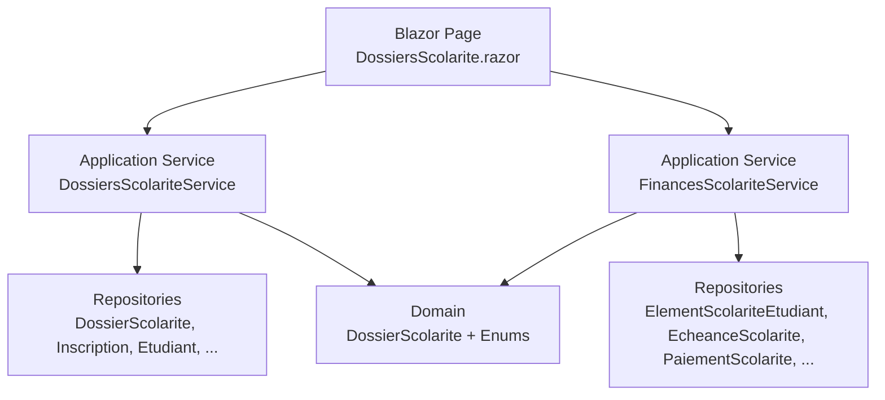
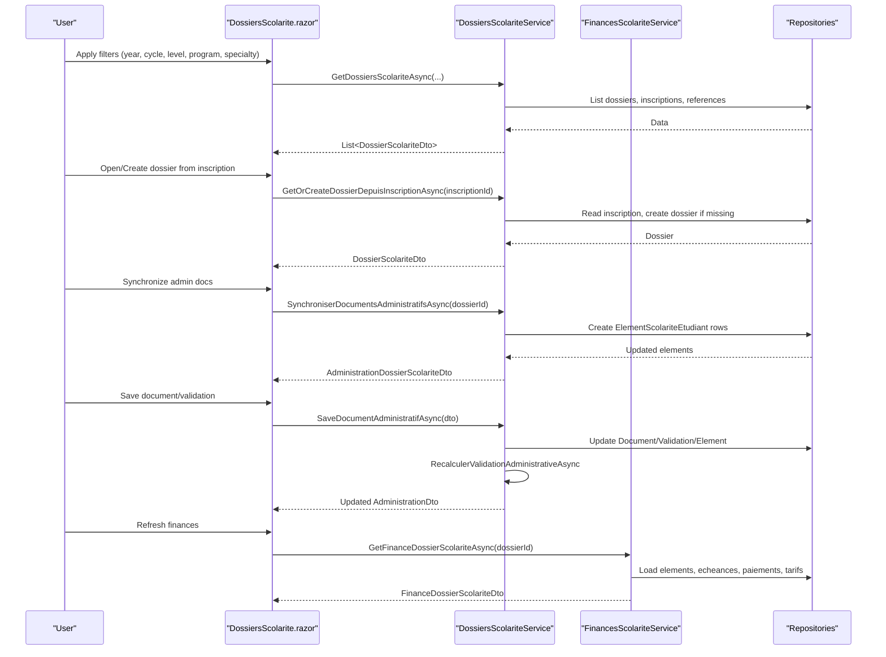
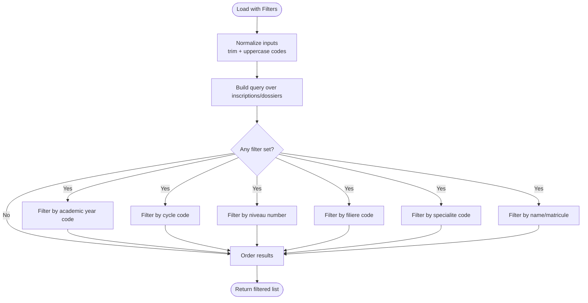
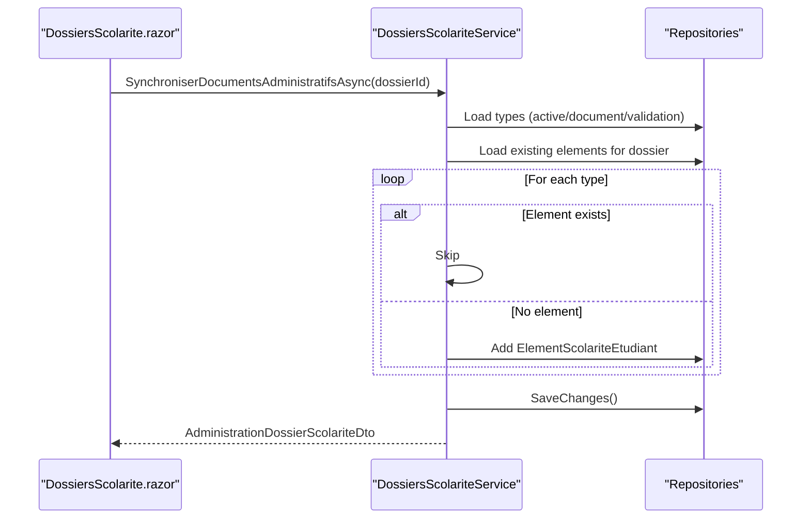
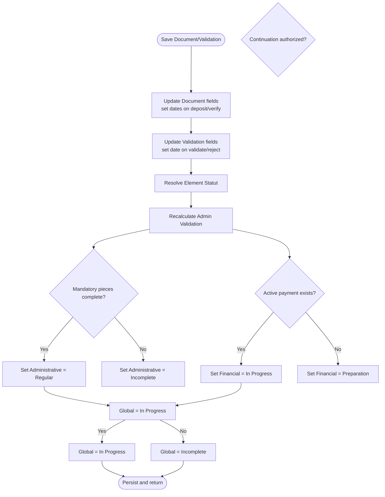
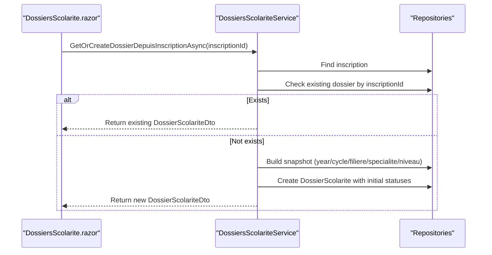
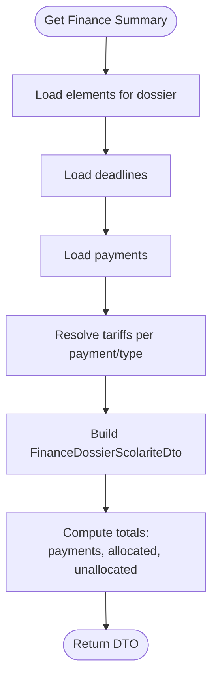
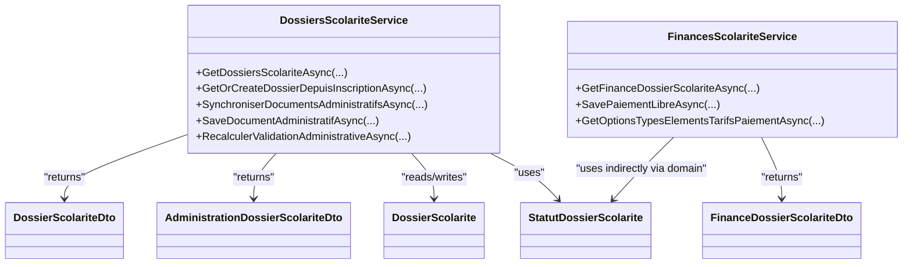

# Student Dossier Management

<cite>
**Referenced Files in This Document**
- [DossiersScolariteService.cs](file://RIIS.Academic.Application/Scolarite/Services/DossiersScolariteService.cs)
- [FinancesScolariteService.cs](file://RIIS.Academic.Application/Scolarite/Services/FinancesScolariteService.cs)
- [DossierScolariteDto.cs](file://RIIS.Academic.Application/Scolarite/Dtos/DossierScolariteDto.cs)
- [AdministrationDossierScolariteDto.cs](file://RIIS.Academic.Application/Scolarite/Dtos/AdministrationDossierScolariteDto.cs)
- [FinanceDossierScolariteDto.cs](file://RIIS.Academic.Application/Scolarite/Dtos/FinanceDossierScolariteDto.cs)
- [DossierScolarite.cs](file://RIIS.Academic.Domain/Scolarite/DossierScolarite.cs)
- [StatutDossierScolarite.cs](file://RIIS.Academic.Domain/Enums/StatutDossierScolarite.cs)
- [DossiersScolarite.razor](file://RIIS.Academic.Web/Components/Pages/Scolarite/DossiersScolarite.razor)
</cite>

## Table of Contents
1. [Introduction](#introduction)
2. [Project Structure](#project-structure)
3. [Core Components](#core-components)
4. [Architecture Overview](#architecture-overview)
5. [Detailed Component Analysis](#detailed-component-analysis)
6. [Dependency Analysis](#dependency-analysis)
7. [Performance Considerations](#performance-considerations)
8. [Troubleshooting Guide](#troubleshooting-guide)
9. [Conclusion](#conclusion)

## Introduction
This document explains the student dossier management interface and its end-to-end workflow from enrollment to completion. It covers:
- Creating and retrieving dossiers from student registrations
- Filtering by academic year, cycle, level, program (filiere), and specialty
- Administrative document synchronization and validation workflows
- Status tracking for administrative, financial, and global states
- Financial status calculations and payment handling
- Integration points with enrollment and tariff resolution

The system is implemented using a clean architecture with clear separation between domain models, application services, DTOs, and the Blazor web UI.

## Project Structure
The student dossier feature spans multiple layers:
- Domain: core entities and enums defining dossier state and relationships
- Application: services orchestrating business logic, data retrieval, and transformations
- Web: Blazor page providing filtering, creation, administration, and finance views

**Diagram sources**
- [DossiersScolarite.razor:1-682](file://RIIS.Academic.Web/Components/Pages/Scolarite/DossiersScolarite.razor#L1-L682)
- [DossiersScolariteService.cs:1-614](file://RIIS.Academic.Application/Scolarite/Services/DossiersScolariteService.cs#L1-L614)
- [FinancesScolariteService.cs:1-361](file://RIIS.Academic.Application/Scolarite/Services/FinancesScolariteService.cs#L1-L361)
- [DossierScolarite.cs:1-29](file://RIIS.Academic.Domain/Scolarite/DossierScolarite.cs#L1-L29)

**Section sources**
- [DossiersScolarite.razor:1-682](file://RIIS.Academic.Web/Components/Pages/Scolarite/DossiersScolarite.razor#L1-L682)
- [DossiersScolariteService.cs:1-614](file://RIIS.Academic.Application/Scolarite/Services/DossiersScolariteService.cs#L1-L614)
- [FinancesScolariteService.cs:1-361](file://RIIS.Academic.Application/Scolarite/Services/FinancesScolariteService.cs#L1-L361)
- [DossierScolarite.cs:1-29](file://RIIS.Academic.Domain/Scolarite/DossierScolarite.cs#L1-L29)

## Core Components
- DossiersScolariteService: central service for listing, filtering, creating dossiers from inscriptions, synchronizing administrative documents, saving document validations, and recalculating statuses.
- FinancesScolariteService: builds financial summaries, resolves tariffs per dossier context, saves free payments, and computes totals and allocations.
- DossiersScolarite.razor: UI that exposes filters, list view, detail view, admin document synchronization/validation, and financial summary refresh.
- Domain models and DTOs: define dossier snapshot fields, statuses, and presentation structures for administration and finance.

Key responsibilities:
- Enrollment integration: create or retrieve a dossier linked to an inscription.
- Admin sync: generate required administrative elements based on configured types.
- Validation: update document and validation statuses; compute completeness and authorization reasons.
- Finance: aggregate expected amounts, payments, deadlines, and allocations; resolve applicable tariffs.

**Section sources**
- [DossiersScolariteService.cs:23-93](file://RIIS.Academic.Application/Scolarite/Services/DossiersScolariteService.cs#L23-L93)
- [DossiersScolariteService.cs:128-162](file://RIIS.Academic.Application/Scolarite/Services/DossiersScolariteService.cs#L128-L162)
- [DossiersScolariteService.cs:164-252](file://RIIS.Academic.Application/Scolarite/Services/DossiersScolariteService.cs#L164-L252)
- [DossiersScolariteService.cs:254-275](file://RIIS.Academic.Application/Scolarite/Services/DossiersScolariteService.cs#L254-L275)
- [DossiersScolariteService.cs:277-317](file://RIIS.Academic.Application/Scolarite/Services/DossiersScolariteService.cs#L277-L317)
- [FinancesScolariteService.cs:17-26](file://RIIS.Academic.Application/Scolarite/Services/FinancesScolariteService.cs#L17-L26)
- [FinancesScolariteService.cs:58-141](file://RIIS.Academic.Application/Scolarite/Services/FinancesScolariteService.cs#L58-L141)
- [FinancesScolariteService.cs:143-193](file://RIIS.Academic.Application/Scolarite/Services/FinancesScolariteService.cs#L143-L193)
- [DossiersScolarite.razor:358-393](file://RIIS.Academic.Web/Components/Pages/Scolarite/DossiersScolarite.razor#L358-L393)
- [DossiersScolarite.razor:444-463](file://RIIS.Academic.Web/Components/Pages/Scolarite/DossiersScolarite.razor#L444-L463)
- [DossiersScolarite.razor:465-520](file://RIIS.Academic.Web/Components/Pages/Scolarite/DossiersScolarite.razor#L465-L520)
- [DossiersScolarite.razor:522-530](file://RIIS.Academic.Web/Components/Pages/Scolarite/DossiersScolarite.razor#L522-L530)

## Architecture Overview
The workflow begins at the UI with filtering and selection, proceeds through application services to repositories and domain models, and returns DTOs for display. Statuses are recalculated after administrative changes and financial updates.

**Diagram sources**
- [DossiersScolarite.razor:358-393](file://RIIS.Academic.Web/Components/Pages/Scolarite/DossiersScolarite.razor#L358-L393)
- [DossiersScolarite.razor:444-463](file://RIIS.Academic.Web/Components/Pages/Scolarite/DossiersScolarite.razor#L444-L463)
- [DossiersScolarite.razor:465-520](file://RIIS.Academic.Web/Components/Pages/Scolarite/DossiersScolarite.razor#L465-L520)
- [DossiersScolarite.razor:522-530](file://RIIS.Academic.Web/Components/Pages/Scolarite/DossiersScolarite.razor#L522-L530)
- [DossiersScolariteService.cs:23-93](file://RIIS.Academic.Application/Scolarite/Services/DossiersScolariteService.cs#L23-L93)
- [DossiersScolariteService.cs:128-162](file://RIIS.Academic.Application/Scolarite/Services/DossiersScolariteService.cs#L128-L162)
- [DossiersScolariteService.cs:164-252](file://RIIS.Academic.Application/Scolarite/Services/DossiersScolariteService.cs#L164-L252)
- [DossiersScolariteService.cs:254-275](file://RIIS.Academic.Application/Scolarite/Services/DossiersScolariteService.cs#L254-L275)
- [FinancesScolariteService.cs:17-26](file://RIIS.Academic.Application/Scolarite/Services/FinancesScolariteService.cs#L17-L26)
- [FinancesScolariteService.cs:143-193](file://RIIS.Academic.Application/Scolarite/Services/FinancesScolariteService.cs#L143-L193)

## Detailed Component Analysis

### Filtering System
The UI provides filters for:
- Academic year (annee academique)
- Cycle
- Level (niveau)
- Program (filiere)
- Specialty (specialite)
- Free-text search by name or matricule

Filtering behavior:
- Normalizes codes to uppercase and trims whitespace before comparison.
- Applies optional inclusion of inscriptions without dossiers.
- Orders results by academic year label descending, then student name ascending.

**Diagram sources**
- [DossiersScolariteService.cs:23-93](file://RIIS.Academic.Application/Scolarite/Services/DossiersScolariteService.cs#L23-L93)
- [DossiersScolarite.razor:358-393](file://RIIS.Academic.Web/Components/Pages/Scolarite/DossiersScolarite.razor#L358-L393)

**Section sources**
- [DossiersScolariteService.cs:23-93](file://RIIS.Academic.Application/Scolarite/Services/DossiersScolariteService.cs#L23-L93)
- [DossiersScolarite.razor:23-105](file://RIIS.Academic.Web/Components/Pages/Scolarite/DossiersScolarite.razor#L23-L105)

### Administrative Document Synchronization
Process:
- Synchronize creates administrative element rows for each active type marked as document or validation, or belonging to document/validation categories.
- For each type, sets initial status based on whether it is mandatory.
- Saves all new elements and returns updated administration view.

**Diagram sources**
- [DossiersScolariteService.cs:128-162](file://RIIS.Academic.Application/Scolarite/Services/DossiersScolariteService.cs#L128-L162)
- [DossiersScolarite.razor:465-481](file://RIIS.Academic.Web/Components/Pages/Scolarite/DossiersScolarite.razor#L465-L481)

**Section sources**
- [DossiersScolariteService.cs:128-162](file://RIIS.Academic.Application/Scolarite/Services/DossiersScolariteService.cs#L128-L162)
- [DossiersScolarite.razor:465-481](file://RIIS.Academic.Web/Components/Pages/Scolarite/DossiersScolarite.razor#L465-L481)

### Validation Workflow and Status Tracking
Saving a document or validation:
- Updates document fields (name, URL, status, verifier, observation) and timestamps when deposit or verification occurs.
- Updates validation fields (status, validator, rejection reason, observation) and timestamp when validated or rejected.
- Resolves element status based on document and validation states.
- Recalculates administrative validation and updates dossier statuses:
  - Administrative: Regular if all mandatory pieces complete; otherwise Incomplete.
  - Financial: In progress if any active payment exists; otherwise Preparation.
  - Global: In progress if continuation authorized (mandatory pieces complete OR initial payment); otherwise Incomplete.

**Diagram sources**
- [DossiersScolariteService.cs:164-252](file://RIIS.Academic.Application/Scolarite/Services/DossiersScolariteService.cs#L164-L252)
- [DossiersScolariteService.cs:254-275](file://RIIS.Academic.Application/Scolarite/Services/DossiersScolariteService.cs#L254-L275)

**Section sources**
- [DossiersScolariteService.cs:164-252](file://RIIS.Academic.Application/Scolarite/Services/DossiersScolariteService.cs#L164-L252)
- [DossiersScolariteService.cs:254-275](file://RIIS.Academic.Application/Scolarite/Services/DossiersScolariteService.cs#L254-L275)

### Enrollment Integration and Automatic Dossier Creation
- The UI allows opening or creating a dossier from an inscription.
- If a dossier already exists for the inscription, it is returned; otherwise, a new dossier is created with a snapshot of academic context (year, cycle, program, specialty, level).
- Initial statuses are set to preparation.

**Diagram sources**
- [DossiersScolarite.razor:444-463](file://RIIS.Academic.Web/Components/Pages/Scolarite/DossiersScolarite.razor#L444-L463)
- [DossiersScolariteService.cs:277-317](file://RIIS.Academic.Application/Scolarite/Services/DossiersScolariteService.cs#L277-L317)

**Section sources**
- [DossiersScolarite.razor:444-463](file://RIIS.Academic.Web/Components/Pages/Scolarite/DossiersScolarite.razor#L444-L463)
- [DossiersScolariteService.cs:277-317](file://RIIS.Academic.Application/Scolarite/Services/DossiersScolariteService.cs#L277-L317)

### Financial Status Calculations and Payment Handling
- Financial summary aggregates:
  - Total payments (excluding cancelled)
  - Total allocated and unallocated amounts
  - Elements with expected amounts and remaining balances
  - Deadlines (echeances) with due dates and statuses
  - Payments and their allocations
- Tariff resolution uses dossier context (academic year, cycle, level, program, specialty) to determine applicable amounts.
- Saving a free payment validates amount, type, tariff, and mode; updates allocation and status; rebuilds finance summary.

**Diagram sources**
- [FinancesScolariteService.cs:143-193](file://RIIS.Academic.Application/Scolarite/Services/FinancesScolariteService.cs#L143-L193)
- [FinancesScolariteService.cs:264-279](file://RIIS.Academic.Application/Scolarite/Services/FinancesScolariteService.cs#L264-L279)

**Section sources**
- [FinancesScolariteService.cs:17-26](file://RIIS.Academic.Application/Scolarite/Services/FinancesScolariteService.cs#L17-L26)
- [FinancesScolariteService.cs:58-141](file://RIIS.Academic.Application/Scolarite/Services/FinancesScolariteService.cs#L58-L141)
- [FinancesScolariteService.cs:143-193](file://RIIS.Academic.Application/Scolarite/Services/FinancesScolariteService.cs#L143-L193)
- [FinancesScolariteService.cs:264-279](file://RIIS.Academic.Application/Scolarite/Services/FinancesScolariteService.cs#L264-L279)

### Bulk Operations and Document Management
- Bulk operations are not explicitly exposed as a single endpoint in the analyzed files. However, the UI supports:
  - Batch filtering and listing across many dossiers
  - Per-row actions to synchronize admin documents and save document/validation entries
  - Refreshing financial summaries per selected dossier
- Document management includes:
  - Uploading or linking documents via URL and setting statuses
  - Recording verification details and observations
  - Managing validations with accept/reject reasons and timestamps

**Section sources**
- [DossiersScolarite.razor:107-143](file://RIIS.Academic.Web/Components/Pages/Scolarite/DossiersScolarite.razor#L107-L143)
- [DossiersScolarite.razor:216-290](file://RIIS.Academic.Web/Components/Pages/Scolarite/DossiersScolarite.razor#L216-L290)
- [DossiersScolariteService.cs:164-252](file://RIIS.Academic.Application/Scolarite/Services/DossiersScolariteService.cs#L164-L252)

## Dependency Analysis
The following diagram shows key dependencies among services, DTOs, and domain models used in the dossier workflow.

**Diagram sources**
- [DossiersScolariteService.cs:1-614](file://RIIS.Academic.Application/Scolarite/Services/DossiersScolariteService.cs#L1-L614)
- [FinancesScolariteService.cs:1-361](file://RIIS.Academic.Application/Scolarite/Services/FinancesScolariteService.cs#L1-L361)
- [DossierScolariteDto.cs:1-29](file://RIIS.Academic.Application/Scolarite/Dtos/DossierScolariteDto.cs#L1-L29)
- [AdministrationDossierScolariteDto.cs:1-43](file://RIIS.Academic.Application/Scolarite/Dtos/AdministrationDossierScolariteDto.cs#L1-L43)
- [FinanceDossierScolariteDto.cs:1-84](file://RIIS.Academic.Application/Scolarite/Dtos/FinanceDossierScolariteDto.cs#L1-L84)
- [DossierScolarite.cs:1-29](file://RIIS.Academic.Domain/Scolarite/DossierScolarite.cs#L1-L29)
- [StatutDossierScolarite.cs:1-13](file://RIIS.Academic.Domain/Enums/StatutDossierScolarite.cs#L1-L13)

**Section sources**
- [DossiersScolariteService.cs:1-614](file://RIIS.Academic.Application/Scolarite/Services/DossiersScolariteService.cs#L1-L614)
- [FinancesScolariteService.cs:1-361](file://RIIS.Academic.Application/Scolarite/Services/FinancesScolariteService.cs#L1-L361)
- [DossierScolariteDto.cs:1-29](file://RIIS.Academic.Application/Scolarite/Dtos/DossierScolariteDto.cs#L1-L29)
- [AdministrationDossierScolariteDto.cs:1-43](file://RIIS.Academic.Application/Scolarite/Dtos/AdministrationDossierScolariteDto.cs#L1-L43)
- [FinanceDossierScolariteDto.cs:1-84](file://RIIS.Academic.Application/Scolarite/Dtos/FinanceDossierScolariteDto.cs#L1-L84)
- [DossierScolarite.cs:1-29](file://RIIS.Academic.Domain/Scolarite/DossierScolarite.cs#L1-L29)
- [StatutDossierScolarite.cs:1-13](file://RIIS.Academic.Domain/Enums/StatutDossierScolarite.cs#L1-L13)

## Performance Considerations
- Filtering loads full lists into memory and applies LINQ filters client-side within the service; consider pagination or server-side filtering for large datasets.
- Context loading gathers multiple reference tables; caching or selective queries could reduce overhead.
- Financial summary aggregates multiple collections; ensure indexes on foreign keys and frequently filtered columns.
- Avoid unnecessary recalculations by batching admin updates where possible.

[No sources needed since this section provides general guidance]

## Troubleshooting Guide
Common issues and resolutions:
- Missing administrative elements: run synchronization to create required rows based on configured types.
- Invalid tariff selection: ensure the selected tariff matches the resolved tariff for the dossier context; revalidate after changes.
- Payment errors: verify positive amounts, active payment modes, and correct type/tarif associations.
- Status not updating: trigger administrative recalculation after saving documents or validations to refresh statuses.

**Section sources**
- [DossiersScolariteService.cs:128-162](file://RIIS.Academic.Application/Scolarite/Services/DossiersScolariteService.cs#L128-L162)
- [DossiersScolariteService.cs:164-252](file://RIIS.Academic.Application/Scolarite/Services/DossiersScolariteService.cs#L164-L252)
- [FinancesScolariteService.cs:58-141](file://RIIS.Academic.Application/Scolarite/Services/FinancesScolariteService.cs#L58-L141)
- [DossiersScolarite.razor:465-520](file://RIIS.Academic.Web/Components/Pages/Scolarite/DossiersScolarite.razor#L465-L520)

## Conclusion
The student dossier management interface provides a comprehensive workflow from enrollment to completion:
- Create or retrieve dossiers directly from inscriptions
- Filter efficiently by academic context and identifiers
- Synchronize and manage administrative documents with robust validation
- Track administrative, financial, and global statuses with automatic recalculation
- Handle financial calculations, payments, and allocations with tariff resolution

This design ensures consistency, traceability, and extensibility for managing student financial dossiers across the academic lifecycle.

[No sources needed since this section summarizes without analyzing specific files]