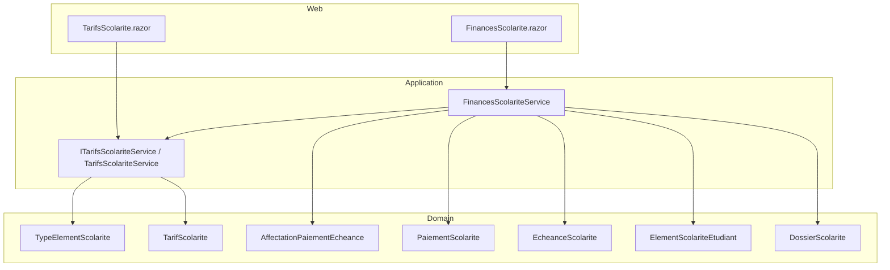
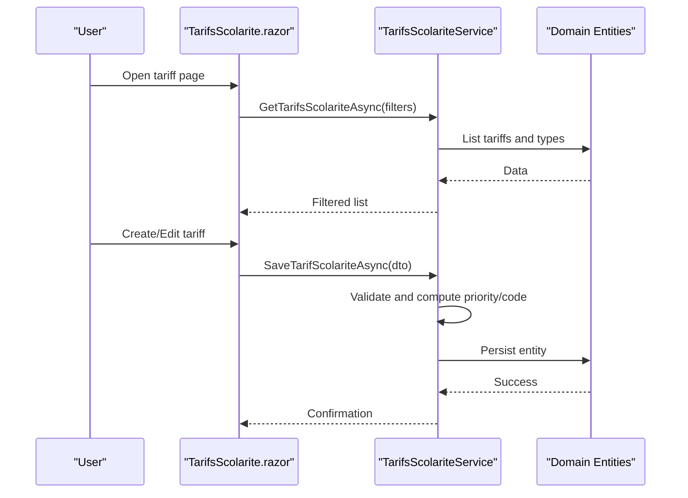
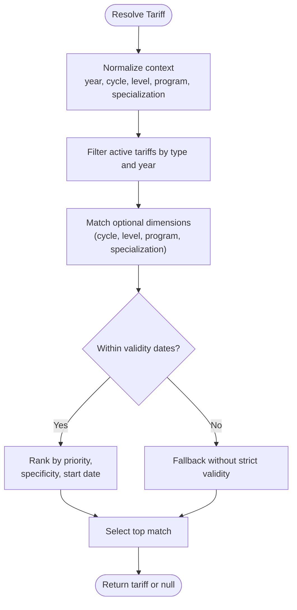
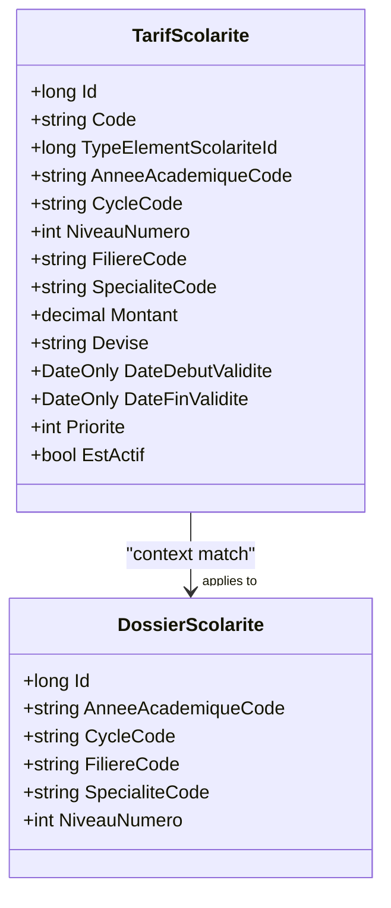
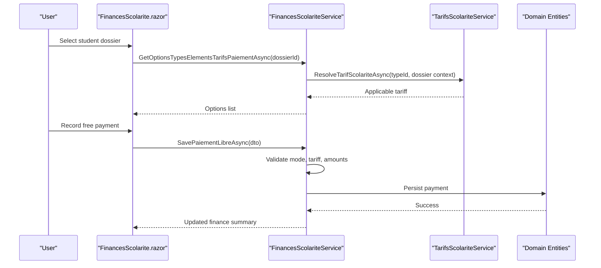
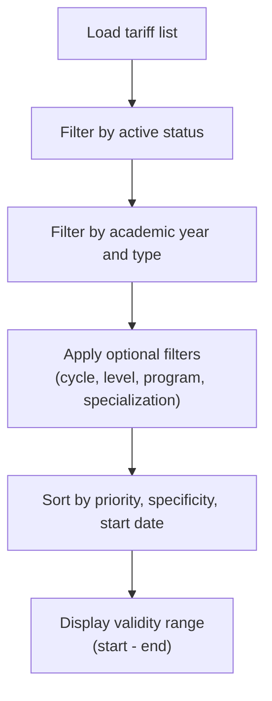
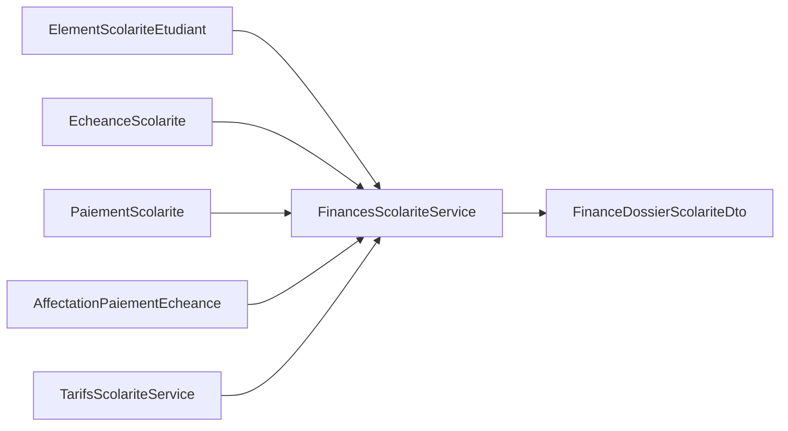
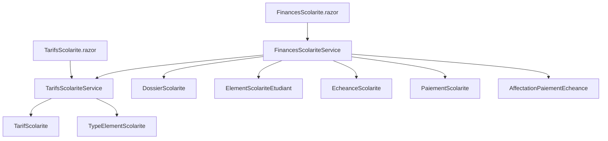

# Tuition Fee Management

<cite>
**Referenced Files in This Document**
- [TarifsScolariteService.cs](file://RIIS.Academic.Application/Scolarite/Services/TarifsScolariteService.cs)
- [ITarifsScolariteService.cs](file://RIIS.Academic.Application/Scolarite/Services/ITarifsScolariteService.cs)
- [FinancesScolariteService.cs](file://RIIS.Academic.Application/Scolarite/Services/FinancesScolariteService.cs)
- [TarifScolariteDto.cs](file://RIIS.Academic.Application/Scolarite/Dtos/TarifScolariteDto.cs)
- [TarifScolariteContexteDto.cs](file://RIIS.Academic.Application/Scolarite/Dtos/TarifScolariteContexteDto.cs)
- [FinanceDossierScolariteDto.cs](file://RIIS.Academic.Application/Scolarite/Dtos/FinanceDossierScolariteDto.cs)
- [TarifsScolarite.razor](file://RIIS.Academic.Web/Components/Pages/Scolarite/TarifsScolarite.razor)
- [FinancesScolarite.razor](file://RIIS.Academic.Web/Components/Pages/Scolarite/FinancesScolarite.razor)
- [TarifScolarite.cs](file://RIIS.Academic.Domain/Scolarite/TarifScolarite.cs)
- [DossierScolarite.cs](file://RIIS.Academic.Domain/Scolarite/DossierScolarite.cs)
- [ElementScolariteEtudiant.cs](file://RIIS.Academic.Domain/Scolarite/ElementScolariteEtudiant.cs)
- [EcheanceScolarite.cs](file://RIIS.Academic.Domain/Scolarite/EcheanceScolarite.cs)
- [PaiementScolarite.cs](file://RIIS.Academic.Domain/Scolarite/PaiementScolarite.cs)
- [AffectationPaiementEcheance.cs](file://RIIS.Academic.Domain/Scolarite/AffectationPaiementEcheance.cs)
- [TypeElementScolarite.cs](file://RIIS.Academic.Domain/Scolarite/TypeElementScolarite.cs)
</cite>

## Table of Contents
1. Introduction
2. Project Structure
3. Core Components
4. Architecture Overview
5. Detailed Component Analysis
6. Dependency Analysis
7. Performance Considerations
8. Troubleshooting Guide
9. Conclusion

## Introduction
This document explains the tuition fee management interface and its supporting services, domain models, and UI pages. It covers how fee structures are configured, how pricing rules are resolved for student profiles, how fees relate to academic programs (cycle, level, program, specialization), and how payments and deadlines are tracked. It also describes validation rules, historical tracking via validity dates, and integration points with financial calculation flows that generate fee schedules from student context.

## Project Structure
The tuition fee system spans three layers:
- Domain layer defines entities such as tariff records, student dossiers, elements, deadlines, payments, and payment allocations.
- Application layer provides services for managing tariffs and finances, including resolution of applicable tariffs based on context and orchestration of payments and deadlines.
- Web layer exposes Razor pages for configuring tariffs and managing student finances.

**Diagram sources**
- [TarifsScolarite.razor:1-560](file://RIIS.Academic.Web/Components/Pages/Scolarite/TarifsScolarite.razor#L1-L560)
- [FinancesScolarite.razor:1-604](file://RIIS.Academic.Web/Components/Pages/Scolarite/FinancesScolarite.razor#L1-L604)
- [ITarifsScolariteService.cs:1-38](file://RIIS.Academic.Application/Scolarite/Services/ITarifsScolariteService.cs#L1-L38)
- [TarifsScolariteService.cs:1-429](file://RIIS.Academic.Application/Scolarite/Services/TarifsScolariteService.cs#L1-L429)
- [FinancesScolariteService.cs:1-361](file://RIIS.Academic.Application/Scolarite/Services/FinancesScolariteService.cs#L1-L361)
- [TarifScolarite.cs:1-22](file://RIIS.Academic.Domain/Scolarite/TarifScolarite.cs#L1-L22)
- [DossierScolarite.cs:1-29](file://RIIS.Academic.Domain/Scolarite/DossierScolarite.cs#L1-L29)
- [ElementScolariteEtudiant.cs:1-26](file://RIIS.Academic.Domain/Scolarite/ElementScolariteEtudiant.cs#L1-L26)
- [EcheanceScolarite.cs:1-20](file://RIIS.Academic.Domain/Scolarite/EcheanceScolarite.cs#L1-L20)
- [PaiementScolarite.cs:1-29](file://RIIS.Academic.Domain/Scolarite/PaiementScolarite.cs#L1-L29)
- [AffectationPaiementEcheance.cs:1-15](file://RIIS.Academic.Domain/Scolarite/AffectationPaiementEcheance.cs#L1-L15)
- [TypeElementScolarite.cs:1-19](file://RIIS.Academic.Domain/Scolarite/TypeElementScolarite.cs#L1-L19)

**Section sources**
- [TarifsScolarite.razor:1-560](file://RIIS.Academic.Web/Components/Pages/Scolarite/TarifsScolarite.razor#L1-L560)
- [FinancesScolarite.razor:1-604](file://RIIS.Academic.Web/Components/Pages/Scolarite/FinancesScolarite.razor#L1-L604)
- [ITarifsScolariteService.cs:1-38](file://RIIS.Academic.Application/Scolarite/Services/ITarifsScolariteService.cs#L1-L38)
- [TarifsScolariteService.cs:1-429](file://RIIS.Academic.Application/Scolarite/Services/TarifsScolariteService.cs#L1-L429)
- [FinancesScolariteService.cs:1-361](file://RIIS.Academic.Application/Scolarite/Services/FinancesScolariteService.cs#L1-L361)
- [TarifScolarite.cs:1-22](file://RIIS.Academic.Domain/Scolarite/TarifScolarite.cs#L1-L22)
- [DossierScolarite.cs:1-29](file://RIIS.Academic.Domain/Scolarite/DossierScolarite.cs#L1-L29)
- [ElementScolariteEtudiant.cs:1-26](file://RIIS.Academic.Domain/Scolarite/ElementScolariteEtudiant.cs#L1-L26)
- [EcheanceScolarite.cs:1-20](file://RIIS.Academic.Domain/Scolarite/EcheanceScolarite.cs#L1-L20)
- [PaiementScolarite.cs:1-29](file://RIIS.Academic.Domain/Scolarite/PaiementScolarite.cs#L1-L29)
- [AffectationPaiementEcheance.cs:1-15](file://RIIS.Academic.Domain/Scolarite/AffectationPaiementEcheance.cs#L1-L15)
- [TypeElementScolarite.cs:1-19](file://RIIS.Academic.Domain/Scolarite/TypeElementScolarite.cs#L1-L19)

## Core Components
- Tariff configuration and resolution: The tariff service manages creation, updates, deletion, code generation, and resolution of applicable tariffs based on academic context (academic year, cycle, level, program, specialization).
- Financial operations: The finance service composes student dossier data, elements, deadlines, payments, and allocations; it resolves applicable tariffs per element and supports free-form payments.
- UI interfaces: The tariff page allows CRUD operations and filtering; the finance page lists student dossiers and enables payment recording and viewing of balances and deadlines.

Key responsibilities:
- Validate inputs and enforce business rules during save operations.
- Resolve the most specific active tariff valid at a reference date.
- Build comprehensive financial summaries per student dossier.
- Provide options for payments based on payable types and active tariffs.

**Section sources**
- [TarifsScolariteService.cs:14-238](file://RIIS.Academic.Application/Scolarite/Services/TarifsScolariteService.cs#L14-L238)
- [FinancesScolariteService.cs:17-141](file://RIIS.Academic.Application/Scolarite/Services/FinancesScolariteService.cs#L17-L141)
- [TarifsScolarite.razor:76-221](file://RIIS.Academic.Web/Components/Pages/Scolarite/TarifsScolarite.razor#L76-L221)
- [FinancesScolarite.razor:135-283](file://RIIS.Academic.Web/Components/Pages/Scolarite/FinancesScolarite.razor#L135-L283)

## Architecture Overview
The system follows a layered architecture:
- Web pages call application services.
- Application services coordinate domain entities and repositories.
- Domain entities encapsulate core business concepts and relationships.

**Diagram sources**
- [TarifsScolarite.razor:275-359](file://RIIS.Academic.Web/Components/Pages/Scolarite/TarifsScolarite.razor#L275-L359)
- [ITarifsScolariteService.cs:7-36](file://RIIS.Academic.Application/Scolarite/Services/ITarifsScolariteService.cs#L7-L36)
- [TarifsScolariteService.cs:107-185](file://RIIS.Academic.Application/Scolarite/Services/TarifsScolariteService.cs#L107-L185)
- [TarifScolarite.cs:1-22](file://RIIS.Academic.Domain/Scolarite/TarifScolarite.cs#L1-L22)

## Detailed Component Analysis

### Tariff Configuration and Resolution
- Configuration: Users create or edit tariffs with type, academic year, cycle, level, program, specialization, amount, currency, validity dates, priority, and active flag. The UI binds these fields and triggers server-side validation and code generation.
- Pricing rules: The service computes specificity based on how many contextual dimensions are specified (cycle, level, program, specialization) and selects the most specific active tariff valid at the reference date. Priority is used as a tie-breaker.
- Validation rules enforced include required fields, positive amounts, valid date ranges, and uniqueness constraints for overlapping contexts and start dates.

**Diagram sources**
- [TarifsScolariteService.cs:195-238](file://RIIS.Academic.Application/Scolarite/Services/TarifsScolariteService.cs#L195-L238)
- [TarifsScolariteService.cs:318-330](file://RIIS.Academic.Application/Scolarite/Services/TarifsScolariteService.cs#L318-L330)

**Section sources**
- [TarifsScolariteService.cs:96-185](file://RIIS.Academic.Application/Scolarite/Services/TarifsScolariteService.cs#L96-L185)
- [TarifsScolariteService.cs:195-238](file://RIIS.Academic.Application/Scolarite/Services/TarifsScolariteService.cs#L195-L238)
- [TarifsScolariteService.cs:250-268](file://RIIS.Academic.Application/Scolarite/Services/TarifsScolariteService.cs#L250-L268)
- [TarifsScolariteService.cs:318-330](file://RIIS.Academic.Application/Scolarite/Services/TarifsScolariteService.cs#L318-L330)
- [TarifsScolarite.razor:76-221](file://RIIS.Academic.Web/Components/Pages/Scolarite/TarifsScolarite.razor#L76-L221)

### Relationship Between Academic Programs, Levels, and Fees
- Contextual dimensions: Cycle, level number, program (filiere), and specialization form the hierarchy used to scope tariffs. The UI enforces consistency so that selected program belongs to the chosen cycle and specialization belongs to the chosen program.
- Tariff specificity: More specific combinations yield higher specificity scores, ensuring precise matching when resolving tariffs for a given student profile.

**Diagram sources**
- [TarifScolarite.cs:1-22](file://RIIS.Academic.Domain/Scolarite/TarifScolarite.cs#L1-L22)
- [DossierScolarite.cs:1-29](file://RIIS.Academic.Domain/Scolarite/DossierScolarite.cs#L1-L29)

**Section sources**
- [TarifsScolariteService.cs:318-330](file://RIIS.Academic.Application/Scolarite/Services/TarifsScolariteService.cs#L318-L330)
- [TarifsScolarite.razor:418-459](file://RIIS.Academic.Web/Components/Pages/Scolarite/TarifsScolarite.razor#L418-L459)

### Payment Recording and Financial Summary
- Options discovery: For a selected student dossier, the finance service enumerates payable element types and resolves the applicable tariff per type using the dossier’s context.
- Free payment entry: Users record payments with type, tariff, mode, date, amount, reference, and observation. The service validates presence of active payment modes and ensures the selected tariff matches the currently applicable one.
- Financial summary: The service aggregates expected amounts, paid amounts, unallocated amounts, deadlines, and allocations to present a complete view.

**Diagram sources**
- [FinancesScolarite.razor:361-439](file://RIIS.Academic.Web/Components/Pages/Scolarite/FinancesScolarite.razor#L361-L439)
- [FinancesScolariteService.cs:28-141](file://RIIS.Academic.Application/Scolarite/Services/FinancesScolariteService.cs#L28-L141)
- [TarifsScolariteService.cs:195-238](file://RIIS.Academic.Application/Scolarite/Services/TarifsScolariteService.cs#L195-L238)

**Section sources**
- [FinancesScolariteService.cs:28-141](file://RIIS.Academic.Application/Scolarite/Services/FinancesScolariteService.cs#L28-L141)
- [FinancesScolariteService.cs:143-193](file://RIIS.Academic.Application/Scolarite/Services/FinancesScolariteService.cs#L143-L193)
- [FinancesScolarite.razor:174-244](file://RIIS.Academic.Web/Components/Pages/Scolarite/FinancesScolarite.razor#L174-L244)

### Historical Fee Tracking and Validity
- Validity windows: Each tariff has start and optional end dates. Resolution considers the reference date to ensure only valid tariffs apply.
- History visibility: The UI displays validity ranges, enabling administrators to track changes over time.

**Diagram sources**
- [TarifsScolariteService.cs:14-70](file://RIIS.Academic.Application/Scolarite/Services/TarifsScolariteService.cs#L14-L70)
- [TarifsScolariteService.cs:195-238](file://RIIS.Academic.Application/Scolarite/Services/TarifsScolariteService.cs#L195-L238)
- [TarifsScolarite.razor:223-255](file://RIIS.Academic.Web/Components/Pages/Scolarite/TarifsScolarite.razor#L223-L255)

**Section sources**
- [TarifsScolariteService.cs:14-70](file://RIIS.Academic.Application/Scolarite/Services/TarifsScolariteService.cs#L14-L70)
- [TarifsScolariteService.cs:195-238](file://RIIS.Academic.Application/Scolarite/Services/TarifsScolariteService.cs#L195-L238)
- [TarifsScolarite.razor:223-255](file://RIIS.Academic.Web/Components/Pages/Scolarite/TarifsScolarite.razor#L223-L255)

### Integration with Financial Calculation Engines
- While no dedicated “financial calculation engine” module exists in the referenced files, the finance service orchestrates calculations by:
  - Aggregating expected amounts across student elements.
  - Summing payments and their allocated portions.
  - Computing remaining balances and statuses.
  - Resolving applicable tariffs per element using the tariff service.

**Diagram sources**
- [FinancesScolariteService.cs:143-193](file://RIIS.Academic.Application/Scolarite/Services/FinancesScolariteService.cs#L143-L193)
- [FinanceDossierScolariteDto.cs:1-84](file://RIIS.Academic.Application/Scolarite/Dtos/FinanceDossierScolariteDto.cs#L1-L84)

**Section sources**
- [FinancesScolariteService.cs:143-193](file://RIIS.Academic.Application/Scolarite/Services/FinancesScolariteService.cs#L143-L193)
- [FinanceDossierScolariteDto.cs:1-84](file://RIIS.Academic.Application/Scolarite/Dtos/FinanceDossierScolariteDto.cs#L1-L84)

## Dependency Analysis
- Service dependencies:
  - Tariff service depends on repositories for tariffs and element types.
  - Finance service depends on repositories for dossiers, elements, deadlines, payments, modes, and allocations, and uses the tariff service for resolution.
- UI dependencies:
  - Tariff page depends on tariff and element type services and referential data.
  - Finance page depends on dossier, finance, referential, and payment mode services.

**Diagram sources**
- [TarifsScolarite.razor:1-560](file://RIIS.Academic.Web/Components/Pages/Scolarite/TarifsScolarite.razor#L1-L560)
- [FinancesScolarite.razor:1-604](file://RIIS.Academic.Web/Components/Pages/Scolarite/FinancesScolarite.razor#L1-L604)
- [TarifsScolariteService.cs:1-429](file://RIIS.Academic.Application/Scolarite/Services/TarifsScolariteService.cs#L1-L429)
- [FinancesScolariteService.cs:1-361](file://RIIS.Academic.Application/Scolarite/Services/FinancesScolariteService.cs#L1-L361)
- [TarifScolarite.cs:1-22](file://RIIS.Academic.Domain/Scolarite/TarifScolarite.cs#L1-L22)
- [TypeElementScolarite.cs:1-19](file://RIIS.Academic.Domain/Scolarite/TypeElementScolarite.cs#L1-L19)
- [DossierScolarite.cs:1-29](file://RIIS.Academic.Domain/Scolarite/DossierScolarite.cs#L1-L29)
- [ElementScolariteEtudiant.cs:1-26](file://RIIS.Academic.Domain/Scolarite/ElementScolariteEtudiant.cs#L1-L26)
- [EcheanceScolarite.cs:1-20](file://RIIS.Academic.Domain/Scolarite/EcheanceScolarite.cs#L1-L20)
- [PaiementScolarite.cs:1-29](file://RIIS.Academic.Domain/Scolarite/PaiementScolarite.cs#L1-L29)
- [AffectationPaiementEcheance.cs:1-15](file://RIIS.Academic.Domain/Scolarite/AffectationPaiementEcheance.cs#L1-L15)

**Section sources**
- [TarifsScolariteService.cs:1-429](file://RIIS.Academic.Application/Scolarite/Services/TarifsScolariteService.cs#L1-L429)
- [FinancesScolariteService.cs:1-361](file://RIIS.Academic.Application/Scolarite/Services/FinancesScolariteService.cs#L1-L361)
- [TarifsScolarite.razor:1-560](file://RIIS.Academic.Web/Components/Pages/Scolarite/TarifsScolarite.razor#L1-L560)
- [FinancesScolarite.razor:1-604](file://RIIS.Academic.Web/Components/Pages/Scolarite/FinancesScolarite.razor#L1-L604)

## Performance Considerations
- Filtering and sorting: The tariff service loads all tariffs and types into memory and applies LINQ filters and ordering. For large datasets, consider server-side paging and indexed queries on key fields (type, academic year, cycle, level, program, specialization).
- Specificity ranking: Ranking by priority, specificity, and start date is efficient but can be optimized by pre-indexing and narrowing result sets early.
- Financial aggregation: Building the finance DTO aggregates multiple collections; batching and minimizing redundant lookups improves performance.

[No sources needed since this section provides general guidance]

## Troubleshooting Guide
Common issues and resolutions:
- Missing prerequisites: Ensure element types and academic years exist before creating tariffs; the UI warns if they are missing.
- Invalid inputs: Required fields like type, academic year, amount, currency, and level must be provided; violations raise explicit errors.
- Duplicate tariffs: Saving a tariff with an existing combination of type, year, context, and start date is rejected.
- Payment validation: Payments require an active payment mode and a tariff that still matches the current applicable tariff for the dossier.

**Section sources**
- [TarifsScolarite.razor:62-74](file://RIIS.Academic.Web/Components/Pages/Scolarite/TarifsScolarite.razor#L62-L74)
- [TarifsScolariteService.cs:107-185](file://RIIS.Academic.Application/Scolarite/Services/TarifsScolariteService.cs#L107-L185)
- [TarifsScolariteService.cs:250-268](file://RIIS.Academic.Application/Scolarite/Services/TarifsScolariteService.cs#L250-L268)
- [FinancesScolariteService.cs:58-94](file://RIIS.Academic.Application/Scolarite/Services/FinancesScolariteService.cs#L58-L94)

## Conclusion
The tuition fee management system provides robust configuration of fee structures, precise resolution of applicable tariffs based on student profiles, and comprehensive financial tracking including payments and deadlines. The layered design separates concerns between UI, application logic, and domain entities, enabling maintainability and extensibility. Administrators can manage tariffs with clear validation and historical visibility, while finance operators can record and monitor payments with confidence in rule enforcement.