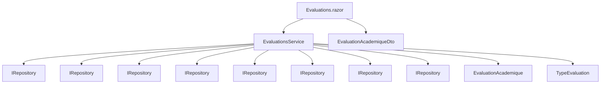
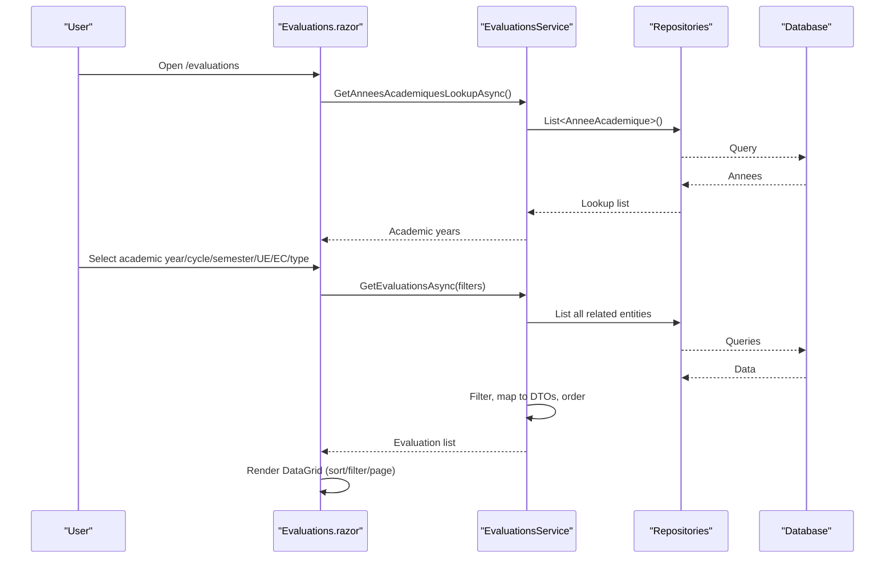
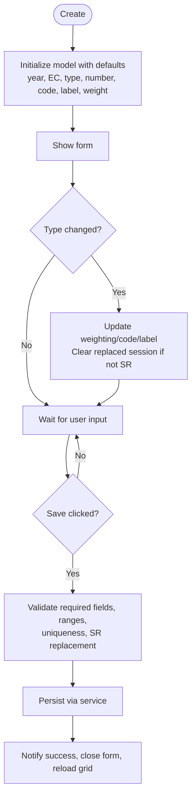
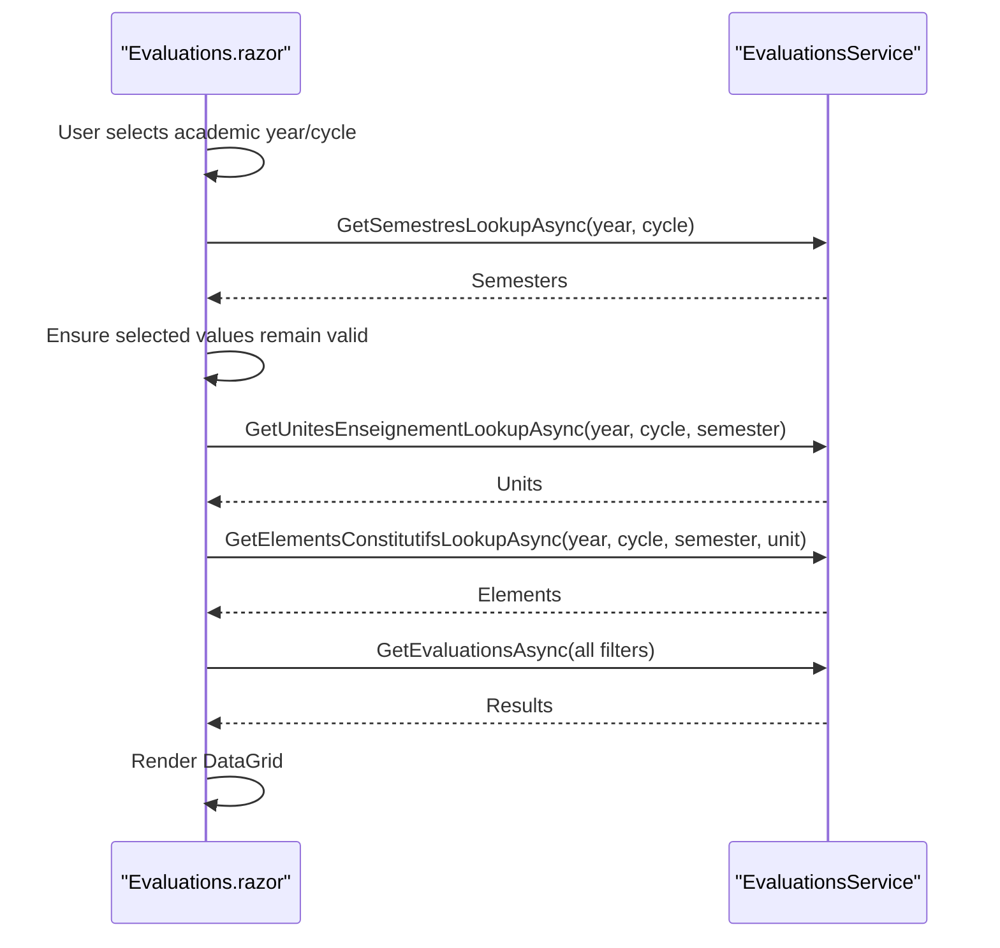
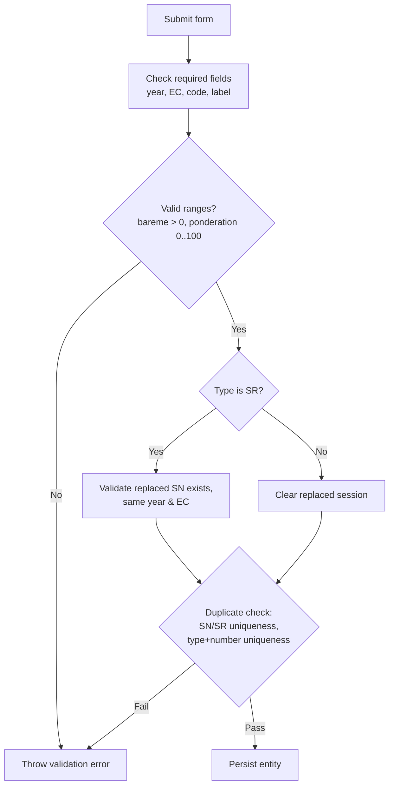
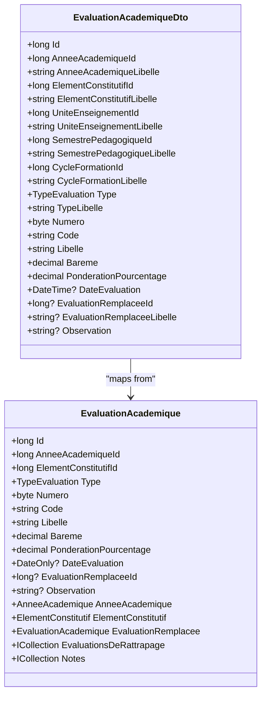
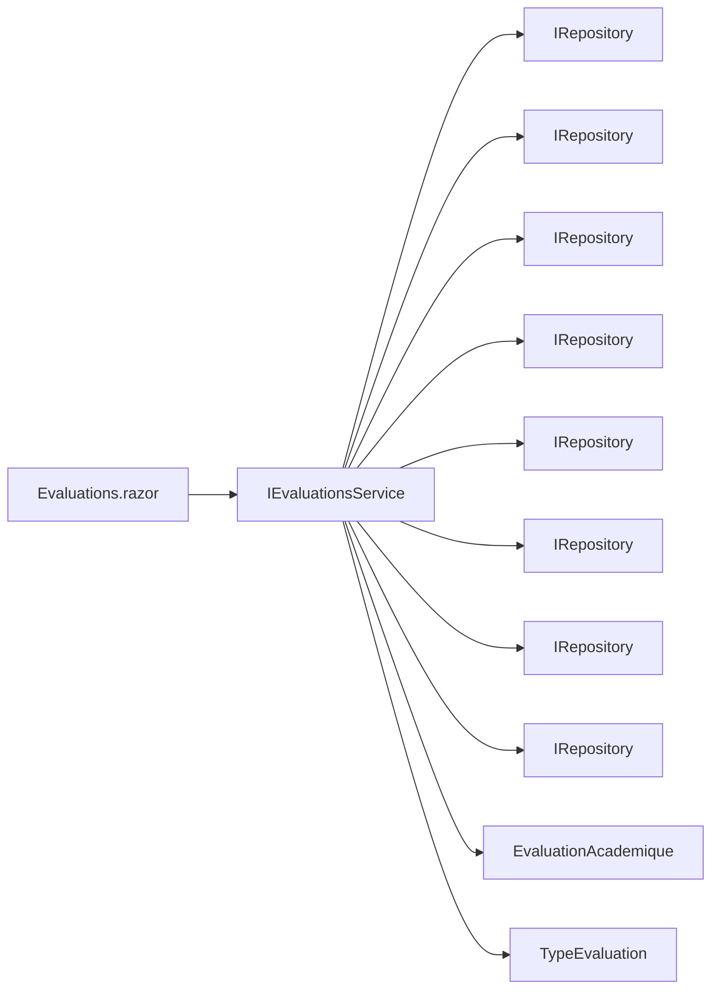

# Evaluations Management

<cite>
**Referenced Files in This Document**
- [Evaluations.razor](file://RIIS.Academic.Web/Components/Pages/Evaluations.razor)
- [EvaluationAcademiqueDto.cs](file://RIIS.Academic.Application/Evaluations/Dtos/EvaluationAcademiqueDto.cs)
- [IEvaluationsService.cs](file://RIIS.Academic.Application/Evaluations/Services/IEvaluationsService.cs)
- [EvaluationsService.cs](file://RIIS.Academic.Application/Evaluations/Services/EvaluationsService.cs)
- [TypeEvaluation.cs](file://RIIS.Academic.Domain/Enums/TypeEvaluation.cs)
- [EvaluationAcademique.cs](file://RIIS.Academic.Domain/Notes/EvaluationAcademique.cs)
</cite>

## Table of Contents
1. [Introduction](#introduction)
2. [Project Structure](#project-structure)
3. [Core Components](#core-components)
4. [Architecture Overview](#architecture-overview)
5. [Detailed Component Analysis](#detailed-component-analysis)
6. [Dependency Analysis](#dependency-analysis)
7. [Performance Considerations](#performance-considerations)
8. [Troubleshooting Guide](#troubleshooting-guide)
9. [Conclusion](#conclusion)

## Introduction
This document explains the evaluations management interface component that enables users to create, filter, and manage academic evaluations for each constituent element (EC). It covers:
- Evaluation creation workflow with hierarchical data binding across academic year, cycle formation, semester, teaching unit (UE), and EC.
- Filtering system by academic year, cycle formation, semester, UE, EC, and evaluation type.
- Evaluation types (CCON, CC, SN, SR) including default grading scales (Bareme), weighting percentages (PonderationPourcentage), and replacement logic for catch-up sessions (SR replacing SN).
- Form validation rules and real-time filter updates.
- Data grid features: sorting, filtering, paging, and CRUD operations (create, edit, delete).

## Project Structure
The evaluations feature spans three layers:
- Web UI: Blazor page implementing filters, form, and data grid.
- Application layer: Service orchestrating lookups, validations, and persistence via repositories.
- Domain layer: Entities and enums defining evaluation types and relationships.

**Diagram sources**
- [Evaluations.razor:1-283](file://RIIS.Academic.Web/Components/Pages/Evaluations.razor#L1-L283)
- [EvaluationsService.cs:8-16](file://RIIS.Academic.Application/Evaluations/Services/EvaluationsService.cs#L8-L16)
- [EvaluationAcademiqueDto.cs:5-29](file://RIIS.Academic.Application/Evaluations/Dtos/EvaluationAcademiqueDto.cs#L5-L29)
- [TypeEvaluation.cs:3-9](file://RIIS.Academic.Domain/Enums/TypeEvaluation.cs#L3-L9)
- [EvaluationAcademique.cs:3-23](file://RIIS.Academic.Domain/Notes/EvaluationAcademique.cs#L3-L23)

**Section sources**
- [Evaluations.razor:1-283](file://RIIS.Academic.Web/Components/Pages/Evaluations.razor#L1-L283)
- [IEvaluationsService.cs:7-47](file://RIIS.Academic.Application/Evaluations/Services/IEvaluationsService.cs#L7-L47)

## Core Components
- Web Page: Evaluations.razor provides the user interface for filtering, creating/editing evaluations, and displaying results in a data grid.
- Service: EvaluationsService implements business logic for querying, validating, saving, and deleting evaluations; it also provides hierarchical lookup methods for dropdowns.
- DTO: EvaluationAcademiqueDto carries evaluation data between UI and service.
- Domain: TypeEvaluation enum defines allowed evaluation types; EvaluationAcademique is the persistent entity with relationships to academic year, EC, replaced session, and notes.

Key responsibilities:
- Hierarchical filtering and cascading dropdowns (academic year → cycle → semester → UE → EC).
- Default value generation for new evaluations (number, code, label, weighting).
- Validation rules for required fields, ranges, uniqueness, and SR replacement constraints.
- Data grid operations: sort, filter, page, edit, delete.

**Section sources**
- [Evaluations.razor:117-255](file://RIIS.Academic.Web/Components/Pages/Evaluations.razor#L117-L255)
- [EvaluationsService.cs:17-120](file://RIIS.Academic.Application/Evaluations/Services/EvaluationsService.cs#L17-L120)
- [EvaluationAcademiqueDto.cs:5-29](file://RIIS.Academic.Application/Evaluations/Dtos/EvaluationAcademiqueDto.cs#L5-L29)
- [TypeEvaluation.cs:3-9](file://RIIS.Academic.Domain/Enums/TypeEvaluation.cs#L3-L9)
- [EvaluationAcademique.cs:3-23](file://RIIS.Academic.Domain/Notes/EvaluationAcademique.cs#L3-L23)

## Architecture Overview
The evaluations management follows a layered architecture:
- UI binds to service methods for data loading and actions.
- Service composes multiple repository calls to build filtered lists and perform validations.
- Domain entities define the model and relationships used by the service.

**Diagram sources**
- [Evaluations.razor:312-329](file://RIIS.Academic.Web/Components/Pages/Evaluations.razor#L312-L329)
- [EvaluationsService.cs:17-120](file://RIIS.Academic.Application/Evaluations/Services/EvaluationsService.cs#L17-L120)

## Detailed Component Analysis

### Evaluation Types and Configurations
- Types: CCON (ControleContinu), CC (ControleConnaissance), SN (SessionNormale), SR (SessionRattrapage).
- Default weighting percentages:
  - CCON: 20%
  - CC: 10%
  - SN: 70%
  - SR: 70%
- Grading scale (Bareme): defaults to 20 for new evaluations; must be greater than zero on save.
- Replacement logic:
  - SR can replace only an SN within the same academic year and EC.
  - If type is not SR, the replaced session field is cleared.
  - Only one SN or SR per EC per academic year is allowed.

These behaviors are enforced in the service’s save method and reflected in the UI’s dynamic behavior.

**Section sources**
- [TypeEvaluation.cs:3-9](file://RIIS.Academic.Domain/Enums/TypeEvaluation.cs#L3-L9)
- [EvaluationsService.cs:172-294](file://RIIS.Academic.Application/Evaluations/Services/EvaluationsService.cs#L172-L294)
- [Evaluations.razor:223-247](file://RIIS.Academic.Web/Components/Pages/Evaluations.razor#L223-L247)
- [Evaluations.razor:552-580](file://RIIS.Academic.Web/Components/Pages/Evaluations.razor#L552-L580)

### Creation Workflow
- Create opens a form pre-filled with:
  - Academic year (default active or first available).
  - Next sequential number for the selected EC and type.
  - Code prefix based on type and number.
  - Label combining type short name and number.
  - Default weighting percentage based on type.
- On type change:
  - For new records, sets default weighting, code, and label.
  - Clears replaced session if type is not SR.
  - Refreshes available SN options for replacement.

**Diagram sources**
- [Evaluations.razor:402-413](file://RIIS.Academic.Web/Components/Pages/Evaluations.razor#L402-L413)
- [Evaluations.razor:465-480](file://RIIS.Academic.Web/Components/Pages/Evaluations.razor#L465-L480)
- [EvaluationsService.cs:142-170](file://RIIS.Academic.Application/Evaluations/Services/EvaluationsService.cs#L142-L170)
- [EvaluationsService.cs:172-294](file://RIIS.Academic.Application/Evaluations/Services/EvaluationsService.cs#L172-L294)

**Section sources**
- [Evaluations.razor:402-413](file://RIIS.Academic.Web/Components/Pages/Evaluations.razor#L402-L413)
- [Evaluations.razor:465-480](file://RIIS.Academic.Web/Components/Pages/Evaluations.razor#L465-L480)
- [EvaluationsService.cs:142-170](file://RIIS.Academic.Application/Evaluations/Services/EvaluationsService.cs#L142-L170)

### Filtering System and Real-Time Updates
Filters include:
- Academic year
- Cycle formation
- Semester
- Teaching unit (UE)
- Constituent element (EC)
- Evaluation type

Real-time behavior:
- Changing academic year or cycle refreshes semesters and units, then reloads evaluations.
- Changing semester refreshes units and elements, then reloads evaluations.
- Changing UE refreshes elements, then reloads evaluations.
- Changing EC or type triggers immediate reload.
- Reset clears all filters and reloads.

**Diagram sources**
- [Evaluations.razor:331-386](file://RIIS.Academic.Web/Components/Pages/Evaluations.razor#L331-L386)
- [EvaluationsService.cs:323-498](file://RIIS.Academic.Application/Evaluations/Services/EvaluationsService.cs#L323-L498)

**Section sources**
- [Evaluations.razor:20-113](file://RIIS.Academic.Web/Components/Pages/Evaluations.razor#L20-L113)
- [Evaluations.razor:331-386](file://RIIS.Academic.Web/Components/Pages/Evaluations.razor#L331-L386)
- [EvaluationsService.cs:323-498](file://RIIS.Academic.Application/Evaluations/Services/EvaluationsService.cs#L323-L498)

### Form Validation Examples
Validation rules enforced at the service level:
- Required fields: academic year, EC, code, label, grading scale > 0.
- Weighting percentage must be between 0 and 100.
- SR requires a replaced SN from the same academic year and EC.
- Uniqueness: only one SN or SR per EC per academic year; no duplicate type+number per EC/year.

UI-level validators:
- Required validators bound to academic year, EC, code, and label fields.
- Numeric bounds for numbering and weighting.

**Diagram sources**
- [EvaluationsService.cs:172-294](file://RIIS.Academic.Application/Evaluations/Services/EvaluationsService.cs#L172-L294)
- [Evaluations.razor:120-255](file://RIIS.Academic.Web/Components/Pages/Evaluations.razor#L120-L255)

**Section sources**
- [EvaluationsService.cs:172-294](file://RIIS.Academic.Application/Evaluations/Services/EvaluationsService.cs#L172-L294)
- [Evaluations.razor:120-255](file://RIIS.Academic.Web/Components/Pages/Evaluations.razor#L120-L255)

### Data Grid Functionality
- Sorting: Enabled on columns; server-side ordering applied by service (by academic year, cycle, semester, unit, EC, type, number).
- Filtering: Client-side filtering enabled on the grid; additional server-side filtering via dropdowns.
- Paging: PageSize set to 10; navigable pages.
- CRUD:
  - Create: Opens form with defaults; saves via service; notifies success; reloads grid.
  - Edit: Loads existing evaluation into form; supports hierarchical updates; saves changes.
  - Delete: Removes evaluation; reloads grid.

**Diagram sources**
- [EvaluationAcademiqueDto.cs:5-29](file://RIIS.Academic.Application/Evaluations/Dtos/EvaluationAcademiqueDto.cs#L5-L29)
- [EvaluationAcademique.cs:3-23](file://RIIS.Academic.Domain/Notes/EvaluationAcademique.cs#L3-L23)

**Section sources**
- [Evaluations.razor:258-282](file://RIIS.Academic.Web/Components/Pages/Evaluations.razor#L258-L282)
- [EvaluationsService.cs:17-120](file://RIIS.Academic.Application/Evaluations/Services/EvaluationsService.cs#L17-L120)

## Dependency Analysis
- The web page depends on IEvaluationsService for all data operations and lookups.
- The service depends on multiple repositories to assemble hierarchical data and apply filters.
- Domain models provide the structure and relationships used throughout the application.

**Diagram sources**
- [IEvaluationsService.cs:7-47](file://RIIS.Academic.Application/Evaluations/Services/IEvaluationsService.cs#L7-L47)
- [EvaluationsService.cs:8-16](file://RIIS.Academic.Application/Evaluations/Services/EvaluationsService.cs#L8-L16)
- [EvaluationAcademique.cs:3-23](file://RIIS.Academic.Domain/Notes/EvaluationAcademique.cs#L3-L23)
- [TypeEvaluation.cs:3-9](file://RIIS.Academic.Domain/Enums/TypeEvaluation.cs#L3-L9)

**Section sources**
- [IEvaluationsService.cs:7-47](file://RIIS.Academic.Application/Evaluations/Services/IEvaluationsService.cs#L7-L47)
- [EvaluationsService.cs:8-16](file://RIIS.Academic.Application/Evaluations/Services/EvaluationsService.cs#L8-L16)

## Performance Considerations
- Server-side filtering: The service loads necessary reference data once per request and applies efficient in-memory filtering using HashSet lookups for IDs. This reduces repeated database queries during complex hierarchical filtering.
- Ordering: Results are ordered by academic year, cycle, semester, unit, EC, type, and number to support consistent display and client-side sorting.
- Pagination: The grid uses client-side pagination with a fixed page size to limit rendering overhead.
- Recommendations:
  - Consider caching frequently accessed reference data (academic years, cycles, semesters) if usage patterns indicate high read volume.
  - Optimize repository queries to project only needed fields when datasets grow large.
  - Monitor network latency for cascading dropdown updates; debounce rapid changes if needed.

[No sources needed since this section provides general guidance]

## Troubleshooting Guide
Common issues and resolutions:
- Missing required fields: Ensure academic year, EC, code, and label are provided; service throws explicit errors otherwise.
- Invalid grading scale or weighting: Bareme must be greater than zero; ponderation must be between 0 and 100.
- SR replacement errors: SR must reference a valid SN from the same academic year and EC; otherwise, validation fails.
- Duplicate evaluations: Only one SN or SR per EC per academic year; duplicate type+number per EC/year is rejected.
- Cascading dropdown inconsistencies: If a selected value becomes invalid after filter changes, the UI clears it automatically to maintain consistency.

Error handling flow:
- UI catches exceptions from service calls and displays notifications.
- Service throws descriptive InvalidOperationException messages for validation failures.

**Section sources**
- [EvaluationsService.cs:172-294](file://RIIS.Academic.Application/Evaluations/Services/EvaluationsService.cs#L172-L294)
- [Evaluations.razor:508-540](file://RIIS.Academic.Web/Components/Pages/Evaluations.razor#L508-L540)

## Conclusion
The evaluations management interface provides a robust, user-friendly way to configure academic evaluations per constituent element. It enforces clear validation rules, supports hierarchical filtering with real-time updates, and offers comprehensive data grid capabilities. The layered design ensures maintainability and scalability, while the defined evaluation types and replacement logic align with academic policies for continuous assessment, knowledge checks, normal sessions, and catch-up sessions.

[No sources needed since this section summarizes without analyzing specific files]