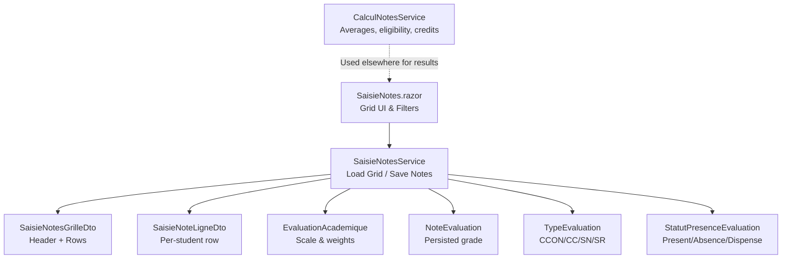
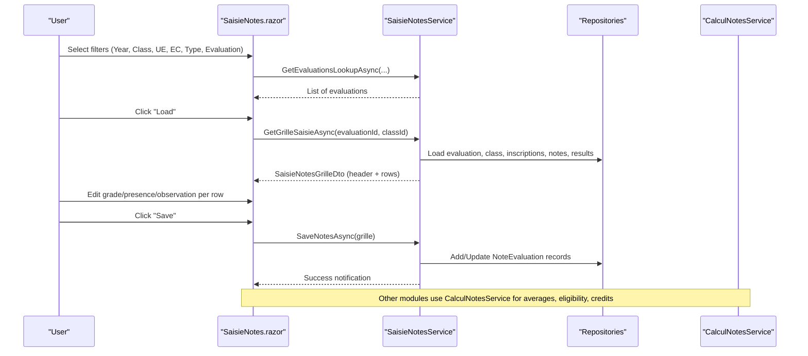
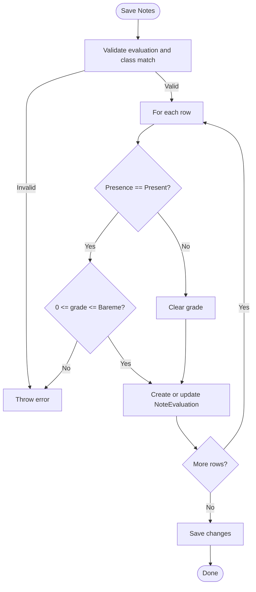
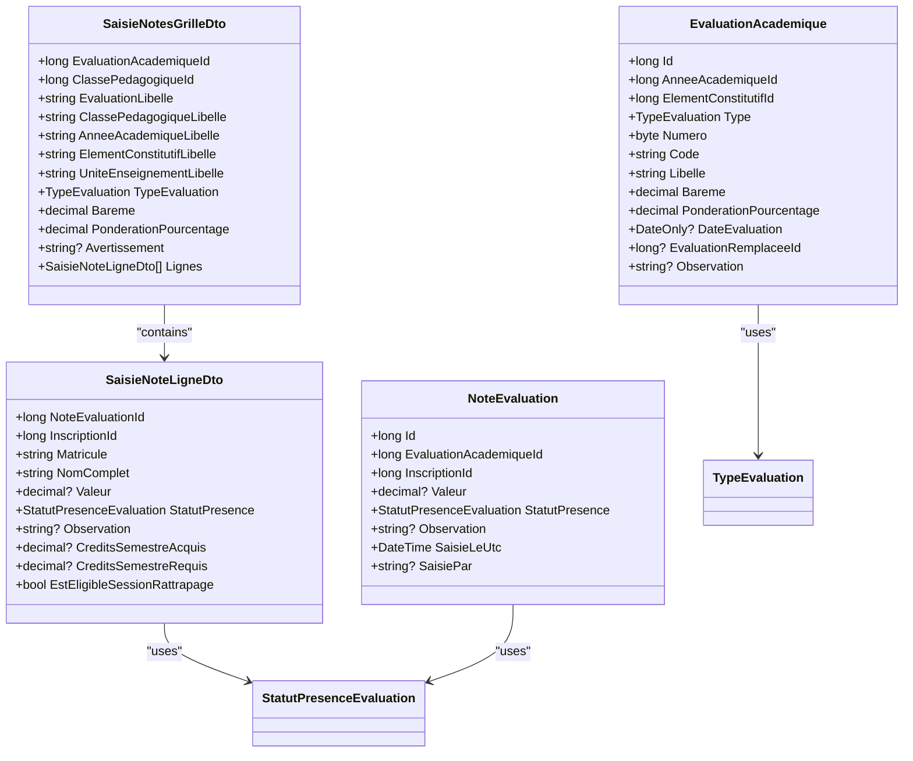

# Grade Entry Interface

<cite>
**Referenced Files in This Document**
- [SaisieNotes.razor](file://RIIS.Academic.Web/Components/Pages/SaisieNotes.razor)
- [SaisieNoteLigneDto.cs](file://RIIS.Academic.Application/Notes/Dtos/SaisieNoteLigneDto.cs)
- [SaisieNotesGrilleDto.cs](file://RIIS.Academic.Application/Notes/Dtos/SaisieNotesGrilleDto.cs)
- [SaisieNotesService.cs](file://RIIS.Academic.Application/Notes/Services/SaisieNotesService.cs)
- [CalculNotesService.cs](file://RIIS.Academic.Application/Notes/Services/CalculNotesService.cs)
- [ICalculNotesService.cs](file://RIIS.Academic.Application/Abstractions/Services/ICalculNotesService.cs)
- [EvaluationAcademique.cs](file://RIIS.Academic.Domain/Notes/EvaluationAcademique.cs)
- [TypeEvaluation.cs](file://RIIS.Academic.Domain/Enums/TypeEvaluation.cs)
- [StatutPresenceEvaluation.cs](file://RIIS.Academic.Domain/Enums/StatutPresenceEvaluation.cs)
- [NoteEvaluation.cs](file://RIIS.Academic.Domain/Notes/NoteEvaluation.cs)
</cite>

## Table of Contents
1. [Introduction](#introduction)
2. [Project Structure](#project-structure)
3. [Core Components](#core-components)
4. [Architecture Overview](#architecture-overview)
5. [Detailed Component Analysis](#detailed-component-analysis)
6. [Dependency Analysis](#dependency-analysis)
7. [Performance Considerations](#performance-considerations)
8. [Troubleshooting Guide](#troubleshooting-guide)
9. [Conclusion](#conclusion)

## Introduction
This document explains the grade entry interface that enables efficient bulk entry of grades for multiple students within a selected evaluation and class context. It covers the grid-based UI, student selection mechanisms, real-time validation and feedback, scoring scales, automatic result computation integration, and error handling. The goal is to help both technical and non-technical users understand how grades are entered, validated, saved, and how they influence downstream calculations such as averages, eligibility for retake sessions, and credit acquisition.

## Project Structure
The grade entry feature spans the Web layer (Blazor page), Application services (data loading, validation, persistence), and Domain models (entities and enums). The key pieces are:
- A Blazor page that renders filters, a data grid for student rows, and action buttons.
- DTOs that model the grid header metadata and per-student row state.
- An application service that composes lookups, builds the grid, validates inputs, and persists changes.
- A calculation service that defines scoring rules and eligibility logic used by other parts of the system.

**Diagram sources**
- [SaisieNotes.razor:1-344](file://RIIS.Academic.Web/Components/Pages/SaisieNotes.razor#L1-L344)
- [SaisieNotesService.cs:126-295](file://RIIS.Academic.Application/Notes/Services/SaisieNotesService.cs#L126-L295)
- [SaisieNotesGrilleDto.cs:1-20](file://RIIS.Academic.Application/Notes/Dtos/SaisieNotesGrilleDto.cs#L1-L20)
- [SaisieNoteLigneDto.cs:1-18](file://RIIS.Academic.Application/Notes/Dtos/SaisieNoteLigneDto.cs#L1-L18)
- [EvaluationAcademique.cs:1-24](file://RIIS.Academic.Domain/Notes/EvaluationAcademique.cs#L1-L24)
- [TypeEvaluation.cs:1-10](file://RIIS.Academic.Domain/Enums/TypeEvaluation.cs#L1-L10)
- [StatutPresenceEvaluation.cs:1-10](file://RIIS.Academic.Domain/Enums/StatutPresenceEvaluation.cs#L1-L10)
- [NoteEvaluation.cs:1-17](file://RIIS.Academic.Domain/Notes/NoteEvaluation.cs#L1-L17)

**Section sources**
- [SaisieNotes.razor:1-344](file://RIIS.Academic.Web/Components/Pages/SaisieNotes.razor#L1-L344)
- [SaisieNotesService.cs:1-317](file://RIIS.Academic.Application/Notes/Services/SaisieNotesService.cs#L1-L317)

## Core Components
- SaisieNotes.razor: Renders academic year, class, unit, component, type, and evaluation filters; displays a paginated, sortable, filterable grid with inline editing for grades, presence, and observations; provides reload and save actions.
- SaisieNotesGrilleDto: Holds evaluation context (labels, scale, weighting), warnings, and the list of student rows.
- SaisieNoteLigneDto: Represents one student’s editable state including existing or new grade value, presence status, observation, semester credits, and retake eligibility flag.
- SaisieNotesService: Loads lookup lists, builds the grid for a given evaluation/class, applies session-specific filtering (e.g., retake eligibility), validates and persists notes, and enforces business rules.
- CalculNotesService: Defines average composition, retake eligibility threshold, and credit awarding based on retained averages.

Key responsibilities:
- UI binds to dropdowns and grid fields, triggers refreshes on filter changes, and calls service methods to load/save data.
- Service ensures consistency between evaluation and class, filters eligible students for retake sessions, and validates grade ranges against the evaluation’s scale.
- Calculation service encapsulates scoring rules used across the application for computing averages, eligibility, and credits.

**Section sources**
- [SaisieNotes.razor:13-188](file://RIIS.Academic.Web/Components/Pages/SaisieNotes.razor#L13-L188)
- [SaisieNotesGrilleDto.cs:1-20](file://RIIS.Academic.Application/Notes/Dtos/SaisieNotesGrilleDto.cs#L1-L20)
- [SaisieNoteLigneDto.cs:1-18](file://RIIS.Academic.Application/Notes/Dtos/SaisieNoteLigneDto.cs#L1-L18)
- [SaisieNotesService.cs:126-295](file://RIIS.Academic.Application/Notes/Services/SaisieNotesService.cs#L126-L295)
- [CalculNotesService.cs:1-25](file://RIIS.Academic.Application/Notes/Services/CalculNotesService.cs#L1-L25)

## Architecture Overview
The grade entry flow starts at the UI with user selections, which drive service calls to build a grid of students. Users edit grades and presence inline. On save, the service validates each row and persists changes. Downstream components use the calculation service to compute averages, determine retake eligibility, and assign credits.

**Diagram sources**
- [SaisieNotes.razor:222-326](file://RIIS.Academic.Web/Components/Pages/SaisieNotes.razor#L222-L326)
- [SaisieNotesService.cs:126-295](file://RIIS.Academic.Application/Notes/Services/SaisieNotesService.cs#L126-L295)
- [CalculNotesService.cs:1-25](file://RIIS.Academic.Application/Notes/Services/CalculNotesService.cs#L1-L25)

## Detailed Component Analysis

### Bulk Grade Entry Grid Interface
- Filters: Academic year, pedagogical class, unit of teaching (UE), constituent element (EC), evaluation type, and specific evaluation. Changing any higher-level filter cascades to refresh dependent dropdowns and clears lower-level selections.
- Grid: Displays matricule, full name, grade input, presence dropdown, semester credits, and observation. The grade field is constrained to the evaluation’s scale and step size. Presence affects whether a grade can be entered.
- Actions: Reload grid to refresh data; save to persist changes.

User experience highlights:
- Inline editing via numeric input and dropdowns.
- Real-time constraints: grade min/max enforced by the UI control bound to the evaluation’s scale.
- Presence changes clear the grade when not present.
- Pagination, sorting, and filtering support large class sizes.

**Section sources**
- [SaisieNotes.razor:13-188](file://RIIS.Academic.Web/Components/Pages/SaisieNotes.razor#L13-L188)
- [SaisieNotes.razor:222-326](file://RIIS.Academic.Web/Components/Pages/SaisieNotes.razor#L222-L326)

### Student Selection Mechanisms
- Students are derived from inscriptions linked to the selected class and academic year.
- For retake sessions (SR), only students who have insufficient semester credits are shown once semester results exist; otherwise, all students are displayed provisionally with a warning.
- The grid shows current semester credits acquired vs required to inform decisions.

Eligibility logic:
- Retake eligibility is determined by comparing acquired vs required credits for the relevant semester.
- The grid includes a flag indicating eligibility for retake sessions per student.

**Section sources**
- [SaisieNotesService.cs:156-185](file://RIIS.Academic.Application/Notes/Services/SaisieNotesService.cs#L156-L185)
- [SaisieNotesGrilleDto.cs:1-20](file://RIIS.Academic.Application/Notes/Dtos/SaisieNotesGrilleDto.cs#L1-L20)
- [SaisieNoteLigneDto.cs:1-18](file://RIIS.Academic.Application/Notes/Dtos/SaisieNoteLigneDto.cs#L1-L18)

### Real-Time Grade Calculation Features
- The grid itself does not compute final averages; it presents semester credits and allows grade entry.
- Average computation and eligibility are handled by the calculation service and used by other features (e.g., transcripts, decisions).
- The grade entry integrates with these rules by validating inputs against the evaluation’s scale and presence rules.

Scoring scales and thresholds:
- Each evaluation defines a scale (Bareme) and weighting percentage.
- Grades must fall within 0 to Bareme.
- Retake eligibility threshold and credit awarding are defined in the calculation service.

**Section sources**
- [EvaluationAcademique.cs:1-24](file://RIIS.Academic.Domain/Notes/EvaluationAcademique.cs#L1-L24)
- [SaisieNotesService.cs:247-267](file://RIIS.Academic.Application/Notes/Services/SaisieNotesService.cs#L247-L267)
- [CalculNotesService.cs:1-25](file://RIIS.Academic.Application/Notes/Services/CalculNotesService.cs#L1-L25)

### Grade Validation Rules
- Presence rule: If presence is not Present, the grade is cleared on change.
- Range rule: When Present, the grade must be between 0 and the evaluation’s Bareme.
- Context rule: Inscriptions must belong to the selected class and academic year; otherwise, saving fails.
- Data integrity: Existing notes are updated; new notes are created if missing.

Validation flow:

**Diagram sources**
- [SaisieNotesService.cs:247-295](file://RIIS.Academic.Application/Notes/Services/SaisieNotesService.cs#L247-L295)

**Section sources**
- [SaisieNotes.razor:301-326](file://RIIS.Academic.Web/Components/Pages/SaisieNotes.razor#L301-L326)
- [SaisieNotesService.cs:247-295](file://RIIS.Academic.Application/Notes/Services/SaisieNotesService.cs#L247-L295)

### Automatic Result Computation Integration
- The calculation service computes:
  - Element constituent average using weighted contributions from continuous assessment, knowledge control, and normal/retake session scores.
  - Retake eligibility based on a threshold.
  - Credits awarded based on a passing average.
- While the grade entry page focuses on data capture, these rules govern downstream computations and decisions.

Integration points:
- Retake session filtering uses semester results to limit eligible students.
- Semester credits displayed in the grid reflect computed values used by eligibility checks.

**Section sources**
- [CalculNotesService.cs:1-25](file://RIIS.Academic.Application/Notes/Services/CalculNotesService.cs#L1-L25)
- [SaisieNotesService.cs:164-185](file://RIIS.Academic.Application/Notes/Services/SaisieNotesService.cs#L164-L185)

### User Experience for Efficient Multi-Student Entry
- Keyboard-friendly controls: Numeric input supports step increments; dropdowns allow quick selection of presence.
- Filtering and sorting: Quickly locate students by name or matricule.
- Pagination: Manage large grids without performance issues.
- Immediate feedback: Presence changes clear invalid grades; save errors are surfaced via notifications.

Best practices:
- Use filters to narrow down to the intended evaluation and class before entering grades.
- Enter presence first to avoid accidental grade entries for absent students.
- Use reload to refresh after external changes or errors.

[No sources needed since this section summarizes UX patterns already covered above]

## Dependency Analysis
The grade entry feature depends on domain entities and enums for evaluation types and presence statuses, and on repositories for data access. The UI depends on the application service for data operations.

**Diagram sources**
- [SaisieNotesGrilleDto.cs:1-20](file://RIIS.Academic.Application/Notes/Dtos/SaisieNotesGrilleDto.cs#L1-L20)
- [SaisieNoteLigneDto.cs:1-18](file://RIIS.Academic.Application/Notes/Dtos/SaisieNoteLigneDto.cs#L1-L18)
- [EvaluationAcademique.cs:1-24](file://RIIS.Academic.Domain/Notes/EvaluationAcademique.cs#L1-L24)
- [NoteEvaluation.cs:1-17](file://RIIS.Academic.Domain/Notes/NoteEvaluation.cs#L1-L17)
- [TypeEvaluation.cs:1-10](file://RIIS.Academic.Domain/Enums/TypeEvaluation.cs#L1-L10)
- [StatutPresenceEvaluation.cs:1-10](file://RIIS.Academic.Domain/Enums/StatutPresenceEvaluation.cs#L1-L10)

**Section sources**
- [SaisieNotesGrilleDto.cs:1-20](file://RIIS.Academic.Application/Notes/Dtos/SaisieNotesGrilleDto.cs#L1-L20)
- [SaisieNoteLigneDto.cs:1-18](file://RIIS.Academic.Application/Notes/Dtos/SaisieNoteLigneDto.cs#L1-L18)
- [EvaluationAcademique.cs:1-24](file://RIIS.Academic.Domain/Notes/EvaluationAcademique.cs#L1-L24)
- [NoteEvaluation.cs:1-17](file://RIIS.Academic.Domain/Notes/NoteEvaluation.cs#L1-L17)
- [TypeEvaluation.cs:1-10](file://RIIS.Academic.Domain/Enums/TypeEvaluation.cs#L1-L10)
- [StatutPresenceEvaluation.cs:1-10](file://RIIS.Academic.Domain/Enums/StatutPresenceEvaluation.cs#L1-L10)

## Performance Considerations
- Pagination, sorting, and filtering are enabled on the grid to handle large datasets efficiently.
- Lookups are loaded once during initialization and refreshed on filter changes, reducing redundant calls.
- Saving updates or creates notes in a loop and commits once, minimizing database round-trips.
- Retake session filtering leverages preloaded semester results to limit the number of rows when applicable.

[No sources needed since this section provides general guidance based on observed implementation patterns]

## Troubleshooting Guide
Common issues and resolutions:
- Cannot load grid: Ensure an evaluation and class are selected; verify they belong to the same academic year.
- Grade out of range: Adjust the grade to be within 0 and the evaluation’s scale; presence must be set to Present.
- Invalid presence: If presence is not Present, the grade will be cleared automatically.
- Retake session limited view: If no semester results exist yet, all students may appear temporarily; once results are calculated, only eligible students will be shown.
- Save errors: Occur if inscriptions do not match the selected class/year or if grade validation fails. Review the error message and correct inputs.

Error handling paths:
- UI catches exceptions during load/save and displays notifications.
- Service throws descriptive exceptions for invalid contexts or validation failures.

**Section sources**
- [SaisieNotes.razor:282-330](file://RIIS.Academic.Web/Components/Pages/SaisieNotes.razor#L282-L330)
- [SaisieNotesService.cs:126-140](file://RIIS.Academic.Application/Notes/Services/SaisieNotesService.cs#L126-L140)
- [SaisieNotesService.cs:247-267](file://RIIS.Academic.Application/Notes/Services/SaisieNotesService.cs#L247-L267)

## Conclusion
The grade entry interface provides a robust, user-friendly way to enter grades for multiple students with strong validation and clear feedback. It integrates seamlessly with the broader academic system by enforcing evaluation scales, presence rules, and retake eligibility criteria, while relying on the calculation service for downstream computations. By leveraging filters, pagination, and inline editing, educators can efficiently manage grading workflows while maintaining data integrity and alignment with institutional policies.

[No sources needed since this section summarizes without analyzing specific files]