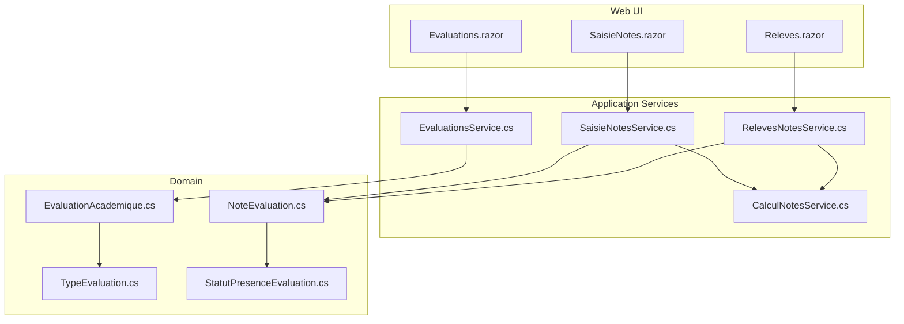
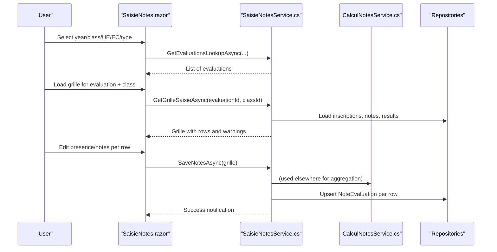
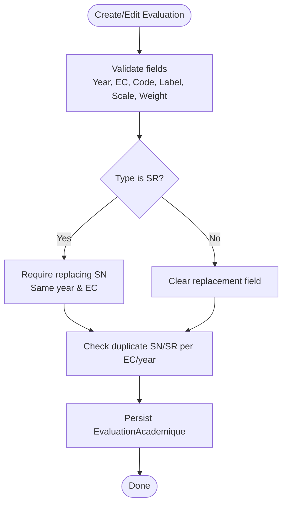
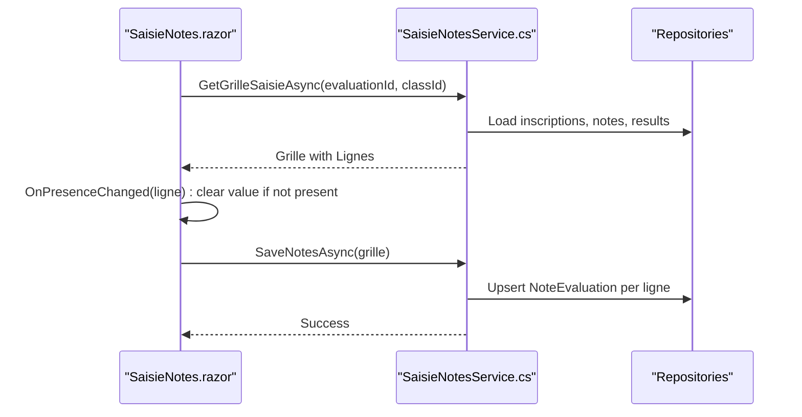
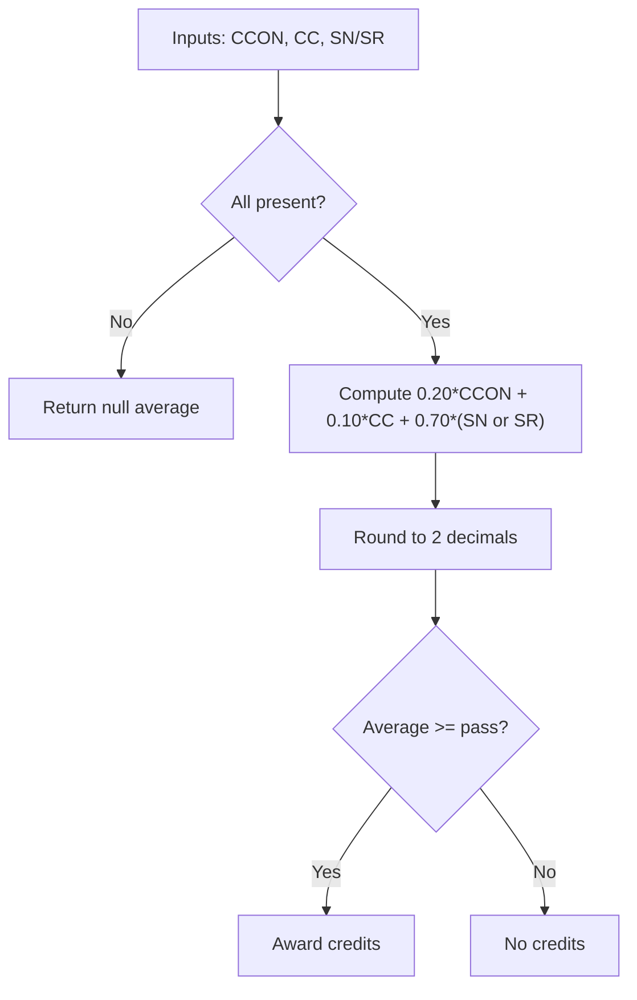
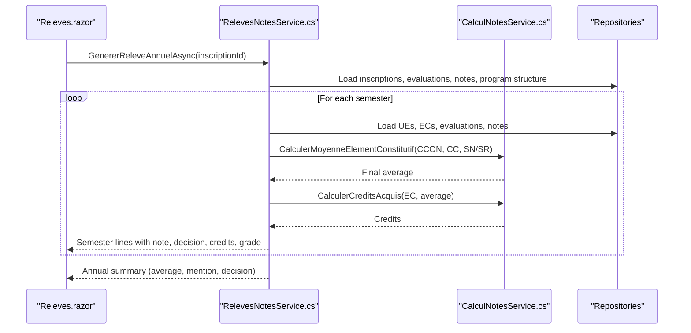
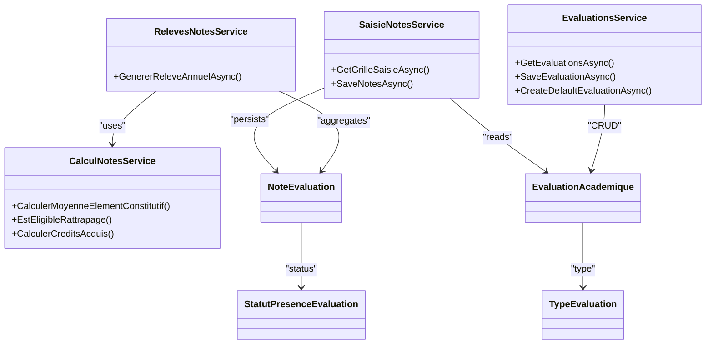

# Grade Management UI

<cite>
**Referenced Files in This Document**
- [SaisieNotes.razor](file://RIIS.Academic.Web/Components/Pages/SaisieNotes.razor)
- [Evaluations.razor](file://RIIS.Academic.Web/Components/Pages/Evaluations.razor)
- [Releves.razor](file://RIIS.Academic.Web/Components/Pages/Releves.razor)
- [SaisieNotesService.cs](file://RIIS.Academic.Application/Notes/Services/SaisieNotesService.cs)
- [CalculNotesService.cs](file://RIIS.Academic.Application/Notes/Services/CalculNotesService.cs)
- [EvaluationsService.cs](file://RIIS.Academic.Application/Evaluations/Services/EvaluationsService.cs)
- [RelevesNotesService.cs](file://RIIS.Academic.Application/Releves/Services/RelevesNotesService.cs)
- [EvaluationAcademique.cs](file://RIIS.Academic.Domain/Notes/EvaluationAcademique.cs)
- [NoteEvaluation.cs](file://RIIS.Academic.Domain/Notes/NoteEvaluation.cs)
- [TypeEvaluation.cs](file://RIIS.Academic.Domain/Enums/TypeEvaluation.cs)
- [StatutPresenceEvaluation.cs](file://RIIS.Academic.Domain/Enums/StatutPresenceEvaluation.cs)
- [SaisieNoteLigneDto.cs](file://RIIS.Academic.Application/Notes/Dtos/SaisieNoteLigneDto.cs)
- [SaisieNotesGrilleDto.cs](file://RIIS.Academic.Application/Notes/Dtos/SaisieNotesGrilleDto.cs)
</cite>

## Table of Contents
1. Introduction
2. Project Structure
3. Core Components
4. Architecture Overview
5. Detailed Component Analysis
6. Dependency Analysis
7. Performance Considerations
8. Troubleshooting Guide
9. Conclusion

## Introduction
This document explains the grade management user interface and its supporting services for creating evaluations, entering grades in bulk, validating inputs, computing weighted results, and visualizing academic outcomes. It focuses on:
- Evaluation creation and configuration (CCON, CC, SN, SR)
- Bulk grade entry per class and evaluation
- Validation rules and presence handling
- Weighted calculation engine and eligibility logic
- Result visualization across semesters and annual transcripts

## Project Structure
The grade management feature spans Web UI components, application services, and domain models:
- Web layer: Blazor pages for evaluation management, grade entry, and transcript viewing
- Application layer: Services orchestrating data access, validation, calculations, and DTO mapping
- Domain layer: Entities and enums defining evaluations, notes, presence statuses, and result structures

**Diagram sources**
- [Evaluations.razor:1-584](file://RIIS.Academic.Web/Components/Pages/Evaluations.razor#L1-L584)
- [SaisieNotes.razor:1-344](file://RIIS.Academic.Web/Components/Pages/SaisieNotes.razor#L1-L344)
- [Releves.razor:1-356](file://RIIS.Academic.Web/Components/Pages/Releves.razor#L1-L356)
- [EvaluationsService.cs:1-643](file://RIIS.Academic.Application/Evaluations/Services/EvaluationsService.cs#L1-L643)
- [SaisieNotesService.cs:1-317](file://RIIS.Academic.Application/Notes/Services/SaisieNotesService.cs#L1-L317)
- [CalculNotesService.cs:1-25](file://RIIS.Academic.Application/Notes/Services/CalculNotesService.cs#L1-L25)
- [RelevesNotesService.cs:1-377](file://RIIS.Academic.Application/Releves/Services/RelevesNotesService.cs#L1-L377)
- [EvaluationAcademique.cs:1-24](file://RIIS.Academic.Domain/Notes/EvaluationAcademique.cs#L1-L24)
- [NoteEvaluation.cs:1-17](file://RIIS.Academic.Domain/Notes/NoteEvaluation.cs#L1-L17)
- [TypeEvaluation.cs:1-10](file://RIIS.Academic.Domain/Enums/TypeEvaluation.cs#L1-L10)
- [StatutPresenceEvaluation.cs:1-10](file://RIIS.Academic.Domain/Enums/StatutPresenceEvaluation.cs#L1-L10)

**Section sources**
- [Evaluations.razor:1-584](file://RIIS.Academic.Web/Components/Pages/Evaluations.razor#L1-L584)
- [SaisieNotes.razor:1-344](file://RIIS.Academic.Web/Components/Pages/SaisieNotes.razor#L1-L344)
- [Releves.razor:1-356](file://RIIS.Academic.Web/Components/Pages/Releves.razor#L1-L356)

## Core Components
- Evaluation management page: Create, edit, filter, and delete evaluations with type-specific defaults and constraints
- Grade entry page: Bulk entry grid per evaluation and class with presence and observation fields
- Transcript viewer: Aggregate semester and annual results with grades, credits, and mentions

Key responsibilities:
- EvaluationsService: CRUD for evaluations, lookup helpers, default generation, validation
- SaisieNotesService: Build grade grids, validate and persist notes, handle rattrapage filtering
- CalculNotesService: Weighted average computation, rattrapage eligibility, credit acquisition
- RelevesNotesService: Generate student transcripts, compute averages, grades, decisions

**Section sources**
- [EvaluationsService.cs:18-294](file://RIIS.Academic.Application/Evaluations/Services/EvaluationsService.cs#L18-L294)
- [SaisieNotesService.cs:126-295](file://RIIS.Academic.Application/Notes/Services/SaisieNotesService.cs#L126-L295)
- [CalculNotesService.cs:7-24](file://RIIS.Academic.Application/Notes/Services/CalculNotesService.cs#L7-L24)
- [RelevesNotesService.cs:93-200](file://RIIS.Academic.Application/Releves/Services/RelevesNotesService.cs#L93-L200)

## Architecture Overview
The UI interacts with services that coordinate data retrieval, validation, and persistence. Calculations are centralized to ensure consistent grading policies.

**Diagram sources**
- [SaisieNotes.razor:222-326](file://RIIS.Academic.Web/Components/Pages/SaisieNotes.razor#L222-L326)
- [SaisieNotesService.cs:126-295](file://RIIS.Academic.Application/Notes/Services/SaisieNotesService.cs#L126-L295)

## Detailed Component Analysis

### Evaluation Creation and Management
- The Evaluations page provides filters by academic year, cycle, semester, UE, EC, and type, enabling targeted listing and editing
- Default evaluation creation sets code, label, scale, and weight based on type; validation enforces required fields, uniqueness, and session replacement rules
- Rattrapage sessions must replace a normal session within the same year and EC

**Diagram sources**
- [Evaluations.razor:117-255](file://RIIS.Academic.Web/Components/Pages/Evaluations.razor#L117-L255)
- [EvaluationsService.cs:172-294](file://RIIS.Academic.Application/Evaluations/Services/EvaluationsService.cs#L172-L294)

**Section sources**
- [Evaluations.razor:1-584](file://RIIS.Academic.Web/Components/Pages/Evaluations.razor#L1-L584)
- [EvaluationsService.cs:18-294](file://RIIS.Academic.Application/Evaluations/Services/EvaluationsService.cs#L18-L294)
- [EvaluationAcademique.cs:1-24](file://RIIS.Academic.Domain/Notes/EvaluationAcademique.cs#L1-L24)
- [TypeEvaluation.cs:1-10](file://RIIS.Academic.Domain/Enums/TypeEvaluation.cs#L1-L10)

### Bulk Grade Entry Interface
- The grade entry page loads a grid of students from the selected class and evaluation
- Each row includes:
  - Student identifier and name
  - Numeric grade input constrained by the evaluation’s scale
  - Presence status dropdown; non-present rows clear the grade
  - Optional observation text
  - Semester credits context for rattrapage visibility
- Real-time behavior:
  - Changing presence clears the grade when not present
  - Grid supports paging, sorting, and filtering
- Saving persists all rows in one operation

**Diagram sources**
- [SaisieNotes.razor:137-186](file://RIIS.Academic.Web/Components/Pages/SaisieNotes.razor#L137-L186)
- [SaisieNotes.razor:301-326](file://RIIS.Academic.Web/Components/Pages/SaisieNotes.razor#L301-L326)
- [SaisieNotesService.cs:126-295](file://RIIS.Academic.Application/Notes/Services/SaisieNotesService.cs#L126-L295)

**Section sources**
- [SaisieNotes.razor:1-344](file://RIIS.Academic.Web/Components/Pages/SaisieNotes.razor#L1-L344)
- [SaisieNotesService.cs:126-295](file://RIIS.Academic.Application/Notes/Services/SaisieNotesService.cs#L126-L295)
- [SaisieNoteLigneDto.cs:1-18](file://RIIS.Academic.Application/Notes/Dtos/SaisieNoteLigneDto.cs#L1-L18)
- [SaisieNotesGrilleDto.cs:1-20](file://RIIS.Academic.Application/Notes/Dtos/SaisieNotesGrilleDto.cs#L1-L20)
- [StatutPresenceEvaluation.cs:1-10](file://RIIS.Academic.Domain/Enums/StatutPresenceEvaluation.cs#L1-L10)

### Calculation Engine and Weighted Aggregation
- Weighted average per Element Constitutif combines:
  - CCON (20%), CC (10%), SN or SR (70%)
- If any component is missing, the final average is null until all are available
- Rattrapage eligibility: average below threshold qualifies for rattrapage
- Credit acquisition: credits awarded if average meets passing threshold

**Diagram sources**
- [CalculNotesService.cs:7-24](file://RIIS.Academic.Application/Notes/Services/CalculNotesService.cs#L7-L24)

**Section sources**
- [CalculNotesService.cs:1-25](file://RIIS.Academic.Application/Notes/Services/CalculNotesService.cs#L1-L25)

### Academic Result Visualization
- The transcript page lists available students and allows previewing annual reports
- For each student, it builds semester sections:
  - Computes per-type averages (CCON, CC, SN/SR)
  - Applies weighted average using the calculation service
  - Determines decision (V/NV), credits, and grade per EC
- Aggregates semester totals and computes annual average, mention, and decision

**Diagram sources**
- [Releves.razor:150-216](file://RIIS.Academic.Web/Components/Pages/Releves.razor#L150-L216)
- [RelevesNotesService.cs:93-200](file://RIIS.Academic.Application/Releves/Services/RelevesNotesService.cs#L93-L200)
- [RelevesNotesService.cs:202-267](file://RIIS.Academic.Application/Releves/Services/RelevesNotesService.cs#L202-L267)
- [RelevesNotesService.cs:290-333](file://RIIS.Academic.Application/Releves/Services/RelevesNotesService.cs#L290-L333)
- [CalculNotesService.cs:7-24](file://RIIS.Academic.Application/Notes/Services/CalculNotesService.cs#L7-L24)

**Section sources**
- [Releves.razor:1-356](file://RIIS.Academic.Web/Components/Pages/Releves.razor#L1-L356)
- [RelevesNotesService.cs:1-377](file://RIIS.Academic.Application/Releves/Services/RelevesNotesService.cs#L1-L377)

## Dependency Analysis
- UI components depend on application services via dependency injection
- Services depend on repositories for data access and on domain entities/enums for business rules
- Calculation logic is isolated in a dedicated service to ensure consistency across grade entry and transcript generation

**Diagram sources**
- [SaisieNotesService.cs:8-17](file://RIIS.Academic.Application/Notes/Services/SaisieNotesService.cs#L8-L17)
- [EvaluationsService.cs:8-16](file://RIIS.Academic.Application/Evaluations/Services/EvaluationsService.cs#L8-L16)
- [RelevesNotesService.cs:8-23](file://RIIS.Academic.Application/Releves/Services/RelevesNotesService.cs#L8-L23)
- [CalculNotesService.cs:7-24](file://RIIS.Academic.Application/Notes/Services/CalculNotesService.cs#L7-L24)
- [EvaluationAcademique.cs:1-24](file://RIIS.Academic.Domain/Notes/EvaluationAcademique.cs#L1-L24)
- [NoteEvaluation.cs:1-17](file://RIIS.Academic.Domain/Notes/NoteEvaluation.cs#L1-L17)
- [TypeEvaluation.cs:1-10](file://RIIS.Academic.Domain/Enums/TypeEvaluation.cs#L1-L10)
- [StatutPresenceEvaluation.cs:1-10](file://RIIS.Academic.Domain/Enums/StatutPresenceEvaluation.cs#L1-L10)

**Section sources**
- [SaisieNotesService.cs:1-317](file://RIIS.Academic.Application/Notes/Services/SaisieNotesService.cs#L1-L317)
- [EvaluationsService.cs:1-643](file://RIIS.Academic.Application/Evaluations/Services/EvaluationsService.cs#L1-L643)
- [RelevesNotesService.cs:1-377](file://RIIS.Academic.Application/Releves/Services/RelevesNotesService.cs#L1-L377)
- [CalculNotesService.cs:1-25](file://RIIS.Academic.Application/Notes/Services/CalculNotesService.cs#L1-L25)

## Performance Considerations
- Bulk save: Notes are persisted in a single transaction per save call, minimizing database round-trips
- Filtering: Lookups use in-memory set operations after initial list fetches; consider indexing on foreign keys for large datasets
- Transcript generation: Aggregations iterate over multiple collections; caching frequently used lookups can reduce repeated queries
- UI responsiveness: DataGrid paging reduces rendering overhead for large student lists

[No sources needed since this section provides general guidance]

## Troubleshooting Guide
Common issues and resolutions:
- Missing evaluation or class: Ensure selection belongs to the same academic year; service validates and throws descriptive errors
- Invalid grade range: Grades must be between 0 and the evaluation’s scale; presence must be present to enter a grade
- Duplicate evaluation: Only one SN or SR per EC and year is allowed; service enforces uniqueness
- Rattrapage eligibility: If no semester results exist yet, all students are shown temporarily; once calculated, only eligible students appear
- Transcript generation failures: Verify program structure (maquette) is linked to the student’s path; otherwise, an error indicates missing curriculum association

**Section sources**
- [SaisieNotesService.cs:126-295](file://RIIS.Academic.Application/Notes/Services/SaisieNotesService.cs#L126-L295)
- [EvaluationsService.cs:172-294](file://RIIS.Academic.Application/Evaluations/Services/EvaluationsService.cs#L172-L294)
- [RelevesNotesService.cs:93-200](file://RIIS.Academic.Application/Releves/Services/RelevesNotesService.cs#L93-L200)

## Conclusion
The grade management UI provides a robust workflow for evaluating students, entering grades in bulk, enforcing validation rules, and visualizing aggregated academic results. Centralized calculation logic ensures consistent weighting and credit allocation across the system. The modular architecture separates concerns between UI, services, and domain, facilitating maintainability and scalability.

[No sources needed since this section summarizes without analyzing specific files]