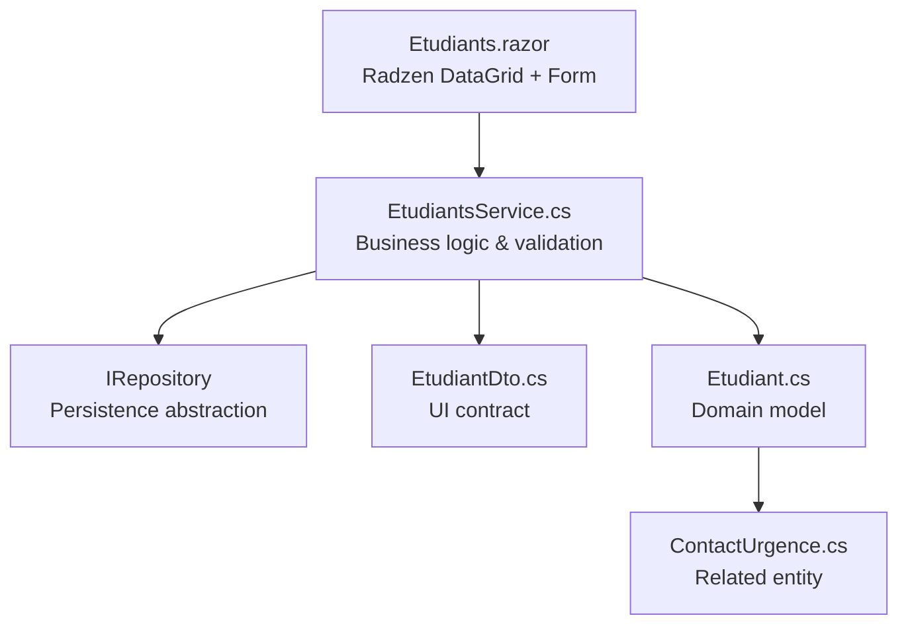
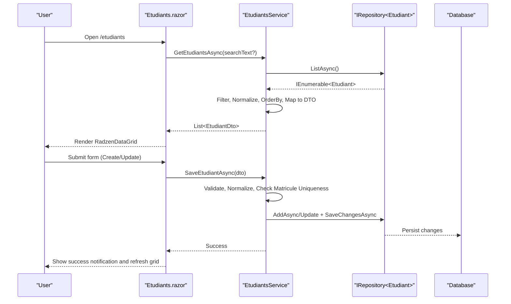
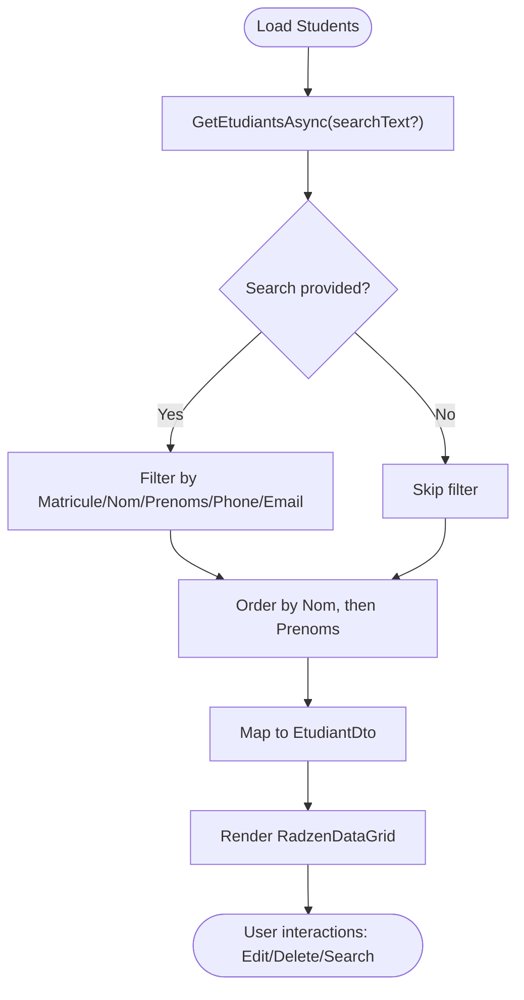
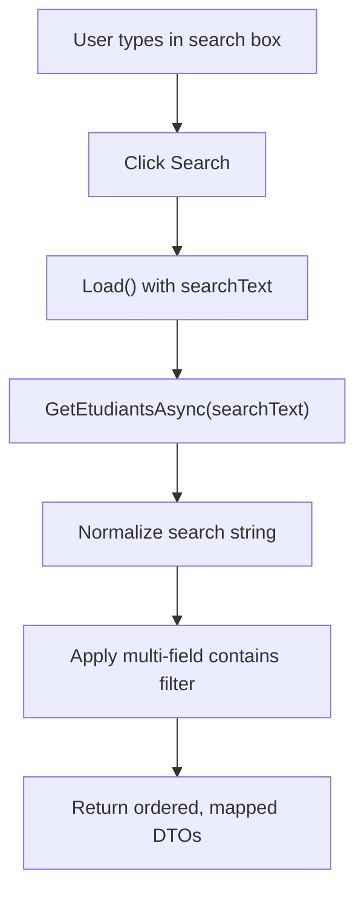
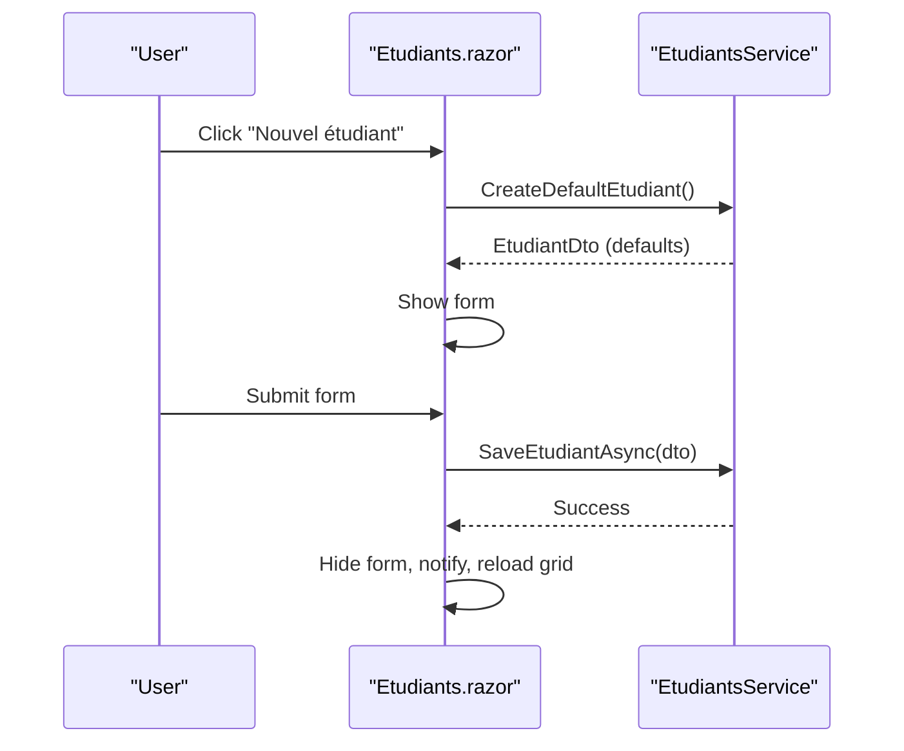
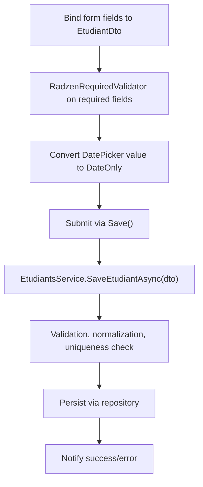
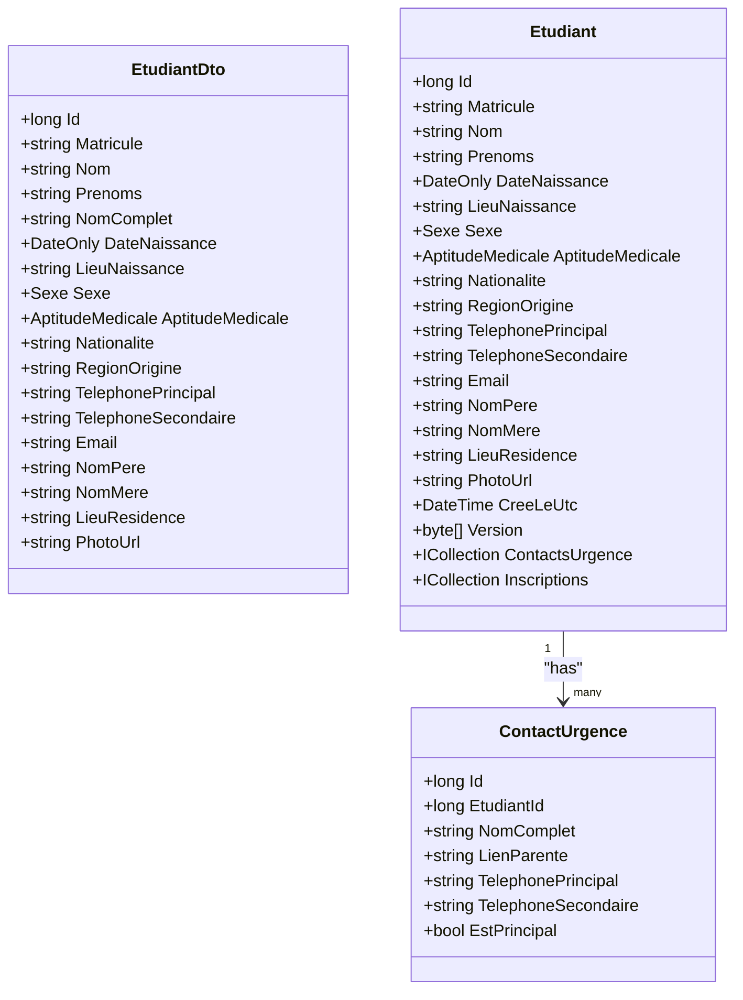
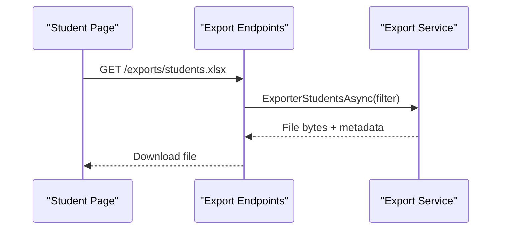
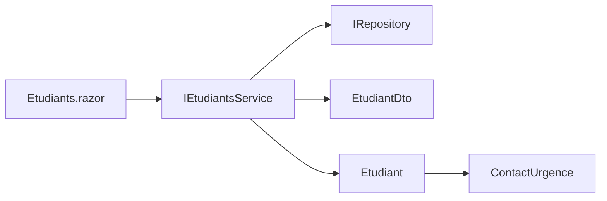

# Student Management UI

<cite>
**Referenced Files in This Document**
- [Etudiants.razor](file://RIIS.Academic.Web/Components/Pages/Etudiants.razor)
- [IEtudiantsService.cs](file://RIIS.Academic.Application/Etudiants/Services/IEtudiantsService.cs)
- [EtudiantsService.cs](file://RIIS.Academic.Application/Etudiants/Services/EtudiantsService.cs)
- [EtudiantDto.cs](file://RIIS.Academic.Application/Etudiants/Dtos/EtudiantDto.cs)
- [Etudiant.cs](file://RIIS.Academic.Domain/Etudiants/Etudiant.cs)
- [ContactUrgence.cs](file://RIIS.Academic.Domain/Etudiants/ContactUrgence.cs)
- [RiisAcademicExportEndpointExtensions.cs](file://RIIS.Academic.Web/Extensions/RiisAcademicExportEndpointExtensions.cs)
</cite>

## Table of Contents
1. Introduction
2. Project Structure
3. Core Components
4. Architecture Overview
5. Detailed Component Analysis
6. Dependency Analysis
7. Performance Considerations
8. Troubleshooting Guide
9. Conclusion

## Introduction
This document describes the student management user interface built with Blazor and Radzen components. It covers the student list view, search and filtering, CRUD operations (create, read, update, delete), data grid implementation, form handling for student registration, validation patterns, and integration with application services. It also explains how to extend the UI with bulk operations and export functionality using existing patterns in the codebase.

## Project Structure
The student management feature spans three layers:
- Presentation layer (Blazor page): Renders the list, search bar, form, and actions using Radzen components.
- Application layer: Contains the service that orchestrates business rules, DTOs, and persistence calls.
- Domain layer: Defines the entity model and related relationships.

**Diagram sources**
- [Etudiants.razor:1-272](file://RIIS.Academic.Web/Components/Pages/Etudiants.razor#L1-L272)
- [EtudiantsService.cs:1-173](file://RIIS.Academic.Application/Etudiants/Services/EtudiantsService.cs#L1-L173)
- [EtudiantDto.cs:1-26](file://RIIS.Academic.Application/Etudiants/Dtos/EtudiantDto.cs#L1-L26)
- [Etudiant.cs:1-28](file://RIIS.Academic.Domain/Etudiants/Etudiant.cs#L1-L28)
- [ContactUrgence.cs:1-15](file://RIIS.Academic.Domain/Etudiants/ContactUrgence.cs#L1-L15)

**Section sources**
- [Etudiants.razor:1-272](file://RIIS.Academic.Web/Components/Pages/Etudiants.razor#L1-L272)
- [EtudiantsService.cs:1-173](file://RIIS.Academic.Application/Etudiants/Services/EtudiantsService.cs#L1-L173)
- [EtudiantDto.cs:1-26](file://RIIS.Academic.Application/Etudiants/Dtos/EtudiantDto.cs#L1-L26)
- [Etudiant.cs:1-28](file://RIIS.Academic.Domain/Etudiants/Etudiant.cs#L1-L28)
- [ContactUrgence.cs:1-15](file://RIIS.Academic.Domain/Etudiants/ContactUrgence.cs#L1-L15)

## Core Components
- Student list view: A RadzenDataGrid displays students with paging, sorting, and filtering enabled. Columns include matricule, name, first names, gender, birth date, phone, and action buttons for edit and delete.
- Search and filtering: A text input supports free-text search across multiple fields; a reset button clears filters and reloads the list.
- CRUD operations:
  - Create: Opens a form pre-filled with default values via the service.
  - Read: Loads all students or filtered results on initialization and after search/reset.
  - Update: Edits an existing student by populating the form with current values.
  - Delete: Removes a student by ID and refreshes the list.
- Form handling and validation: Uses RadzenTemplateForm bound to EtudiantDto with required validators for key fields. Date picker is converted to DateOnly for storage.
- Service integration: All operations call IEtudiantsService methods which encapsulate validation, normalization, and persistence.

**Section sources**
- [Etudiants.razor:16-159](file://RIIS.Academic.Web/Components/Pages/Etudiants.razor#L16-L159)
- [Etudiants.razor:162-272](file://RIIS.Academic.Web/Components/Pages/Etudiants.razor#L162-L272)
- [EtudiantsService.cs:9-33](file://RIIS.Academic.Application/Etudiants/Services/EtudiantsService.cs#L9-L33)
- [EtudiantsService.cs:53-127](file://RIIS.Academic.Application/Etudiants/Services/EtudiantsService.cs#L53-L127)

## Architecture Overview
The UI follows a clean separation of concerns:
- The Blazor page composes Radzen components to present data and capture user input.
- The application service enforces business rules (validation, normalization, uniqueness checks) and coordinates persistence through a repository abstraction.
- The domain model defines entities and relationships, including optional emergency contacts.

**Diagram sources**
- [Etudiants.razor:184-238](file://RIIS.Academic.Web/Components/Pages/Etudiants.razor#L184-L238)
- [EtudiantsService.cs:9-33](file://RIIS.Academic.Application/Etudiants/Services/EtudiantsService.cs#L9-L33)
- [EtudiantsService.cs:53-127](file://RIIS.Academic.Application/Etudiants/Services/EtudiantsService.cs#L53-L127)

## Detailed Component Analysis

### Student List View and Data Grid
- RadzenDataGrid configuration enables paging, sorting, and filtering out of the box.
- Columns are defined for core student attributes; custom templates format dates.
- Action column provides Edit and Delete buttons per row.

**Diagram sources**
- [EtudiantsService.cs:9-33](file://RIIS.Academic.Application/Etudiants/Services/EtudiantsService.cs#L9-L33)
- [Etudiants.razor:140-159](file://RIIS.Academic.Web/Components/Pages/Etudiants.razor#L140-L159)

**Section sources**
- [Etudiants.razor:140-159](file://RIIS.Academic.Web/Components/Pages/Etudiants.razor#L140-L159)
- [EtudiantsService.cs:9-33](file://RIIS.Academic.Application/Etudiants/Services/EtudiantsService.cs#L9-L33)

### Search and Filtering
- Free-text search trims input and matches against multiple fields case-insensitively.
- Reset clears the search term and reloads the full list.

**Diagram sources**
- [Etudiants.razor:186-197](file://RIIS.Academic.Web/Components/Pages/Etudiants.razor#L186-L197)
- [EtudiantsService.cs:9-33](file://RIIS.Academic.Application/Etudiants/Services/EtudiantsService.cs#L9-L33)

**Section sources**
- [Etudiants.razor:16-24](file://RIIS.Academic.Web/Components/Pages/Etudiants.razor#L16-L24)
- [Etudiants.razor:186-197](file://RIIS.Academic.Web/Components/Pages/Etudiants.razor#L186-L197)
- [EtudiantsService.cs:9-33](file://RIIS.Academic.Application/Etudiants/Services/EtudiantsService.cs#L9-L33)

### CRUD Operations
- Create: Initializes a default student via the service and shows the form.
- Read: Loads students on initialization and after any mutation.
- Update: Populates the form with selected student’s data.
- Delete: Deletes by ID and refreshes the list.

**Diagram sources**
- [Etudiants.razor:199-238](file://RIIS.Academic.Web/Components/Pages/Etudiants.razor#L199-L238)
- [EtudiantsService.cs:42-127](file://RIIS.Academic.Application/Etudiants/Services/EtudiantsService.cs#L42-L127)

**Section sources**
- [Etudiants.razor:199-256](file://RIIS.Academic.Web/Components/Pages/Etudiants.razor#L199-L256)
- [EtudiantsService.cs:42-127](file://RIIS.Academic.Application/Etudiants/Services/EtudiantsService.cs#L42-L127)

### Form Handling and Validation Patterns
- Bound to EtudiantDto using RadzenTemplateForm.
- Required validators enforce presence of key fields (name, first names, birth place, nationality, primary phone).
- Date picker converts DateTime? to DateOnly before saving.
- Dropdowns use enum options for gender and medical fitness.

**Diagram sources**
- [Etudiants.razor:26-137](file://RIIS.Academic.Web/Components/Pages/Etudiants.razor#L26-L137)
- [Etudiants.razor:230-264](file://RIIS.Academic.Web/Components/Pages/Etudiants.razor#L230-L264)
- [EtudiantsService.cs:53-127](file://RIIS.Academic.Application/Etudiants/Services/EtudiantsService.cs#L53-L127)

**Section sources**
- [Etudiants.razor:26-137](file://RIIS.Academic.Web/Components/Pages/Etudiants.razor#L26-L137)
- [Etudiants.razor:230-264](file://RIIS.Academic.Web/Components/Pages/Etudiants.razor#L230-L264)
- [EtudiantsService.cs:53-127](file://RIIS.Academic.Application/Etudiants/Services/EtudiantsService.cs#L53-L127)

### Integration with Student Services
- The page injects IEtudiantsService and NotificationService.
- All data operations go through the service, ensuring consistent validation and error handling.
- Default values for new students are provided by the service to streamline creation.

**Section sources**
- [Etudiants.razor:1-4](file://RIIS.Academic.Web/Components/Pages/Etudiants.razor#L1-L4)
- [Etudiants.razor:184-238](file://RIIS.Academic.Web/Components/Pages/Etudiants.razor#L184-L238)
- [IEtudiantsService.cs:5-12](file://RIIS.Academic.Application/Etudiants/Services/IEtudiantsService.cs#L5-L12)
- [EtudiantsService.cs:42-51](file://RIIS.Academic.Application/Etudiants/Services/EtudiantsService.cs#L42-L51)

### Data Models and Relationships
- EtudiantDto represents the UI contract with computed properties like full name.
- Etudiant is the domain entity with required fields and relationships to emergency contacts and enrollments.
- ContactUrgence models emergency contact details linked to a student.

**Diagram sources**
- [EtudiantDto.cs:5-25](file://RIIS.Academic.Application/Etudiants/Dtos/EtudiantDto.cs#L5-L25)
- [Etudiant.cs:3-27](file://RIIS.Academic.Domain/Etudiants/Etudiant.cs#L3-L27)
- [ContactUrgence.cs:3-14](file://RIIS.Academic.Domain/Etudiants/ContactUrgence.cs#L3-L14)

**Section sources**
- [EtudiantDto.cs:5-25](file://RIIS.Academic.Application/Etudiants/Dtos/EtudiantDto.cs#L5-L25)
- [Etudiant.cs:3-27](file://RIIS.Academic.Domain/Etudiants/Etudiant.cs#L3-L27)
- [ContactUrgence.cs:3-14](file://RIIS.Academic.Domain/Etudiants/ContactUrgence.cs#L3-L14)

### Bulk Operations and Export Functionality
- Bulk selection: The current student list does not implement row selection checkboxes. To add bulk operations, enable selection mode in RadzenDataGrid and collect selected items for batch actions (e.g., bulk delete or status updates).
- Export: While the student page does not include export buttons, the project demonstrates export endpoints for other features (Word/Excel). You can follow the same pattern to add student exports:
  - Define export DTOs for student data.
  - Implement export services to generate files.
  - Register export endpoints similar to existing ones.

Note: The above sequence illustrates the intended flow based on existing export endpoint patterns.

**Diagram sources**
- [RiisAcademicExportEndpointExtensions.cs:9-91](file://RIIS.Academic.Web/Extensions/RiisAcademicExportEndpointExtensions.cs#L9-L91)

**Section sources**
- [RiisAcademicExportEndpointExtensions.cs:9-91](file://RIIS.Academic.Web/Extensions/RiisAcademicExportEndpointExtensions.cs#L9-L91)

### Responsive Table Design
- The layout uses RadzenStack and RadzenRow/Column to structure content responsively.
- The DataGrid columns define widths where appropriate to ensure readability on smaller screens.
- Paging and sorting improve usability when datasets grow.

**Section sources**
- [Etudiants.razor:5-14](file://RIIS.Academic.Web/Components/Pages/Etudiants.razor#L5-L14)
- [Etudiants.razor:140-159](file://RIIS.Academic.Web/Components/Pages/Etudiants.razor#L140-L159)

## Dependency Analysis
- The UI depends on IEtudiantsService for all student-related operations.
- The service depends on IRepository<Etudiant> for persistence, abstracting database access.
- DTOs decouple UI from domain entities, enabling safe evolution of contracts.
- Domain entities define relationships (e.g., emergency contacts) that may be surfaced in future UI enhancements.

**Diagram sources**
- [Etudiants.razor:1-4](file://RIIS.Academic.Web/Components/Pages/Etudiants.razor#L1-L4)
- [IEtudiantsService.cs:5-12](file://RIIS.Academic.Application/Etudiants/Services/IEtudiantsService.cs#L5-L12)
- [EtudiantsService.cs:1-7](file://RIIS.Academic.Application/Etudiants/Services/EtudiantsService.cs#L1-L7)
- [EtudiantDto.cs:5-25](file://RIIS.Academic.Application/Etudiants/Dtos/EtudiantDto.cs#L5-L25)
- [Etudiant.cs:3-27](file://RIIS.Academic.Domain/Etudiants/Etudiant.cs#L3-L27)
- [ContactUrgence.cs:3-14](file://RIIS.Academic.Domain/Etudiants/ContactUrgence.cs#L3-L14)

**Section sources**
- [Etudiants.razor:1-4](file://RIIS.Academic.Web/Components/Pages/Etudiants.razor#L1-L4)
- [IEtudiantsService.cs:5-12](file://RIIS.Academic.Application/Etudiants/Services/IEtudiantsService.cs#L5-L12)
- [EtudiantsService.cs:1-7](file://RIIS.Academic.Application/Etudiants/Services/EtudiantsService.cs#L1-L7)

## Performance Considerations
- Server-side filtering: Current filtering occurs in memory after loading all records. For large datasets, consider implementing server-side search and pagination to reduce payload size.
- Indexing: Ensure database indexes on frequently searched fields (e.g., Matricule, Nom, Email) to speed up queries if moving filtering to the database.
- Caching: Consider caching lookup lists (e.g., gender and medical fitness options) if they change infrequently.
- Debounced search: Add debouncing to the search input to avoid excessive reloads while typing.

[No sources needed since this section provides general guidance]

## Troubleshooting Guide
- Validation errors: Required field validators will prevent submission until mandatory fields are filled. Errors are shown inline next to fields.
- Business rule exceptions: Saving a student validates required fields, normalizes inputs, and checks for duplicate matricules. Exceptions are caught and displayed via notifications.
- Date handling: Ensure the DatePicker value is correctly converted to DateOnly; otherwise, save may fail due to type mismatch.
- Network or persistence issues: Any exceptions during save/delete are caught and reported to the user.

**Section sources**
- [Etudiants.razor:230-256](file://RIIS.Academic.Web/Components/Pages/Etudiants.razor#L230-L256)
- [EtudiantsService.cs:53-127](file://RIIS.Academic.Application/Etudiants/Services/EtudiantsService.cs#L53-L127)

## Conclusion
The student management UI provides a robust foundation for managing student data using Radzen components and a clean architecture. It includes a responsive list view with search, a validated form for registration and editing, and seamless integration with application services. Future enhancements can include bulk operations via DataGrid selection and export capabilities following the established export endpoint patterns in the project.