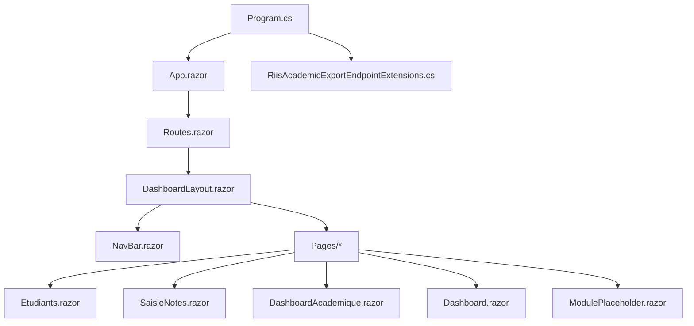
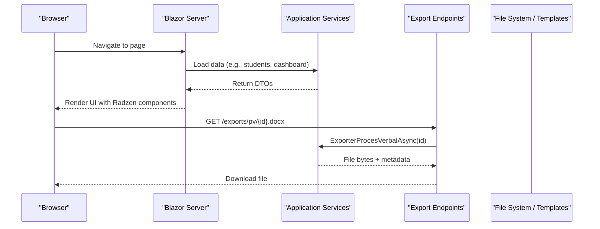
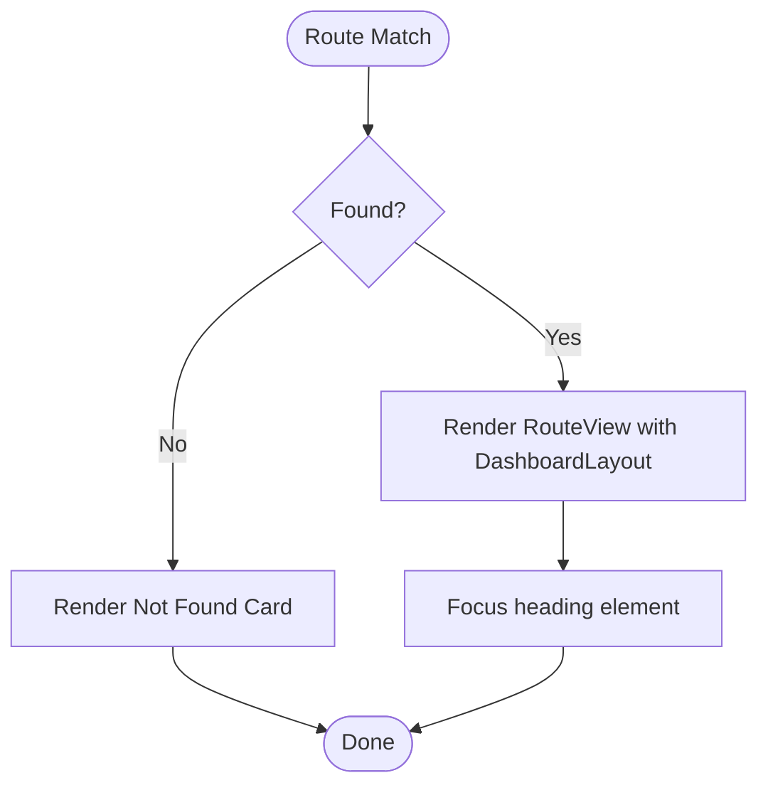
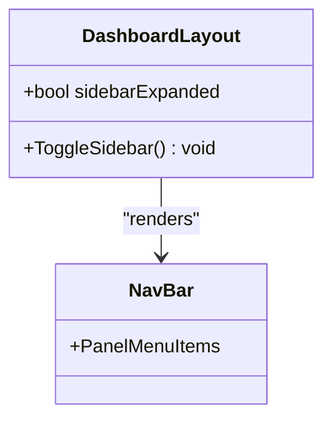
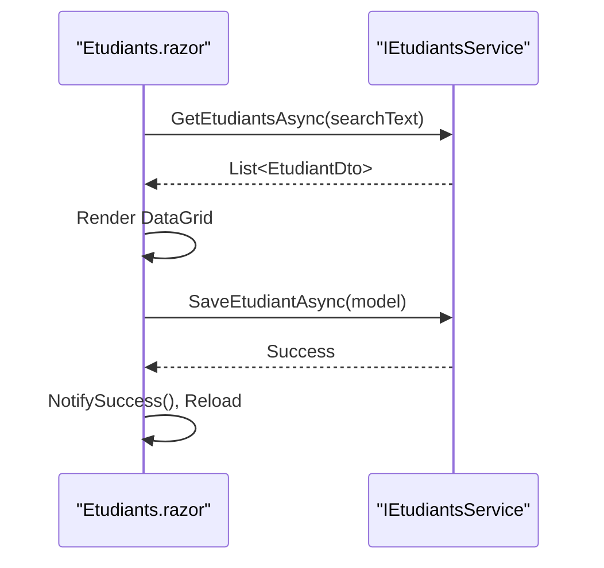
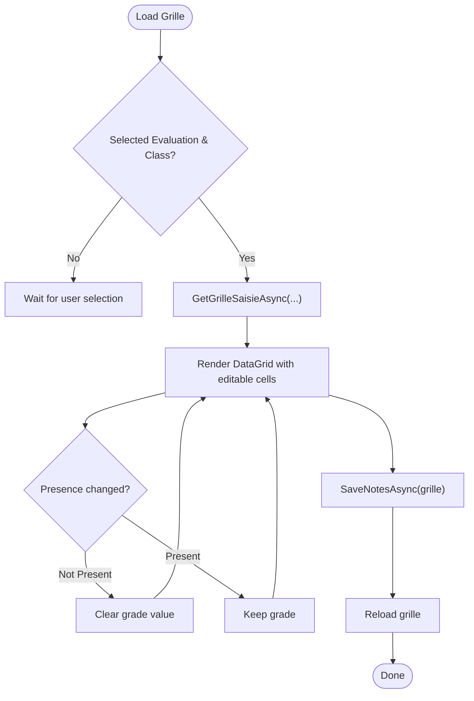
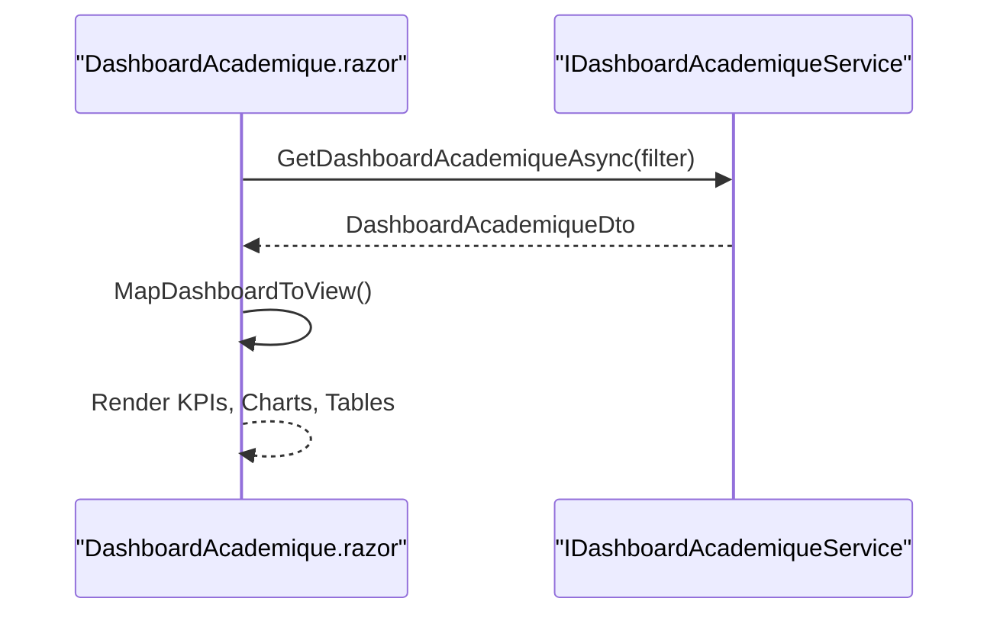
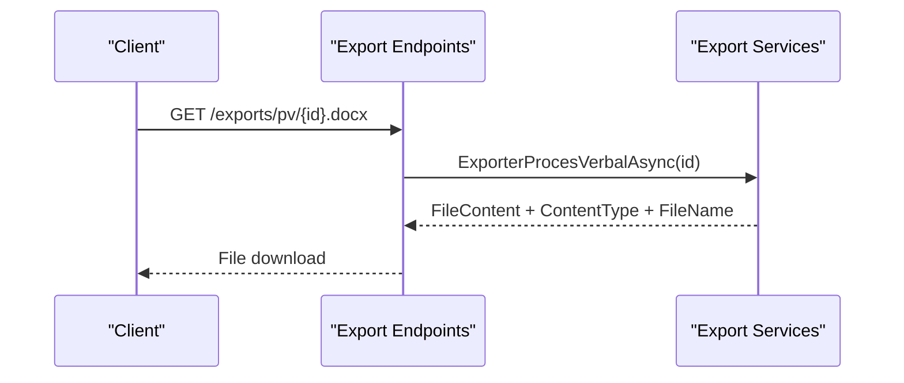
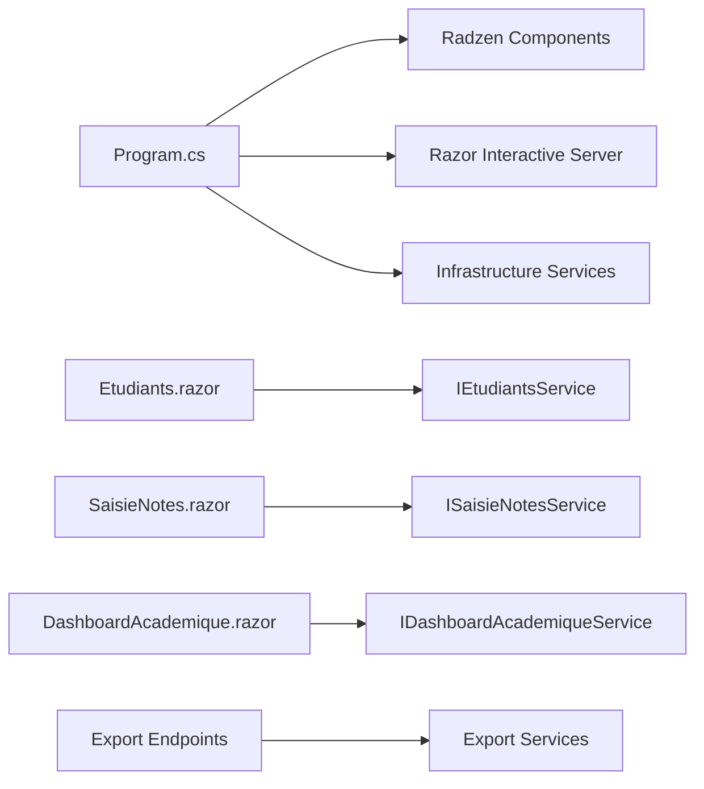

# Web Application

<cite>
**Referenced Files in This Document**
- [Program.cs](file://RIIS.Academic.Web/Program.cs)
- [App.razor](file://RIIS.Academic.Web/Components/App.razor)
- [Routes.razor](file://RIIS.Academic.Web/Components/Routes.razor)
- [_Imports.razor](file://RIIS.Academic.Web/Components/_Imports.razor)
- [DashboardLayout.razor](file://RIIS.Academic.Web/Components/Layout/DashboardLayout.razor)
- [NavBar.razor](file://RIIS.Academic.Web/Components/Layout/NavBar.razor)
- [Dashboard.razor](file://RIIS.Academic.Web/Components/Pages/Dashboard.razor)
- [Etudiants.razor](file://RIIS.Academic.Web/Components/Pages/Etudiants.razor)
- [SaisieNotes.razor](file://RIIS.Academic.Web/Components/Pages/SaisieNotes.razor)
- [DashboardAcademique.razor](file://RIIS.Academic.Web/Components/Pages/DashboardAcademique.razor)
- [ModulePlaceholder.razor](file://RIIS.Academic.Web/Components/Pages/ModulePlaceholder.razor)
- [RiisAcademicExportEndpointExtensions.cs](file://RIIS.Academic.Web/Extensions/RiisAcademicExportEndpointExtensions.cs)
- [appsettings.json](file://RIIS.Academic.Web/appsettings.json)
</cite>

## Table of Contents
1. Introduction
2. Project Structure
3. Core Components
4. Architecture Overview
5. Detailed Component Analysis
6. Dependency Analysis
7. Performance Considerations
8. Troubleshooting Guide
9. Conclusion

## Introduction
This document describes the Blazor Server web application structure and components for the RIIS Academic system. It explains component hierarchy, routing configuration, layout structure, page organization, Radzen UI integration, state management patterns, client-side service communication, form handling, data binding, event processing, navigation patterns, authentication considerations, responsive design, component composition, reusability, and performance optimization techniques.

## Project Structure
The web project is a Blazor Server app that:
- Bootstraps services and middleware in Program.cs
- Defines the root HTML shell and theme in App.razor
- Configures routing and default layout in Routes.razor
- Provides a dashboard layout with header, sidebar, and body in DashboardLayout.razor
- Implements navigation via NavBar.razor
- Organizes feature pages under Components/Pages
- Exposes export endpoints for documents via RiisAcademicExportEndpointExtensions.cs
- Uses Radzen UI components throughout for consistent styling and interactivity

**Diagram sources**
- [Program.cs:8-26](file://RIIS.Academic.Web/Program.cs#L8-L26)
- [App.razor:1-20](file://RIIS.Academic.Web/Components/App.razor#L1-L20)
- [Routes.razor:1-15](file://RIIS.Academic.Web/Components/Routes.razor#L1-L15)
- [DashboardLayout.razor:1-33](file://RIIS.Academic.Web/Components/Layout/DashboardLayout.razor#L1-L33)
- [NavBar.razor:1-55](file://RIIS.Academic.Web/Components/Layout/NavBar.razor#L1-L55)
- [RiisAcademicExportEndpointExtensions.cs:9-93](file://RIIS.Academic.Web/Extensions/RiisAcademicExportEndpointExtensions.cs#L9-L93)

**Section sources**
- [Program.cs:8-26](file://RIIS.Academic.Web/Program.cs#L8-L26)
- [App.razor:1-20](file://RIIS.Academic.Web/Components/App.razor#L1-L20)
- [Routes.razor:1-15](file://RIIS.Academic.Web/Components/Routes.razor#L1-L15)
- [DashboardLayout.razor:1-33](file://RIIS.Academic.Web/Components/Layout/DashboardLayout.razor#L1-L33)
- [NavBar.razor:1-55](file://RIIS.Academic.Web/Components/Layout/NavBar.razor#L1-L55)
- [RiisAcademicExportEndpointExtensions.cs:9-93](file://RIIS.Academic.Web/Extensions/RiisAcademicExportEndpointExtensions.cs#L9-L93)

## Core Components
- Root application shell: App.razor sets the base href, applies the Radzen theme, includes global scripts, and renders head/body outlets with interactive server render mode.
- Routing: Routes.razor configures the Router, assigns a default layout (DashboardLayout), focuses headings on navigation, and provides a not-found page using Radzen cards and text.
- Layout: DashboardLayout.razor composes RadzenLayout, RadzenHeader, RadzenSidebar (with NavBar), and RadzenBody to host page content. It exposes a collapsible sidebar toggle.
- Navigation: NavBar.razor uses RadzenPanelMenu to define top-level sections and sub-items with paths for each module.
- Global imports: _Imports.razor centralizes namespaces for Radzen, application DTOs/services, and domain types to reduce duplication across components.
- Configuration: appsettings.json contains connection strings and environment settings used by infrastructure layers.

Key responsibilities:
- App.razor: Theme, scripts, and root rendering pipeline
- Routes.razor: Route resolution and default layout assignment
- DashboardLayout.razor: Consistent chrome (header/sidebar/body) and stateful sidebar toggle
- NavBar.razor: Declarative navigation menu with icons and paths
- _Imports.razor: Shared namespace imports for components
- appsettings.json: Connection strings and environment flags

**Section sources**
- [App.razor:1-20](file://RIIS.Academic.Web/Components/App.razor#L1-L20)
- [Routes.razor:1-15](file://RIIS.Academic.Web/Components/Routes.razor#L1-L15)
- [DashboardLayout.razor:1-33](file://RIIS.Academic.Web/Components/Layout/DashboardLayout.razor#L1-L33)
- [NavBar.razor:1-55](file://RIIS.Academic.Web/Components/Layout/NavBar.razor#L1-L55)
- [_Imports.razor:1-34](file://RIIS.Academic.Web/Components/_Imports.razor#L1-L34)
- [appsettings.json:1-23](file://RIIS.Academic.Web/appsettings.json#L1-L23)

## Architecture Overview
The application follows a layered approach where Blazor Server components consume application services (injected via DI). The server hosts interactive components and communicates with backend services. Export endpoints are exposed as minimal APIs for generating downloadable documents.

**Diagram sources**
- [Program.cs:8-26](file://RIIS.Academic.Web/Program.cs#L8-L26)
- [RiisAcademicExportEndpointExtensions.cs:9-93](file://RIIS.Academic.Web/Extensions/RiisAcademicExportEndpointExtensions.cs#L9-L93)

## Detailed Component Analysis

### Routing and Layout
- Default layout: All routed pages use DashboardLayout unless otherwise specified.
- Not found: A friendly message is shown when a route does not match.
- Focus management: Headings receive focus after navigation for accessibility.

**Diagram sources**
- [Routes.razor:1-15](file://RIIS.Academic.Web/Components/Routes.razor#L1-L15)

**Section sources**
- [Routes.razor:1-15](file://RIIS.Academic.Web/Components/Routes.razor#L1-L15)

### Dashboard Layout and Navigation
- Header: Displays branding and subtitle; includes a sidebar toggle button.
- Sidebar: Collapsible panel containing NavBar.
- Body: Renders page content within a padded stack container.
- NavBar: Hierarchical menu with icons and paths for all modules.

**Diagram sources**
- [DashboardLayout.razor:1-33](file://RIIS.Academic.Web/Components/Layout/DashboardLayout.razor#L1-L33)
- [NavBar.razor:1-55](file://RIIS.Academic.Web/Components/Layout/NavBar.razor#L1-L55)

**Section sources**
- [DashboardLayout.razor:1-33](file://RIIS.Academic.Web/Components/Layout/DashboardLayout.razor#L1-L33)
- [NavBar.razor:1-55](file://RIIS.Academic.Web/Components/Layout/NavBar.razor#L1-L55)

### Page: Students (CRUD Example)
- Data loading: Loads student list on initialization and supports search/reset.
- Form handling: Uses RadzenTemplateForm with two-way binding to an EtudiantDto model and validation via RadzenRequiredValidator.
- Grid: Displays students with paging, sorting, filtering, and action buttons for edit/delete.
- Service communication: Injects IEtudiantsService to perform CRUD operations.
- Notifications: Uses NotificationService to show success/error messages.

**Diagram sources**
- [Etudiants.razor:162-272](file://RIIS.Academic.Web/Components/Pages/Etudiants.razor#L162-L272)

**Section sources**
- [Etudiants.razor:1-272](file://RIIS.Academic.Web/Components/Pages/Etudiants.razor#L1-L272)

### Page: Grade Entry (Complex Filtering and Grid Editing)
- Filters: Cascading dropdowns for academic year, class, unit, element, evaluation type, and evaluation selection.
- Grid editing: Inline numeric input for grades, presence status dropdown, and observation field.
- Validation and constraints: Numeric min/max based on grading scale; presence changes clear grade if not present.
- Service communication: Injects ISaisieNotesService to load lookup lists and save notes.
- State management: Local state tracks selected filters and current grid; ensures selected values remain valid when options change.

**Diagram sources**
- [SaisieNotes.razor:190-344](file://RIIS.Academic.Web/Components/Pages/SaisieNotes.razor#L190-L344)

**Section sources**
- [SaisieNotes.razor:1-344](file://RIIS.Academic.Web/Components/Pages/SaisieNotes.razor#L1-L344)

### Page: Academic Dashboard (KPIs and Charts)
- Filters: Year, cycle, level, program path, semester; dynamically built from reference data.
- KPIs: Success rate, number of enrolled, note completion percentage, retake count/rate.
- Visualizations: Sparklines, area charts, donut charts, column charts, and tabs for different views.
- Data mapping: Maps service DTOs to local view models for chart series and tables.
- Error handling: Shows alert and notification on load errors; manages loading state.

**Diagram sources**
- [DashboardAcademique.razor:326-659](file://RIIS.Academic.Web/Components/Pages/DashboardAcademique.razor#L326-L659)

**Section sources**
- [DashboardAcademique.razor:1-659](file://RIIS.Academic.Web/Components/Pages/DashboardAcademique.razor#L1-L659)

### Page: Dashboard (Entry Point)
- Purpose: Central hub with grouped sections and shortcuts to modules.
- Navigation: Uses NavigationManager to navigate to module paths.
- Composition: Reuses Radzen cards, rows, columns, and icons to present structured entry points.

**Section sources**
- [Dashboard.razor:1-114](file://RIIS.Academic.Web/Components/Pages/Dashboard.razor#L1-L114)

### Placeholder Module Page
- Purpose: Catch-all placeholder for future modules with dynamic title/description/icon generation.
- Behavior: Returns to dashboard via a button; displays informational alert indicating readiness for implementation.

**Section sources**
- [ModulePlaceholder.razor:1-88](file://RIIS.Academic.Web/Components/Pages/ModulePlaceholder.razor#L1-L88)

### Export Endpoints
- Purpose: Provide downloadable Word and Excel files for academic records and transcripts.
- Implementation: Minimal API endpoints mapped in RiisAcademicExportEndpointExtensions.cs, injecting export services and returning file results or 404.

**Diagram sources**
- [RiisAcademicExportEndpointExtensions.cs:9-93](file://RIIS.Academic.Web/Extensions/RiisAcademicExportEndpointExtensions.cs#L9-L93)

**Section sources**
- [RiisAcademicExportEndpointExtensions.cs:1-94](file://RIIS.Academic.Web/Extensions/RiisAcademicExportEndpointExtensions.cs#L1-L94)

## Dependency Analysis
- DI registration: Program.cs registers Radzen components, Razor interactive server components, and infrastructure services.
- Imports: _Imports.razor centralizes namespaces for application services and DTOs, enabling components to inject services without per-file imports.
- Pages depend on application services via @inject; services encapsulate business logic and data access.
- Export endpoints depend on application export services to generate files.

**Diagram sources**
- [Program.cs:8-26](file://RIIS.Academic.Web/Program.cs#L8-L26)
- [Etudiants.razor:1-272](file://RIIS.Academic.Web/Components/Pages/Etudiants.razor#L1-L272)
- [SaisieNotes.razor:1-344](file://RIIS.Academic.Web/Components/Pages/SaisieNotes.razor#L1-L344)
- [DashboardAcademique.razor:1-659](file://RIIS.Academic.Web/Components/Pages/DashboardAcademique.razor#L1-L659)
- [RiisAcademicExportEndpointExtensions.cs:9-93](file://RIIS.Academic.Web/Extensions/RiisAcademicExportEndpointExtensions.cs#L9-L93)

**Section sources**
- [Program.cs:8-26](file://RIIS.Academic.Web/Program.cs#L8-L26)
- [_Imports.razor:1-34](file://RIIS.Academic.Web/Components/_Imports.razor#L1-L34)

## Performance Considerations
- Use server-side rendering with interactive components judiciously to balance responsiveness and server load.
- Prefer server-side data fetching in OnInitializedAsync and avoid excessive re-renders by minimizing state churn.
- Leverage Radzen DataGrid features like paging, sorting, and filtering to reduce payload size and improve UX.
- For large dashboards, consider lazy-loading chart data and deferring non-critical computations until needed.
- Cache lookup lists (e.g., academic years, classes) at the service layer to avoid repeated calls.
- Use efficient DTOs and map only necessary fields to the UI to minimize serialization overhead.

[No sources needed since this section provides general guidance]

## Troubleshooting Guide
- Not found routes: Routes.razor renders a friendly card explaining the missing module; verify NavBar paths and page routes.
- Form validation errors: Ensure required fields have validators and bound properties; check error messages via NotificationService.
- Service call failures: Wrap async calls in try/catch and surface errors via NotificationService; inspect network requests and service responses.
- Export downloads failing: Verify endpoint parameters and service availability; confirm file generation returns non-null content.

**Section sources**
- [Routes.razor:6-13](file://RIIS.Academic.Web/Components/Routes.razor#L6-L13)
- [Etudiants.razor:230-256](file://RIIS.Academic.Web/Components/Pages/Etudiants.razor#L230-L256)
- [SaisieNotes.razor:282-326](file://RIIS.Academic.Web/Components/Pages/SaisieNotes.razor#L282-L326)
- [DashboardAcademique.razor:369-401](file://RIIS.Academic.Web/Components/Pages/DashboardAcademique.razor#L369-L401)
- [RiisAcademicExportEndpointExtensions.cs:11-89](file://RIIS.Academic.Web/Extensions/RiisAcademicExportEndpointExtensions.cs#L11-L89)

## Conclusion
The RIIS Academic Blazor Server application provides a cohesive, Radzen-powered interface organized around a consistent layout and modular pages. Components communicate with application services through dependency injection, leveraging forms, grids, and charts to deliver rich functionality. Export endpoints enable document generation for academic records. The architecture supports scalable feature growth through clear separation of concerns, reusable layouts, and centralized imports.

[No sources needed since this section summarizes without analyzing specific files]